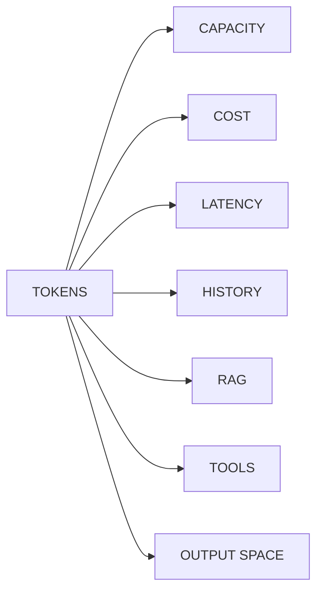
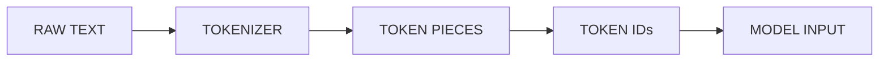
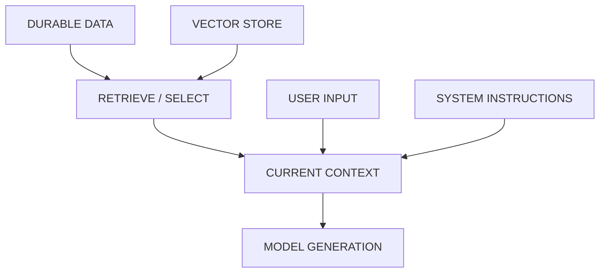
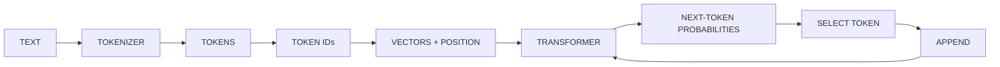
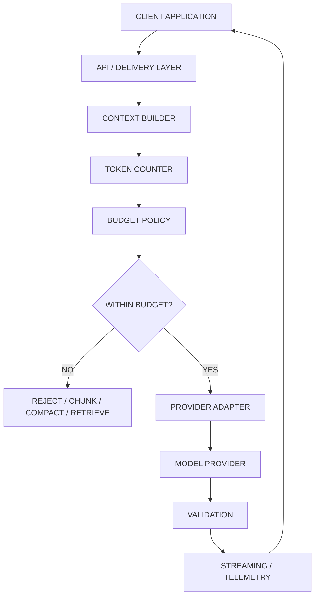
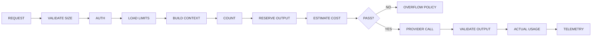
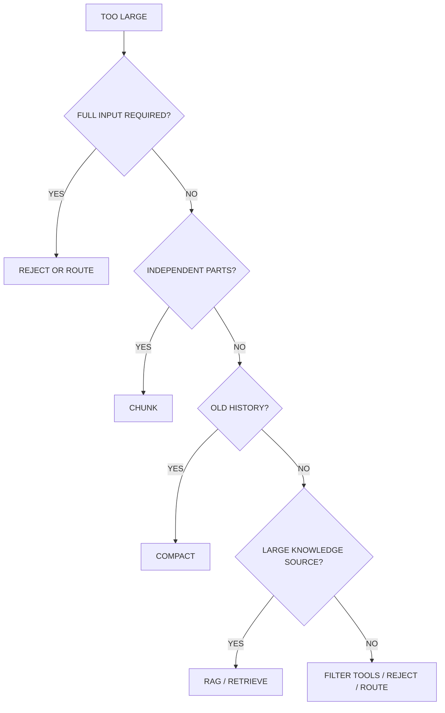
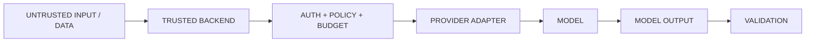
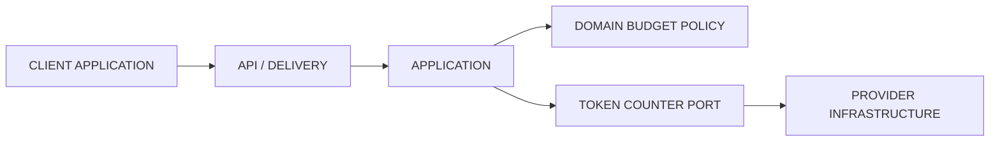
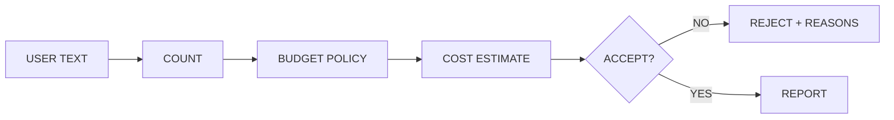

# Day 1 — Tokens & Context
## AI Product Engineering Learning Note

> **Core question:** How much information can an AI product safely send to an LLM, and what should happen when the request does not fit?
>
> **Memory hook:** **COUNT → RESERVE → BUDGET → DECIDE → CALL → MEASURE**
>
> **Completion rule:** Understanding the lesson is not enough. Day 1 is complete only when the Budget Guard, tests, experiments, behavior note, and challenge evidence are verified.

---

# 1. Why Day 1 Comes First

Every LLM request consumes tokens.

Tokens affect:

- context capacity,
- output capacity,
- latency,
- cost,
- conversation history,
- RAG evidence,
- tool/schema space,
- structured-output completion.

That makes tokens a **product resource**, not just an LLM vocabulary concept.



### Why later topics depend on this

```text
Day 1  Tokens & Context
   ↓
Day 2  Prompt Contracts       → prompts consume context
   ↓
Day 3  Provider Adapter       → providers/models differ
   ↓
Day 4  Structured Output      → output needs headroom
   ↓
Reliability / Assistants / RAG / Agents / SaaS
```

### Senior-engineer mindset

Do not ask:

> “How large is the model's context window?”

Ask:

> “How much context does this product actually need, what must be protected, and what is the failure policy when it does not fit?”

---

# 2. Token Fundamentals

## Token

A token is a **model-specific processing unit**.

It may represent:

- a whole word,
- part of a word,
- punctuation,
- whitespace + text,
- a character,
- part of Unicode/emoji,
- a special model/message marker.

### Important

```text
TOKEN ≠ WORD
TOKEN ≠ CHARACTER
TOKEN ≠ BYTE
```

## Essential vocabulary

| Term | Meaning |
|---|---|
| Tokenizer | Converts content into tokens |
| Vocabulary | Token set known to that tokenizer |
| Token ID | Integer identifier for a token |
| Input tokens | Tokens sent to the model |
| Output tokens | Tokens generated by the model |
| Context | Information available during this generation |
| Context window | Finite active capacity |
| Output limit | Maximum generation allowance |
| Truncation | Removing content |
| Compaction | Replacing detailed content with a smaller representation |

## Why tokenization exists

Whole-word tokenization creates vocabulary problems.

Character-level tokenization creates very long sequences.

Subword tokenization is the compromise.

Common families include BPE, WordPiece, SentencePiece, and unigram tokenization.



### Engineering rule

> **The same text can produce different token counts across models.**

Therefore, never blindly reuse one model's token count for another model.

---

# 3. Context Is Not Memory

This distinction is fundamental.

| System | Purpose |
|---|---|
| Model weights | Knowledge learned during training |
| Context | Temporary information visible now |
| Conversation / relational store | Durable application history |
| Vector store | Searchable external knowledge |
| RAG | Selects evidence and places it into context |



### Memory hook

> **Stored ≠ visible to the model.**

Data only becomes useful to the current model call when the application retrieves/selects it and includes it in the active request.

---

# 4. How an LLM Processes Text

Conceptually:



Important:

- The tokenizer **does not reason**.
- A token ID is only an identifier.
- The transformer performs the learned computation.
- Generation proceeds token by token.
- Generated output becomes part of the active sequence.
- System instructions, tools, schemas, retrieved documents, and wrappers can also consume context.

A rough token heuristic can help UI estimates, but it is **not authoritative budget enforcement**.

---

# 5. The Context Budget

A request can contain:

```text
INPUT =
SYSTEM
+ TOOLS
+ HISTORY
+ RETRIEVAL
+ USER INPUT
+ OVERHEAD
```

In symbols:

```text
I = S + T + H + R + U + O
```

A useful conceptual safe-input formula is:

```text
Allowed Input =
min(
    Product Input Limit,
    Provider Input Limit,
    Context Capacity - Reserved Output - Safety Buffer
)
```

Provider contracts differ, so this is a **product mental model**, not a universal provider API rule.

## Why reserve output?

Because the model needs room to answer.

```text
BAD

|----------------------- CONTEXT -----------------------|
|                INPUT FILLS EVERYTHING                 |
                                                     ↑
                                               no room to finish


GOOD

|----------------------- CONTEXT -----------------------|
|       CONTROLLED INPUT       | OUTPUT | SAFETY BUFFER |
```

Output headroom is especially important for:

- JSON,
- extraction,
- code,
- reports,
- tool calls,
- long answers.

### Day 1 learning budget

These are exercise values, not universal production standards:

```text
Product max input : 6,000
Reserved output   : 1,000
Safety margin     :   256
Latency target    : 8,000 ms
Max estimated cost: $0.02
```

Real production values should come from measured usage and current provider configuration.

---

# 6. Position in the Complete Ecosystem

Use professional, technology-neutral architecture terms.



### Responsibility split

**Client Application**

- collects input,
- shows estimates,
- displays progress/errors,
- presents usage.

**Trusted backend**

- authenticates,
- counts authoritative usage,
- enforces product limits,
- controls provider access,
- protects credentials,
- applies authorization,
- records usage.

### Key rule

> **The client can communicate the budget. The trusted backend enforces it.**

---

# 7. Production Request Lifecycle

A production-oriented request should roughly follow:



### Why both estimate and actual usage?

Before the call:

> Estimate protects the product.

After the call:

> Actual usage tells you what really happened.

Store them separately.

---

# 8. What Happens When Context Does Not Fit?

Do not default to silent truncation.

Use an explicit strategy.

| Strategy | Best fit | Main trade-off |
|---|---|---|
| Reject | Exact full input required | Weaker UX |
| Chunk | Independent sections/items | Cross-chunk relationships |
| Compact / summarize | Older detail less important | Information loss |
| Retrieve / RAG | Large knowledge source | Retrieval can miss evidence |
| Remove unused tools | Only some capabilities needed | Requires routing |
| Larger-context model | Full material genuinely required | Cost/latency |
| Silent truncation | Almost never | Hidden correctness/security failures |

### Decision mental model



### Never silently remove

- authorization rules,
- tenant boundaries,
- confirmation requirements,
- tool restrictions,
- validation requirements,
- other security-critical instructions.

---

# 9. Long Context vs RAG

These solve different problems.

```text
LONG CONTEXT = CAPACITY
RAG          = EVIDENCE SELECTION
```

### Long context

Useful when more material genuinely needs to be visible.

Costs/trade-offs:

- more input,
- more prefill,
- more cost,
- more irrelevant material,
- possible attention/relevance dilution.

### RAG

Useful when you have a large external knowledge source and only some evidence is relevant.

Costs/trade-offs:

- retrieval can fail,
- indexing/search adds complexity,
- retrieved evidence still consumes context.

### Senior decision

Compare:

- quality,
- latency,
- cost,
- privacy,
- retrieval reliability,
- operational complexity,
- failure behavior.

> Do not ask “Which is better?” Ask “Which failure mode is acceptable for this product?”

---

# 10. Performance

## More input usually means

```text
MORE INPUT
→ more tokenization / payload
→ more prefill
→ higher time-to-first-token
→ more cost
```

## More output usually means

```text
MORE OUTPUT
→ more decoding
→ longer total response time
→ more cost
→ more chance of format drift
```

## Streaming

Streaming improves **perceived responsiveness**.

It does not automatically reduce total model computation.

## Counting methods

| Method | Good for | Warning |
|---|---|---|
| Local tokenizer | Fast preflight | Must match target model |
| Provider counter | Provider-aligned count | Extra integration/network work |
| Heuristic | UI hint | Not authoritative |
| Actual usage | Billing/telemetry after call | Too late for preflight protection |

---

# 11. Security & Privacy

## Denial of wallet

```text
LARGE INPUTS
+ HIGH REQUEST RATE
+ UNBOUNDED RETRIES
→ TOKEN / COST EXPLOSION
```

Controls:

- authentication,
- byte-size limits,
- token limits,
- rate limits,
- quotas,
- cost ceilings,
- bounded retries.

## Data minimization

Do not send information simply because context capacity exists.

More context may mean more:

- personal information,
- customer data,
- proprietary code,
- cross-tenant exposure,
- logging risk.

## Prompt injection

Token budgeting does **not** solve prompt injection.

Treat runtime data such as:

- user input,
- retrieved documents,
- external tool results

as untrusted unless application policy validates/trusts them.

### Trust boundary



> **Prompt wording is behavior guidance. It is not deterministic security enforcement.**

---

# 12. Clean Architecture

Day 1 should separate product policy from provider implementation.



| Layer | Responsibility |
|---|---|
| Domain | Budget rules and deterministic policy |
| Application | Orchestrate request assessment |
| Port / Interface | Define token-counting contract |
| Provider Infrastructure | Provider/model-specific counter |
| API / Delivery | CLI now, API later |
| Client Application | UX and status |

### Dependency rule

> **Business rules depend on abstractions, not provider SDKs.**

This prepares Day 3: you can add/switch provider adapters without rewriting Day 1 budget policy.

---

# 13. Minimal Code Shape

You do not need hundreds of lines to prove Day 1.

## Port

```python
from typing import Protocol


class TokenCounter(Protocol):
    def count(self, text: str) -> int:
        ...
```

## Domain policy

```python
from dataclasses import dataclass


@dataclass(frozen=True)
class RequestBudget:
    max_input_tokens: int
    reserved_output_tokens: int
    safety_margin_tokens: int


def allowed_input(
    *,
    provider_input_limit: int,
    context_capacity: int,
    budget: RequestBudget,
) -> int:
    context_cap = max(
        0,
        context_capacity
        - budget.reserved_output_tokens
        - budget.safety_margin_tokens,
    )

    return min(
        provider_input_limit,
        budget.max_input_tokens,
        context_cap,
    )
```

Provider-specific SDK code belongs in infrastructure, not in this domain function.

> Before running provider-specific code, verify the current provider SDK/model documentation. Do not hard-code temporary model IDs into business logic.

---

# 14. Folder Structure

Keep Day 1 small:

```text
src/
└── llm_budget/
    ├── domain/
    │   └── budget.py
    ├── application/
    │   └── assess_request.py
    ├── ports/
    │   └── token_counter.py
    ├── infrastructure/
    │   └── provider_counter.py
    └── interfaces/
        └── cli.py

tests/
docs/
evals/
```

---

# 15. Mini Project — LLM Request Budget Guard

Build one CLI:



It should report:

```json
{
  "model": "configured-model",
  "characters": 58,
  "words": 8,
  "input_tokens": 11,
  "allowed_input_tokens": 6000,
  "remaining_input_tokens": 5989,
  "reserved_output_tokens": 1000,
  "accepted": true,
  "reasons": []
}
```

Also include worst-case cost when pricing configuration is available.

## Tests / experiments

Run:

- English
- Roman Urdu
- Urdu or Bangla
- code
- JSON
- emoji-heavy input
- empty input
- `limit - 1`
- `limit`
- `limit + 1`

Do not log API keys or raw sensitive prompts.

---

# 16. Model-Behavior Note

You need three cases:

| Failure | Problem | Safe behavior |
|---|---|---|
| Missing context | Required evidence was not supplied | Ask for evidence |
| Ambiguous instruction | Multiple valid interpretations | Clarify or use documented default |
| Hallucinated fact | Model invents unsupported information | Explicit no-answer |

### Important distinction

```text
MISSING CONTEXT
= INPUT CONDITION

HALLUCINATION
= INCORRECT OUTPUT BEHAVIOR
```

Good product design detects the first and prevents the second.

---

# 17. Beginner vs Production Mistakes

## Beginner mistakes

- token = word,
- character limit = exact token limit,
- context = permanent memory,
- count only user message,
- ignore tools/system/schema,
- fill entire context window,
- forget output reserve,
- assume one tokenizer works everywhere.

## Production mistakes

- enforce limits only in the client,
- trust client-supplied counts,
- silently truncate security rules,
- send all conversation history,
- include all tools,
- dump excessive RAG results,
- reuse counts after model/provider switch,
- ignore actual usage,
- log sensitive prompts,
- allow unbounded retries.

---

# 18. Engineering Challenge

Given:

```text
Provider context window : 16,384
Provider max input      : 16,384
Provider max output     :  4,096

Product max input       : 10,000
Reserved output         :  1,500
Safety margin           :    384
Maximum cost            :  $0.01
```

Request:

```text
System instructions :   700
Tool schemas        :   900
History             : 4,000
Retrieved documents : 3,600
User input          : 1,200
Overhead            :   250
```

Hypothetical pricing:

```text
Input  : $0.40 / million
Output : $1.60 / million
```

Answer without looking at notes:

1. Total input?
2. Allowed input?
3. Over or under by how much?
4. Worst-case cost?
5. What would you reduce first, and why?
6. What must never be silently truncated?
7. Which three unit tests would you write?

The important part is not only the arithmetic.

> You must be able to defend the **reduction order** as an engineering decision.

---

# 19. Day 1 Completion Gate

```text
[ ] Budget Guard CLI works
[ ] Unit tests pass
[ ] Six tokenization experiments recorded
[ ] Boundary tests pass
[ ] Model-behavior note written
[ ] Challenge solved
[ ] Can explain Long Context vs RAG
[ ] Can explain Client vs Backend responsibility
[ ] Can draw the architecture from memory
```

### Status vocabulary

```text
STUDIED
→ I read/understood it.

IMPLEMENTED
→ I built it.

VERIFIED
→ I have evidence it works.

DONE
→ Roadmap gate is satisfied.
```

Do not collapse these four states into “done.”

---

# 20. Final Recall Map

```text
TOKEN
→ model-specific processing unit
→ token ≠ word

TOKENIZER
→ text → pieces → IDs
→ model-specific

CONTEXT
→ temporary active information
→ context ≠ durable memory

REQUEST
→ system + tools + history + retrieval + user + overhead

BUDGET
→ product limit
→ provider limit
→ reserved output
→ safety buffer

OVERFLOW
→ reject / chunk / compact / retrieve / filter / route
→ never silently truncate protected rules

LONG CONTEXT
→ capacity

RAG
→ evidence selection

PERFORMANCE
→ more input = more prefill / TTFT / cost
→ more output = more decode time / cost

SECURITY
→ denial of wallet
→ data minimization
→ runtime data can be untrusted

ARCHITECTURE
→ Domain Policy
→ TokenCounter Port
→ Provider Infrastructure

PRODUCTION
→ COUNT
→ RESERVE
→ BUDGET
→ DECIDE
→ CALL
→ MEASURE
```

---

# Interview Recall

You should be able to answer these without notes:

1. What is a token?
2. Why is token ≠ word?
3. What is a context window?
4. Context vs durable memory?
5. Why reserve output?
6. Why can models tokenize the same text differently?
7. How do you handle oversized input?
8. Why not always use the largest-context model?
9. Where should budget enforcement live?
10. Estimated usage vs actual usage?
11. Long Context vs RAG?
12. What is denial of wallet?

---

# Day 1 Checkpoint Update

- **Day 1 — Tokens & Context**
- Core model: tokens/context are finite product resources.
- Tokenization is model-specific; token ≠ word.
- Context is temporary active information, not durable memory.
- Request budget includes system + tools + history + retrieval + user + overhead.
- Reserve output and safety capacity before the provider call.
- Overflow must follow an explicit policy.
- Long Context = Capacity; RAG = Evidence Selection.
- More input affects prefill/TTFT/cost; more output affects generation time/cost.
- Trusted backend enforces authoritative limits.
- Domain policy remains separate from provider infrastructure.
- Security includes denial-of-wallet and data minimization.
- Build: **LLM Request Budget Guard**.
- Evidence: CLI + tests + experiments + behavior note + challenge.
- Memory hook: **COUNT → RESERVE → BUDGET → DECIDE → CALL → MEASURE**
- Next: **Day 2 — Prompt Contracts**
