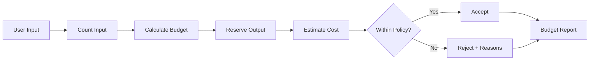
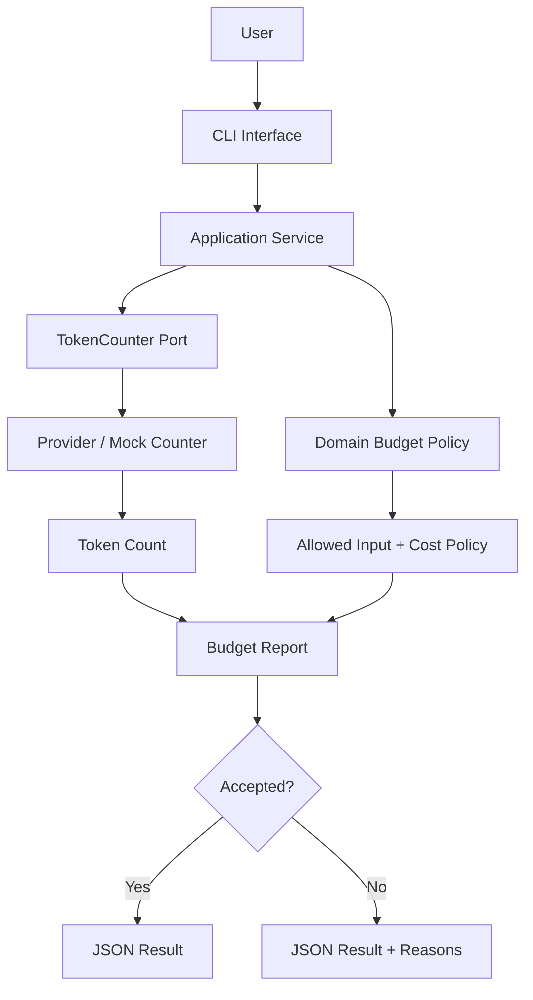
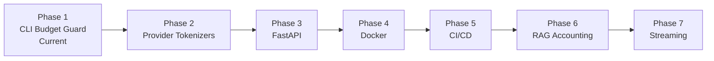

# LLM Request Budget Guard

> A production-inspired Python CLI for validating LLM request budgets, estimating worst-case cost, and rejecting unsafe requests before they reach an AI provider.

    

---

## Overview

LLM applications operate under finite context windows, output limits, latency constraints, and token-based costs.

**LLM Request Budget Guard** performs a preflight assessment before a request is sent to a provider. It measures input size, estimates token usage, calculates the safe input budget, reserves output capacity, estimates worst-case request cost, and returns an explicit accept/reject decision.

The project demonstrates a core production principle:

> **Budget the request before making the model call.**

### What it protects

- Context capacity
- Output headroom
- Cost ceilings
- Request reliability
- Application-level policy boundaries

---

## Key Features

| Capability | Description |
|---|---|
| Character counting | Measures raw input size |
| Word counting | Provides a human-readable text metric |
| Token estimation | Estimates model input consumption |
| Safe input budgeting | Calculates the maximum allowed input |
| Remaining budget | Reports unused input capacity |
| Output reservation | Protects room for model generation |
| Cost estimation | Predicts worst-case input and output cost |
| Policy decision | Accepts or rejects the request |
| Rejection reasons | Explains why a request failed validation |
| Clean Architecture | Separates policy from provider-specific infrastructure |
| CLI interface | Exposes the assessment workflow to developers |

---

## Demo

### Run the CLI

```bash
python -m llm_budget.interfaces.cli "Hello ChatGPT"
```

### Example output

```json
{
  "characters": 13,
  "words": 2,
  "input_tokens": 3,
  "allowed_input_tokens": 6000,
  "remaining_input_tokens": 5997,
  "reserved_output_tokens": 1000,
  "estimated_input_cost": 0.0000012,
  "estimated_output_cost": 0.0016,
  "estimated_total_cost": 0.0016012,
  "accepted": true,
  "reasons": []
}
```

### Request lifecycle



---

## Architecture

The implementation follows a simplified **Clean Architecture** so deterministic product policy is isolated from provider-specific code.



### Layer responsibilities

| Layer | Responsibility |
|---|---|
| `domain` | Deterministic budget rules and policy |
| `application` | Orchestrates request assessment |
| `ports` | Defines the token-counting abstraction |
| `infrastructure` | Implements token counting for a provider or mock |
| `interfaces` | Exposes the application through the CLI |
| `tests` | Verifies policy, boundaries, and behavior |
| `evals` | Stores experiments and evaluation evidence |
| `docs` | Holds deeper engineering and learning notes |

### Why Clean Architecture?

The token-counting mechanism can change without rewriting the budget policy.

For example, replacing the current mock counter with a provider-specific tokenizer should affect the infrastructure implementation—not the domain rules that decide whether a request fits.

> **Dependency rule:** business policy depends on abstractions, not provider SDKs.

---

## Project Structure

```text
llm-request-budget-guard/
│
├── docs/
├── evals/
├── tests/
│
├── src/
│   └── llm_budget/
│       ├── domain/
│       │   └── budget.py
│       ├── application/
│       │   └── assess_request.py
│       ├── ports/
│       │   └── token_counter.py
│       ├── infrastructure/
│       │   └── provider_counter.py
│       └── interfaces/
│           └── cli.py
│
├── README.md
└── pyproject.toml
```

---

## Engineering Decisions

### `Protocol` for the token counter

The application depends on a token-counting contract rather than a concrete provider implementation.

```python
from typing import Protocol


class TokenCounter(Protocol):
    def count(self, text: str) -> int:
        ...
```

This keeps the application testable and makes provider-specific tokenizers replaceable.

**Trade-off:** an abstraction adds a small amount of structure, but prevents provider concerns from leaking into business policy.

### Mock token counter

The current project intentionally uses an approximation:

```text
1 token ≈ 4 characters
```

This is suitable for exercising request-budget logic without coupling Day 1 of the project to a specific provider SDK.

**Trade-off:** deterministic and simple for learning/testing, but not authoritative for production enforcement.

### Domain layer

The domain owns budget rules because they are deterministic product policy, not infrastructure behavior.

This makes the logic easy to unit test and independent of CLI or provider integrations.

### Application layer

The application service coordinates:

```text
count → budget → estimate → decide → report
```

It does not own provider implementation details.

### Ports

Ports establish boundaries between core application behavior and external implementations.

The `TokenCounter` port allows the mock counter to be replaced later by model-specific counting.

### Interfaces

The CLI is a delivery mechanism. It accepts user input and presents the assessment result without owning budget policy.

### Reserved output tokens

A request should not be allowed to consume the entire context capacity.

Reserved output tokens protect generation headroom for the response.

### Safety margin

A safety margin provides additional capacity for uncertainty and request overhead instead of budgeting to the absolute edge of the context window.

---

## Budget Algorithm

The safe input budget is calculated as:

```text
Allowed Input =
min(
    Product Input Limit,
    Provider Input Limit,
    Context Capacity
      - Reserved Output
      - Safety Margin
)
```

### Variables

| Variable | Purpose |
|---|---|
| Product Input Limit | Application-level maximum input policy |
| Provider Input Limit | Maximum input supported by the configured provider/model |
| Context Capacity | Total active context capacity |
| Reserved Output | Capacity intentionally protected for generation |
| Safety Margin | Extra headroom for uncertainty and overhead |
| Allowed Input | Maximum request input accepted by policy |

The final value is the most restrictive applicable limit.

---

## Cost Estimation

The guard estimates a worst-case request cost before a provider call.

### Input cost

```text
Input Cost =
(Input Tokens / 1,000,000)
× Input Price
```

### Output cost

```text
Output Cost =
(Reserved Output Tokens / 1,000,000)
× Output Price
```

### Total estimated cost

```text
Total Cost =
Input Cost + Output Cost
```

Using the reserved output allowance makes the estimate intentionally conservative: it models the configured output budget rather than assuming the model will stop early.

---

## Testing

The project uses **Pytest** and exercises both normal and edge-case inputs.

### Test coverage categories

- English text
- Roman Urdu
- Urdu
- Bangla
- Hindi
- Arabic
- Chinese
- Japanese
- Korean
- JSON
- Python code
- SQL
- HTML
- Emoji-only input
- Empty input

### Boundary testing

A production budget guard should explicitly test the decision boundary:

```text
limit - 1  → accepted
limit      → accepted
limit + 1  → rejected
```

These tests verify the policy at the exact point where behavior changes.

### Acceptance behavior

The output reports:

- measured input values,
- calculated token budget,
- remaining capacity,
- estimated cost,
- acceptance status,
- rejection reasons.

> The project note records the test categories and verification goals. It does not provide a pasted terminal transcript with an exact Pytest pass count, so this README does not invent one.

---

## Tokenization Experiments

The current experiments use the mock approximation `1 token ≈ 4 characters`.

| Input | Characters | Words | Estimated Tokens |
|---|---:|---:|---:|
| English | 25 | 5 | 6 |
| Roman Urdu | 58 | 11 | 14 |
| Urdu | 54 | 12 | 13 |
| Bangla | 50 | 9 | 12 |
| Hindi | 52 | 11 | 13 |
| Arabic | 42 | 8 | 10 |
| Chinese | 24 | 1 | 6 |
| Japanese | 26 | 1 | 6 |
| Korean | 34 | 8 | 8 |
| JSON | 51 | 2 | 12 |
| Python Code | 31 | 7 | 7 |
| SQL Query | 33 | 8 | 8 |
| HTML | 26 | 3 | 6 |
| Emoji Only | 11 | 1 | 2 |
| Empty Input | 0 | 0 | 1 |

### Observations

- Word count and token count are different metrics.
- Whitespace-based word counting behaves poorly for languages such as Chinese and Japanese.
- Source code, JSON, SQL, HTML, and emoji behave differently from ordinary prose.
- Character count is useful as a rough heuristic but is not an authoritative token count.
- Real token counts depend on the target model's tokenizer.

Because the current implementation uses a mock counter, these numbers demonstrate **input-shape differences and budgeting behavior**, not real provider tokenization efficiency.

---

## Engineering Observations

```text
TOKEN ≠ WORD
TOKEN ≠ CHARACTER
CONTEXT ≠ DURABLE MEMORY
ESTIMATE ≠ ACTUAL USAGE
```

Key takeaways:

- Tokenization is model-specific.
- A character limit is not an exact token limit.
- Word count should never be trusted as the production budget.
- Output capacity should be reserved before the model call.
- Product policy should be enforced before relying on provider failure behavior.
- Provider-specific counting belongs behind an abstraction.
- Oversized requests need an explicit failure policy.
- Security-critical instructions should never be silently truncated.

---

## Production Limitations

### Current implementation

The project intentionally uses a mock tokenizer:

```text
1 token ≈ 4 characters
```

This keeps the budget policy deterministic and easy to exercise while learning the architecture.

### Production implementation

A production deployment should replace the approximation with a tokenizer aligned to the configured provider and model.

Potential implementations include:

- OpenAI `tiktoken`
- Anthropic-compatible counting
- Gemini-compatible counting
- Hugging Face tokenizers

Provider/model configuration should remain outside the core budget policy.

---

## Roadmap



| Phase | Goal | Status |
|---|---|---|
| 1 | CLI budget guard and policy | Current |
| 2 | Provider-specific tokenizers | Planned |
| 3 | FastAPI delivery layer | Planned |
| 4 | Containerization with Docker | Planned |
| 5 | CI/CD with GitHub Actions | Planned |
| 6 | RAG token accounting | Planned |
| 7 | Streaming estimation | Planned |

Additional planned work includes multiple-provider support, pricing configuration, budget configuration files, and prompt-history accounting.

---

## Skills Demonstrated

| Area | Evidence |
|---|---|
| Python | Typed application and domain implementation |
| CLI development | Typer-based delivery interface |
| Clean Architecture | Domain/application/ports/infrastructure separation |
| Domain modeling | Explicit request-budget policy |
| AI engineering | Context, token, output, and cost budgeting |
| Cost control | Worst-case request estimation |
| Testing | Input-category and boundary validation |
| Software design | Replaceable token-counter abstraction |
| Reliability thinking | Preflight acceptance/rejection policy |

---

## Lessons Learned

This project reinforced that token budgeting is a **product engineering concern**, not merely an LLM implementation detail.

The key design lessons are:

1. Measure before making the provider call.
2. Reserve response capacity rather than filling the entire context window.
3. Keep deterministic business rules separate from provider SDKs.
4. Treat token counting as model-specific infrastructure.
5. Test exact budget boundaries.
6. Record estimates separately from actual provider usage when real integrations are added.
7. Use explicit overflow behavior rather than silent truncation.

---

## Future Improvements

- Replace mock counting with provider/model-specific tokenizers
- Support multiple AI providers
- Add real pricing configuration
- Add configurable product budgets
- Account for prompt and conversation history
- Add RAG evidence accounting
- Add streaming-aware estimates
- Expose the application through FastAPI
- Add Docker packaging
- Add CI/CD with GitHub Actions

---

## Documentation

The detailed engineering and learning note is kept separately from this portfolio-facing README:

```text
docs/LLM_REQUEST_BUDGET_GUARD_PROJECT_NOTE.md
```

This keeps the repository landing page concise while preserving deeper design notes and experiment evidence.

---

## License

MIT License.

---

Built as part of an **AI Product Engineering Journey**.
