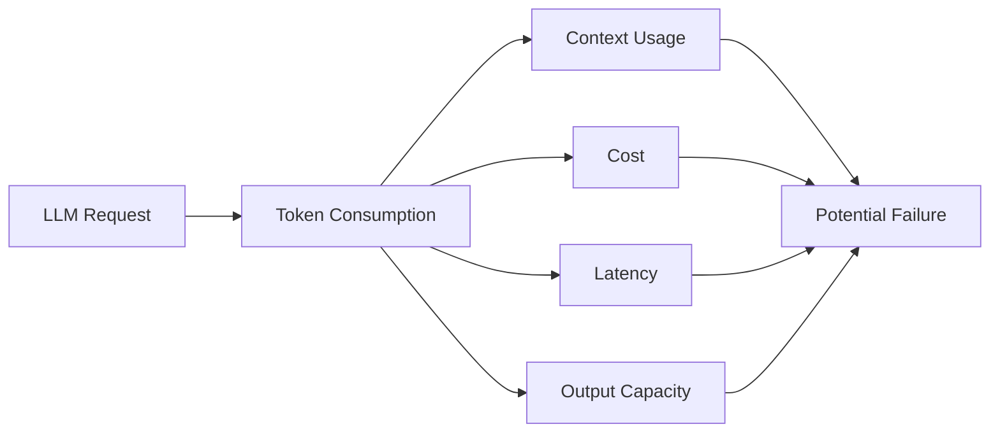
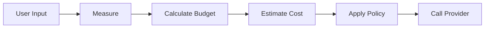
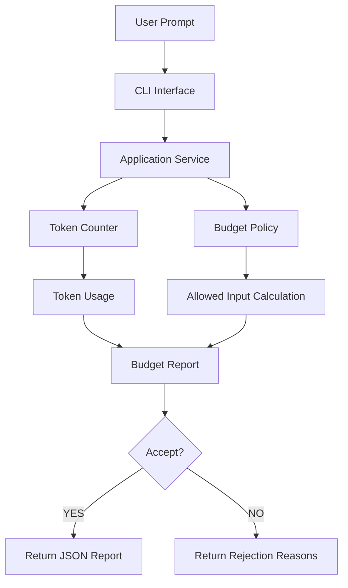
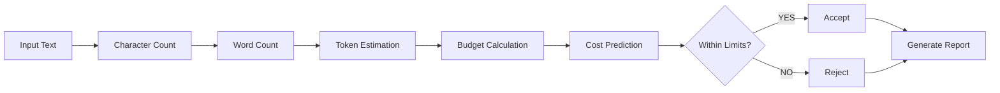
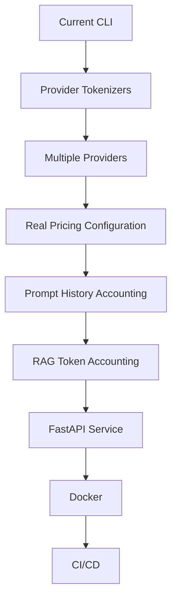
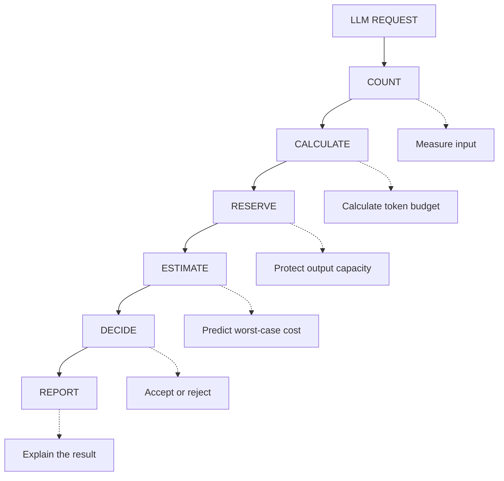

# Day 1 Project — LLM Request Budget Guard
## AI Product Engineering Learning Note

> **Core question:** How can an AI product validate LLM requests before spending tokens, money, and context capacity?
>
> **Memory hook:** **COUNT → CALCULATE → RESERVE → ESTIMATE → DECIDE → REPORT**
>
> **Completion rule:** The project is complete only when the budget guard, CLI, tests, experiments, and architecture decisions are verified.

---

# 1. Project Overview

## 🛡️ LLM Request Budget Guard

A production-inspired CLI tool that validates LLM requests **before** sending them to an AI provider.

Instead of blindly forwarding prompts, the system:

- measures input size,
- estimates token usage,
- calculates available budget,
- reserves output capacity,
- predicts worst-case cost,
- decides whether the request should be accepted or rejected.

This project was built while studying:

```text
Day 1 — Tokens & Context
AI Product Engineering Roadmap
```

The goal is not only token counting.

The goal is learning how production AI systems protect:

- context capacity,
- latency,
- cost,
- reliability,
- user experience.

---

# 2. Why This Project Matters

Large Language Models have finite context windows.

Every request consumes limited resources.



If the request exceeds the allowed budget:

- API calls may fail
- Costs may increase
- Latency may increase
- Context may overflow
- Important instructions may be lost

Production systems do not blindly call providers.

They validate requests first.

---

# 3. Engineering Mindset

Beginner approach:

```text
User Input
    ↓
Send Directly
    ↓
Call LLM
```

Production approach:



The product owns the decision.

The provider only executes the request.

---

# 4. Features

The Budget Guard provides:

| Capability | Purpose |
|---|---|
| Character Count | Measure raw input size |
| Word Count | Human-readable input analysis |
| Token Estimation | Predict model consumption |
| Input Budget Calculation | Determine safe request size |
| Remaining Budget | Show available capacity |
| Output Reservation | Protect generation space |
| Cost Estimation | Predict worst-case spending |
| Accept / Reject Decision | Apply safety policy |
| Rejection Reasons | Explain failures |
| Clean Architecture | Separate business rules |
| CLI Interface | Provide developer workflow |

---

# 5. System Architecture



The architecture follows a simplified **Clean Architecture**.

Business rules remain independent from provider-specific implementations.

---

# 6. Project Structure

```text
llm-request-budget-guard/
│
├── docs/
├── evals/
├── tests/
│
├── src/
│   └── llm_budget/
│       ├── domain/
│       │   └── budget.py
│       ├── application/
│       │   └── assess_request.py
│       ├── ports/
│       │   └── token_counter.py
│       ├── infrastructure/
│       │   └── provider_counter.py
│       └── interfaces/
│           └── cli.py
│
├── README.md
└── pyproject.toml
```

---

# 7. Request Validation Flow

A production request lifecycle:



---

# 8. Budget Formula

The safe input budget is:

```text
Allowed Input =
min(
    Product Input Limit,
    Provider Input Limit,
    Context Capacity
      - Reserved Output
      - Safety Margin
)
```

The system protects output space by reserving tokens before the request.

---

# 9. Cost Estimation

## Input Cost

```text
Input Cost =
(Input Tokens / 1,000,000)
× Input Price
```

## Output Cost

```text
Output Cost =
(Reserved Output Tokens / 1,000,000)
× Output Price
```

## Total Cost

```text
Total Cost =
Input Cost + Output Cost
```

---

# 10. CLI Example

Run:

```bash
python -m llm_budget.interfaces.cli "Hello ChatGPT"
```

Example response:

```json
{
  "characters": 13,
  "words": 2,
  "input_tokens": 3,
  "allowed_input_tokens": 6000,
  "remaining_input_tokens": 5997,
  "reserved_output_tokens": 1000,
  "estimated_input_cost": 0.0000012,
  "estimated_output_cost": 0.0016,
  "estimated_total_cost": 0.0016012,
  "accepted": true,
  "reasons": []
}
```

---

# 11. Verification Experiments

The system was tested with different input categories.

| Input Type | Result |
|---|---|
| English | ✅ |
| Roman Urdu | ✅ |
| Urdu | ✅ |
| Bangla | ✅ |
| Hindi | ✅ |
| Arabic | ✅ |
| Chinese | ✅ |
| Japanese | ✅ |
| Korean | ✅ |
| JSON | ✅ |
| Python Code | ✅ |
| SQL Query | ✅ |
| HTML | ✅ |
| Emoji Only | ✅ |
| Empty Input | ✅ |

---

# 12. Tokenization Experiment

The experiment demonstrates:

> Different languages produce different character, word, and token behavior.

Current mock tokenizer:

```text
1 token ≈ 4 characters
```

Real providers use model-specific tokenizers.

Examples include:

- OpenAI `tiktoken`
- Anthropic tokenizer
- Gemini tokenizer
- HuggingFace tokenizers

---

# 13. Language Comparison

| Language | Characters | Words | Estimated Tokens |
|---|---:|---:|---:|
| English | 25 | 5 | 6 |
| Roman Urdu | 58 | 11 | 14 |
| Urdu | 54 | 12 | 13 |
| Bangla | 50 | 9 | 12 |
| Hindi | 52 | 11 | 13 |
| Arabic | 42 | 8 | 10 |
| Chinese | 24 | 1 | 6 |
| Japanese | 26 | 1 | 6 |
| Korean | 34 | 8 | 8 |
| JSON | 51 | 2 | 12 |
| Python Code | 31 | 7 | 7 |
| SQL Query | 33 | 8 | 8 |
| HTML | 26 | 3 | 6 |
| Emoji Only | 11 | 1 | 2 |
| Empty Input | 0 | 0 | 1 |

---

# 14. Experiment Observations

Important findings:

- Token count is not equal to word count.
- Character count cannot accurately predict tokens.
- Programming languages tokenize differently from natural language.
- Unicode languages behave differently.
- Emoji consume tokens.
- Provider tokenizers are model-specific.
- Word count is not a reliable production token estimate.

### Engineering Rule

> **Never use word count as a production token budget.**

---

# 15. Technology Stack

| Technology | Role |
|---|---|
| Python 3.12 | Core implementation |
| Typer | CLI interface |
| Dataclasses | Domain data modeling |
| Pytest | Automated testing |
| Clean Architecture | Separation of concerns |

---

# 16. Learning Outcomes

After completing this project, I can explain:

- What a token is
- Why token ≠ word
- Context window limitations
- Input budget calculation
- Reserved output tokens
- Safety margins
- Context overflow
- Cost estimation
- Request validation
- Clean Architecture
- Token Counter Port
- Provider-specific tokenization
- Production budget guard design

---

# 17. Current Limitations

This project intentionally uses a mock tokenizer.

```text
1 token ≈ 4 characters
```

This is useful for learning but should not be treated as authoritative production token counting.

Production systems should integrate provider-specific tokenization.

---

# 18. Future Improvements



Planned improvements:

- Integrate OpenAI `tiktoken`
- Support multiple providers
- Add real pricing configuration
- Add budget configuration files
- Add prompt history accounting
- Add streaming estimation
- Add RAG token accounting
- Expose a FastAPI API
- Add Docker support
- Add CI/CD with GitHub Actions

---

# 19. Skills Demonstrated

- Python
- CLI Development
- Clean Architecture
- Domain Modeling
- Cost Estimation
- Token Budgeting
- Software Design
- Testing
- AI Engineering Fundamentals

---

# 20. Project Completion Gate

```text
[ ] CLI Budget Guard implemented
[ ] Token estimation working
[ ] Budget calculation verified
[ ] Cost estimation tested
[ ] Multiple language experiments completed
[ ] Boundary cases tested
[ ] Clean Architecture applied
[ ] Production trade-offs understood
```

---

# Final Recall Map



---

# Interview Recall

You should be able to answer these without notes:

1. Why should LLM requests be validated before calling providers?
2. Why is token count different from word count?
3. Why reserve output tokens?
4. What happens when context exceeds capacity?
5. Why should budget rules live outside provider code?
6. Why are tokenizers model-specific?
7. Why is character count only an estimate?
8. How would you improve this system for production?

---

# Project Status

```text
IMPLEMENTED
→ CLI tool created

VERIFIED
→ Tests and experiments completed

PRODUCTION CONCEPTS
→ Budgeting
→ Cost Control
→ Context Protection
→ Clean Architecture
```

---

# License

MIT License

---

Built as part of my **AI Product Engineering Journey** 🚀
