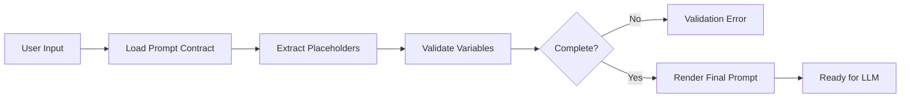
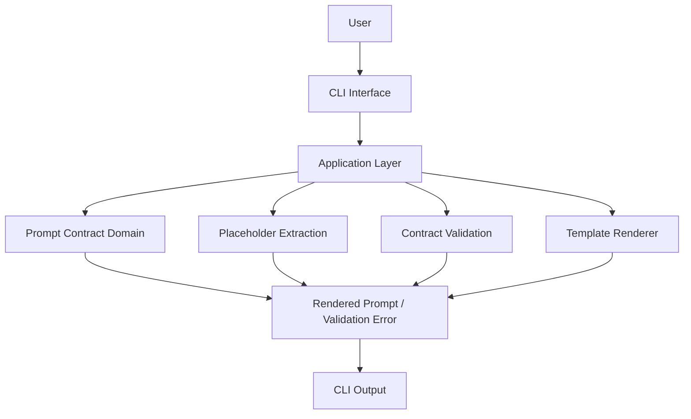
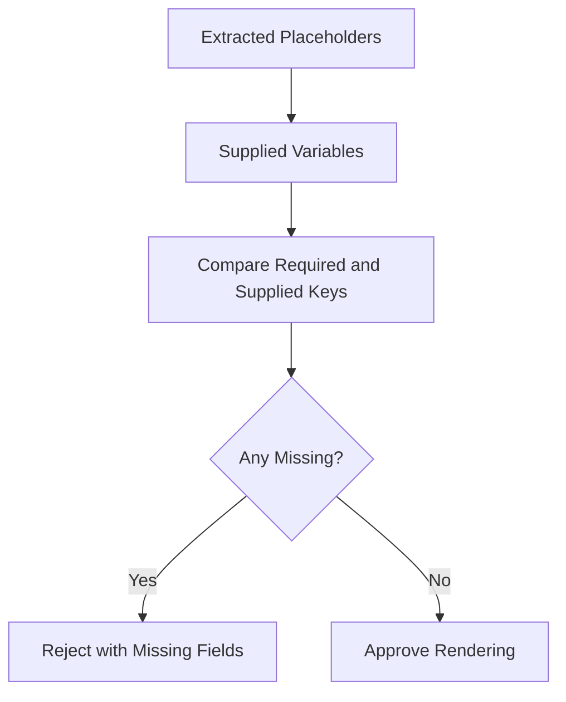
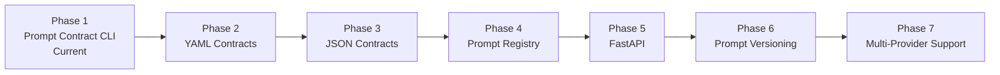

# Prompt Contract Lab

> A production-inspired Python CLI for defining, validating, and rendering deterministic Prompt Contracts before requests reach a Large Language Model (LLM).

     

---

## Overview

Production prompt engineering is not random prompt writing.

Modern AI applications need structured, reviewable, testable, and deterministic instructions. **Prompt Contract Lab** demonstrates how prompts can be treated as software artifacts with explicit roles, objectives, rules, inputs, placeholders, and output requirements.

Before a prompt is considered ready for an LLM, the project:

- defines the Prompt Contract,
- extracts required placeholders,
- validates supplied variables,
- rejects incomplete input,
- renders the final prompt deterministically,
- exposes the workflow through a CLI.

The project demonstrates a core engineering principle:

> **Validate and render the prompt before making the model call.**

### What it protects

- Prompt consistency
- Required input completeness
- Output-format expectations
- Application-level prompt policy
- Testability and reproducibility
- Separation between prompt logic and provider integrations

---

## Why This Project Exists

Prompts often begin as strings embedded directly inside application code:

```python
prompt = f"Answer this question: {question}"
```

That approach is easy to start but difficult to control as a system grows.

Without a formal contract:

- prompt logic becomes duplicated,
- required values are tracked manually,
- missing variables can reach runtime,
- wording changes are difficult to review,
- output requirements become inconsistent,
- testing becomes fragile,
- provider code and prompt policy become coupled.

Prompt Contracts solve this by creating a stable interface between the application and the model.

```text
API Contract
    for software requests

Prompt Contract
    for LLM instructions
```

Instead of treating the prompt as unstructured text, the application treats it as a validated specification.

---

## Project Goals

| Goal | Engineering Outcome |
|---|---|
| Structure prompts explicitly | Roles, objectives, rules, inputs, and outputs are visible |
| Discover required inputs | Placeholders are extracted automatically |
| Reject incomplete requests | Missing values fail before rendering |
| Render predictably | Identical inputs produce identical prompt text |
| Isolate prompt policy | Core behavior remains independent of CLI and provider SDKs |
| Make prompt behavior testable | Extraction, validation, and rendering can be unit tested |
| Prepare for future integrations | The same contract pipeline can support APIs, agents, and providers |

---

## Key Features

| Capability | Description |
|---|---|
| Prompt Contracts | Defines structured prompt specifications |
| Placeholder Extraction | Discovers variables embedded in a template |
| Contract Validation | Detects missing required values |
| Deterministic Rendering | Produces the same prompt for the same contract and inputs |
| Explicit Failure Behavior | Stops incomplete prompts before model execution |
| CLI Interface | Renders contracts directly from the terminal |
| Clean Architecture | Separates domain rules from delivery and infrastructure |
| Unit Testing | Verifies extraction, validation, and rendering behavior |
| Extensible Design | Leaves room for repositories, registries, APIs, and providers |
| Versioned Prompt Thinking | Encourages prompts to be reviewed and evolved like code |

---

## Quick Start

### Requirements

- Python 3.12
- A virtual environment
- Project dependencies declared in `pyproject.toml`

### Installation

```bash
git clone <repository-url>
cd prompt-contract-lab

python -m venv .venv
```

Activate the environment:

```bash
# macOS / Linux
source .venv/bin/activate
```

```powershell
# Windows PowerShell
.venv\Scripts\Activate.ps1
```

Install the project:

```bash
pip install -e .
```

Run the test suite:

```bash
pytest
```

> Replace `<repository-url>` with the actual repository URL.

---

## Demo

### Render a Prompt Contract

```bash
python -m prompt_contract.interfaces.cli \
  "What is Prompt Engineering?"
```

### Example Output

```text
========================
Prompt Contract
========================

Version:
v1.0

ROLE
Senior AI Assistant

OBJECTIVE
Answer the user's question accurately using the provided context.

RULES
- Never hallucinate.
- Use only the supplied context.
- If information is missing, say you do not know.
- Be concise and clear.

INPUT

Question:
What is Prompt Engineering?

Context:

OUTPUT FORMAT

Answer in Markdown.

Sections:

- Answer
- Explanation
- References (if available)
```

The CLI output is the rendered Prompt Contract. It is not the model response.

---

## Prompt Lifecycle



Every stage before the provider call is deterministic and testable.

---

## Architecture

Prompt Contract Lab follows a simplified **Clean Architecture** so prompt policy remains independent from interfaces and future provider integrations.



### Layer Responsibilities

| Layer | Responsibility |
|---|---|
| `domain` | Prompt Contract concepts, invariants, and deterministic rules |
| `application` | Coordinates extraction, validation, and rendering |
| `ports` | Defines boundaries for future repositories or provider-facing services |
| `infrastructure` | Holds future external implementations such as YAML loaders or registries |
| `interfaces` | Accepts user input and presents results through the CLI |
| `tests` | Verifies contract behavior and failure boundaries |
| `evals` | Stores prompt experiments and evaluation evidence |
| `docs` | Preserves deeper engineering and learning notes |

### Why Clean Architecture?

Prompt validation is business logic.

It should not depend on:

- OpenAI SDKs,
- Anthropic SDKs,
- Gemini SDKs,
- Typer,
- FastAPI,
- databases,
- prompt registries.

The same contract rules should remain reusable across multiple delivery mechanisms.

```text
CLI
FastAPI
Background Worker
Agent Runtime
Evaluation Harness
        ↓
Application Workflow
        ↓
Prompt Contract Domain
```

> **Dependency rule:** prompt policy depends on abstractions—not frameworks or providers.

---

## Project Structure

```text
prompt-contract-lab/
│
├── docs/
│   └── PROJECT_NOTE.md
│
├── evals/
├── tests/
│
├── src/
│   └── prompt_contract/
│       ├── application/
│       ├── domain/
│       ├── infrastructure/
│       ├── interfaces/
│       └── ports/
│
├── README.md
└── pyproject.toml
```

The tree intentionally documents only the directories and files established by the project description. Individual implementation filenames can evolve without changing the architectural boundaries.

---

## Prompt Contract Anatomy

A Prompt Contract can define the following sections:

| Section | Purpose |
|---|---|
| Version | Identifies the contract revision |
| Role | Describes the model's operating role |
| Objective | States the task to complete |
| Rules | Defines behavioral and business constraints |
| Input | Declares dynamic values supplied at runtime |
| Output Format | Defines the expected response structure |

Example:

```text
Version:
v1.0

ROLE
Senior AI Assistant

OBJECTIVE
Answer accurately using only the supplied context.

RULES
- Never hallucinate.
- Be concise.
- State when information is missing.

INPUT

Question:
{{question}}

Context:
{{context}}

OUTPUT FORMAT
Markdown
```

This structure makes prompt intent visible during review.

---

## Placeholder Extraction

Prompt templates contain dynamic values:

```text
Question:
{{question}}

Context:
{{context}}
```

The extraction step discovers the required variables:

```python
["question", "context"]
```

### Why extraction matters

Without automatic extraction:

- developers must maintain a separate variable list,
- templates and input schemas can drift,
- missing fields may remain unnoticed,
- duplicate prompt logic can emerge.

Extraction makes the template itself the source of truth for required values.

### Duplicate placeholders

A placeholder may appear more than once:

```text
Original question: {{question}}
Restated question: {{question}}
```

The required variable remains `question`, and every occurrence should render consistently.

---

## Validation Pipeline

Validation occurs before rendering.



### Validation Rules

| Rule | Expected Result |
|---|---|
| Every required placeholder is supplied | Accept |
| One or more required placeholders are missing | Reject |
| A placeholder appears multiple times | Validate once, render every occurrence |
| An optional field is intentionally empty | Allow when the contract permits it |
| Additional unknown input is supplied | Ignore unless stricter policy is introduced |
| Validation fails | Do not render an incomplete prompt |

Example failure:

```text
Missing placeholder:
context
```

The system should fail explicitly rather than silently leaving `{{context}}` in the final prompt.

---

## Rendering Pipeline

Rendering begins only after validation succeeds.

Template:

```text
Question:
{{question}}

Context:
{{context}}
```

Variables:

```python
{
    "question": "What is Prompt Engineering?",
    "context": "Prompt engineering is the practice of designing model instructions."
}
```

Rendered output:

```text
Question:
What is Prompt Engineering?

Context:
Prompt engineering is the practice of designing model instructions.
```

### Deterministic behavior

For the same:

- contract version,
- template,
- variable names,
- variable values,

the rendered prompt should be identical.

This enables:

- snapshot testing,
- regression testing,
- reproducible evaluations,
- easier prompt review,
- safer versioning.

---

## End-to-End Algorithm

```text
Receive Prompt Contract
        ↓
Extract Placeholders
        ↓
Receive Input Variables
        ↓
Compare Required and Supplied Variables
        ↓
Missing Values?
    ┌───┴────┐
   Yes      No
    ↓        ↓
Return      Render Template
Error        ↓
         Return Final Prompt
```

The model call is intentionally outside this algorithm.

Prompt Contract Lab prepares a valid prompt; a provider integration may consume it later.

---

## Engineering Decisions

### Prompt Contracts Instead of Hardcoded Prompts

Hardcoded prompts hide policy inside application code.

A contract makes policy:

- explicit,
- reusable,
- reviewable,
- version controlled,
- testable.

**Trade-off:** contracts add structure, but that structure reduces drift as an application grows.

### Validation Before Rendering

Rendering an invalid template can produce partially substituted prompts.

The project therefore uses:

```text
extract → validate → render
```

rather than:

```text
render → discover failure
```

### Deterministic Rendering

The renderer performs substitution only. It should not contain business decisions or provider calls.

This keeps failures understandable and tests focused.

### Domain Layer

The domain owns prompt rules and invariants.

It should remain independent from:

- CLI parsing,
- terminal formatting,
- provider SDKs,
- databases,
- network calls.

### Application Layer

The application layer coordinates the use case:

```text
load → extract → validate → render → return
```

It orchestrates behavior without taking ownership of interface concerns.

### Ports and Infrastructure

The current project requires minimal infrastructure.

Future implementations may add:

- YAML contract loaders,
- JSON contract loaders,
- prompt repositories,
- remote registries,
- approval workflows.

Those capabilities should be introduced behind boundaries instead of changing core validation rules.

### CLI as a Delivery Mechanism

The CLI:

- receives the user's question,
- calls the application workflow,
- displays a rendered prompt or validation error.

It should not duplicate extraction or validation logic.

---

## Traditional Prompting vs Prompt Contracts

| Traditional Prompting | Prompt Contracts |
|---|---|
| Prompt strings scattered through code | Structured prompt specification |
| Variables tracked manually | Placeholders extracted automatically |
| Missing values discovered late | Missing values rejected before rendering |
| Output expectations are implicit | Output format is declared |
| Difficult to review | Reviewable as a software artifact |
| Difficult to test | Deterministic and testable |
| Provider concerns can leak into prompt logic | Core policy remains provider-independent |
| Changes are hard to trace | Contracts can be version controlled |

---

## Production Use Cases

| Use Case | How a Prompt Contract Helps |
|---|---|
| Customer support assistant | Enforces role, tone, evidence rules, and response sections |
| RAG question answering | Requires question and retrieved context before rendering |
| Content moderation workflow | Declares policy rules and structured output requirements |
| Document extraction | Defines required source text and expected JSON fields |
| AI agent tool planning | Separates task instructions from runtime variables |
| Evaluation pipelines | Re-renders identical prompts for reproducible comparisons |
| Multi-provider applications | Reuses prompt policy while changing provider infrastructure |
| Regulated workflows | Makes instructions and revisions reviewable |

These examples describe where the architecture can apply; they are not claims that provider integrations already exist in this repository.

---

## Testing

The project uses **Pytest** to verify deterministic behavior across the Prompt Contract lifecycle.

### Test Coverage

The documented implementation verifies:

- placeholder extraction,
- prompt rendering,
- contract validation,
- missing placeholder detection,
- successful rendering,
- invalid contract rejection.

Run the suite:

```bash
pytest
```

Documented example result:

```text
========================= test session starts =========================

collected 6 items

tests/test_extract_placeholders.py ...
tests/test_render_contract.py .
tests/test_validate_contract.py ..

========================== 6 passed ==========================
```

The exact file names and pass count should always match the current repository state.

### Boundary Cases

A reliable test suite should include:

| Case | Expected Behavior |
|---|---|
| All placeholders supplied | Render successfully |
| One placeholder missing | Reject |
| Multiple placeholders missing | Report all missing values |
| Duplicate placeholder | Render each occurrence |
| Empty optional context | Preserve the empty value when allowed |
| Long input | Render without changing content |
| Unicode input | Preserve characters |
| Markdown input | Preserve formatting |
| Unknown variable | Ignore under the current documented rule |
| Unresolved placeholder after rendering | Treat as a failure condition |

### Testing Principle

> The goal is not only code coverage. The goal is confidence that every Prompt Contract fails and succeeds predictably.

---

## Verification Experiments

| Experiment | Expected Result | Documented Status |
|---|---|---|
| Basic question | Prompt rendered | ✅ |
| Empty context | Valid contract | ✅ |
| Missing placeholder | Validation error | ✅ |
| Duplicate placeholder | Render correctly | ✅ |
| Long prompt | Render successfully | ✅ |
| Unicode input | Preserved | ✅ |
| Markdown output | Preserved | ✅ |

These experiments focus on deterministic prompt construction, not model response quality.

---

## Common Mistakes

| Mistake | Why It Is Risky | Better Approach |
|---|---|---|
| Embedding prompts in many functions | Changes become inconsistent | Centralize reusable contracts |
| Rendering before validation | Incomplete prompts can escape | Validate every required value first |
| Treating empty and missing as identical | Business intent becomes unclear | Define field semantics explicitly |
| Allowing unresolved placeholders | Models receive broken instructions | Reject before provider execution |
| Mixing provider calls into rendering | Core logic becomes coupled | Keep rendering deterministic |
| Testing only the happy path | Failures appear in production | Test missing, duplicate, empty, and Unicode inputs |
| Changing templates without version discipline | Evaluations become hard to reproduce | Version and review contract changes |
| Assuming output format guarantees compliance | LLM output is probabilistic | Validate model output separately in a future boundary |

---

## Engineering Observations

```text
PROMPT ≠ CONTRACT
CONTRACT ≠ TEMPLATE
VALIDATION ≠ RENDERING
RENDERED PROMPT ≠ MODEL RESPONSE
OUTPUT INSTRUCTION ≠ OUTPUT GUARANTEE
```

Key observations:

- A template is one part of a Prompt Contract.
- A contract adds expectations, required inputs, rules, and version context.
- Validation prevents incomplete prompt construction.
- Rendering should not make business decisions.
- Deterministic prompt preparation makes testing possible.
- Provider-independent policy is easier to reuse.
- Model output still requires separate validation in production systems.

---

## Learning Outcomes

| Area | Learning Outcome |
|---|---|
| Prompt Engineering | Explain why production prompts need structure |
| Contract Design | Define roles, objectives, rules, inputs, and outputs |
| Template Processing | Extract and substitute placeholders |
| Validation | Reject missing required values before rendering |
| Determinism | Explain why reproducible prompts improve testing |
| Clean Architecture | Separate domain rules from interfaces and infrastructure |
| CLI Development | Expose an application use case through the terminal |
| Testing | Verify success paths, failure paths, and boundaries |
| AI Product Engineering | Treat prompts as maintainable software assets |

---

## Production Considerations

A production Prompt Contract system may need:

- persistent contract storage,
- explicit contract identifiers,
- semantic versioning,
- approval and review workflows,
- environment-specific configuration,
- audit history,
- model and provider compatibility metadata,
- output schema validation,
- observability and tracing,
- rollback support,
- secret-handling rules,
- prompt-injection defenses.

The current project intentionally focuses on deterministic prompt construction and validation.

---

## Performance Considerations

For small templates, extraction, validation, and substitution are inexpensive.

As a system grows:

- compile or cache placeholder patterns,
- avoid repeatedly parsing unchanged contract versions,
- use set comparison for required and supplied variables,
- keep rendering linear in template size,
- place limits on untrusted input size,
- benchmark large templates before introducing complex syntax.

Performance optimization should not weaken validation or make failures less explicit.

---

## Security Considerations

Prompt Contracts improve structure, but they do not eliminate AI security risks.

Production systems should consider:

- treating user input as data rather than trusted instructions,
- separating system rules from untrusted content,
- preventing secrets from being embedded in templates,
- avoiding logging sensitive rendered prompts without controls,
- validating output separately from prompt rendering,
- applying input-size limits,
- recording contract versions for audits,
- reviewing template changes like code changes.

> A valid prompt can still contain unsafe or malicious input. Contract validation confirms completeness—not truthfulness or safety.

---

## Current Limitations

The documented implementation intentionally remains focused.

Current limitations include:

- a static Prompt Contract,
- plain-text templates,
- no YAML support,
- no JSON contract format,
- no prompt registry,
- no prompt version history,
- no database storage,
- no AI-provider integration,
- no schema-based variable typing,
- no conditional rendering,
- no nested placeholders.

These boundaries keep the learning project centered on extraction, validation, rendering, and architecture.

---

## Roadmap



| Phase | Goal | Status |
|---|---|---|
| 1 | Prompt Contract CLI | Current |
| 2 | YAML Prompt Contracts | Planned |
| 3 | JSON Prompt Contracts | Planned |
| 4 | Prompt Registry | Planned |
| 5 | FastAPI Integration | Planned |
| 6 | Prompt Versioning | Planned |
| 7 | Multi-Provider Support | Planned |

---

## Skills Demonstrated

| Area | Evidence |
|---|---|
| Python | Typed implementation |
| CLI Development | Typer-based interface |
| Clean Architecture | Layered project boundaries |
| Prompt Engineering | Structured Prompt Contract design |
| Template Rendering | Deterministic prompt generation |
| Validation | Required-placeholder verification |
| Software Design | Separation of concerns |
| Testing | Pytest-based behavior verification |
| AI Engineering | Production-inspired prompt preparation pipeline |

---

## Lessons Learned

This project reinforces that prompts should be treated as **software assets**, not arbitrary strings scattered throughout an application.

The central lessons are:

1. Prompt Contracts create consistency.
2. Validation should occur before rendering.
3. Rendering should be deterministic.
4. Business rules belong in the domain layer.
5. Interfaces should deliver use cases, not own policy.
6. Prompt templates should be reusable and version controlled.
7. Failure behavior is part of the contract.
8. Testing prompt preparation is as important as testing ordinary application logic.
9. Model output validation is a separate production concern.
10. Clean boundaries make future integrations easier.

---

## Future Improvements

- YAML Prompt Contracts
- JSON Prompt Contracts
- Prompt versioning
- Prompt registry
- Conditional templates
- Nested placeholders
- Prompt schema validation
- Required and optional field metadata
- FastAPI delivery layer
- LangChain integration
- LangGraph integration
- AI agent support
- Database storage
- Docker support
- GitHub Actions CI/CD
- Multi-provider prompt management
- Structured output validation
- Contract audit history

---

## Documentation

The detailed engineering note is stored separately:

```text
docs/PROJECT_NOTE.md
```

This keeps the repository landing page portfolio-friendly while preserving deeper architecture, workflow, testing, security, and learning notes.

---

## References

- Python documentation
- Pytest documentation
- Typer documentation
- *Clean Architecture* by Robert C. Martin
- Provider documentation for any future LLM integration

References are intentionally general because the current project does not depend on a specific model provider.

---

## Acknowledgements

Built as part of an **AI Product Engineering Journey** focused on applying production software engineering principles to modern AI systems.

---

## License

MIT License.

---

## Author

**Muhammad Zaid**

AI Product Engineering Journey

> **Treat prompts like code: design them, validate them, version them, test them, and evolve them with the same discipline as any production software artifact.**
