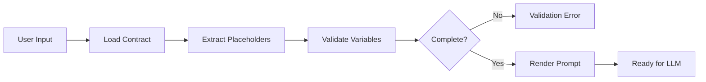
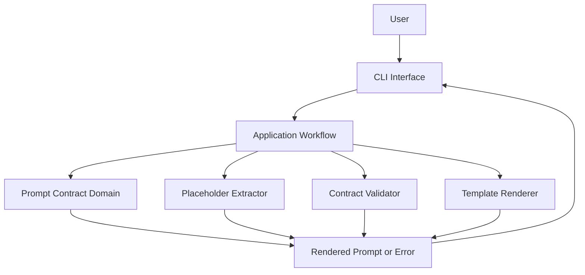
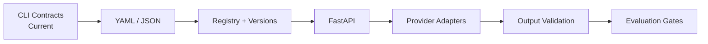

# Prompt Contract Lab

> A production-inspired Python CLI for defining, validating, and rendering deterministic prompt contracts before requests reach a Large Language Model.


     

---

## Overview

**Prompt Contract Lab** treats prompt construction as a deterministic application workflow rather than ad hoc string formatting.

Each prompt contract makes its version, role, objective, rules, runtime inputs, and expected output format explicit. Before a prompt is ready for an LLM, the application extracts its placeholders, validates supplied variables, rejects incomplete input, and renders the final text.

The project demonstrates a core production principle:

> **Validate and render the prompt before making the model call.**

### What it protects

- Prompt consistency
- Required-input completeness
- Output-format expectations
- Reviewability and reproducibility
- Application-level prompt policy
- Separation from provider-specific infrastructure

---

## Key Features

| Capability | Description |
|---|---|
| Prompt contracts | Defines versioned roles, objectives, rules, inputs, and output requirements |
| Placeholder extraction | Discovers runtime variables directly from the template |
| Contract validation | Rejects missing required values before rendering |
| Deterministic rendering | Produces identical prompt text for identical contracts and inputs |
| Explicit failures | Reports incomplete input instead of emitting a partially rendered prompt |
| CLI interface | Exposes the contract workflow from the terminal |
| Clean Architecture | Keeps prompt policy independent of delivery frameworks and model providers |
| Pytest verification | Covers extraction, validation, rendering, and failure boundaries |
| Extensible boundaries | Supports future loaders, registries, APIs, and provider adapters |

---

## Installation

Requires **Python 3.12**.

```bash
python -m venv .venv
source .venv/bin/activate
python -m pip install -e .
```

On Windows, activate the environment with `.venv\Scripts\Activate.ps1`.

---

## Usage

Render the default prompt contract:

```bash
python -m prompt_contract.interfaces.cli \
  "What is Prompt Engineering?"
```

Example output (abridged):

```text
Prompt Contract
Version: v1.0
Role: Senior AI Assistant
Objective: Answer accurately using the provided context.
Question: What is Prompt Engineering?
Context:
Output: Markdown with Answer, Explanation, and References sections.
```

The CLI returns a rendered prompt contract—not a model response.

---

## Prompt Lifecycle



Every stage shown above is deterministic and runs before any provider boundary.

---

## Architecture

The implementation follows a simplified **Clean Architecture**. Stable prompt rules remain isolated from CLI behavior and future external integrations.



### Layer responsibilities

| Layer | Responsibility |
|---|---|
| `domain` | Contract concepts, invariants, and deterministic prompt policy |
| `application` | Coordinates extraction, validation, rendering, and result handling |
| `ports` | Defines boundaries for future contract stores or external services |
| `infrastructure` | Implements loaders, registries, persistence, or provider adapters |
| `interfaces` | Accepts CLI input and presents results |
| `tests` | Verifies component behavior and contract boundaries |
| `evals` | Preserves prompt experiments and future model-quality evidence |
| `docs` | Contains implementation rationale and production considerations |

> **Dependency rule:** prompt policy depends on abstractions, not frameworks or model SDKs.

---

## Project Structure

```text
prompt-contract-lab/
├── docs/
│   └── PROJECT_NOTE.md
├── evals/
├── tests/
├── src/
│   └── prompt_contract/
│       ├── application/
│       ├── domain/
│       ├── infrastructure/
│       ├── interfaces/
│       └── ports/
├── README.md
└── pyproject.toml
```

The package boundaries are stable even as individual implementation filenames evolve.

---

## Prompt Contract Model

| Section | Responsibility |
|---|---|
| Version | Identifies the contract revision |
| Role | Establishes the model's operating perspective |
| Objective | Defines the task |
| Rules | Captures behavioral and business constraints |
| Input | Declares runtime content through placeholders |
| Output Format | States the requested response structure |

A template performs substitution. A prompt contract adds version context, constraints, required inputs, and output expectations around a template such as `Question: {{question}}`.

---

## Validation and Rendering

For `Question: {{question}}\nContext: {{context}}`, extraction produces `{"question", "context"}`. Validation compares that set with the supplied variable keys:

```text
Missing Variables = Required Placeholders - Supplied Variables
```

| Condition | Result |
|---|---|
| All required placeholders supplied | Render |
| One or more placeholders missing | Reject and report missing names |
| Placeholder appears multiple times | Validate once; replace every occurrence |
| Optional field is intentionally empty | Preserve the empty value when permitted |
| Unknown variable supplied | Ignore under the current policy |
| Unresolved placeholder remains | Fail verification |

Rendering begins only after validation succeeds.

```text
extract → validate → render → verify → return
```

For the same contract version, template, and input values, the rendered prompt is identical. This supports snapshot tests, regression checks, reproducible evaluations, and reliable debugging.

---

## Engineering Decisions

| Decision | Rationale | Trade-off |
|---|---|---|
| Contracts over scattered prompt strings | Centralizes prompt policy and required inputs | Adds structure to small prompts |
| Template as the placeholder source of truth | Prevents drift between templates and manually maintained schemas | Requires explicit placeholder syntax |
| Validation before rendering | Prevents partially substituted prompts from escaping | Adds a separate pipeline stage |
| Side-effect-free renderer | Keeps substitution deterministic and easy to test | Provider calls require another boundary |
| Provider-independent domain | Preserves prompt behavior across SDK changes | External integrations need adapters |
| Thin CLI | Avoids duplicating policy in the delivery layer | CLI remains intentionally limited |
| Explicit contract version | Makes prompt changes reviewable and reproducible | Version governance is still manual |

Deep implementation rationale is documented in [`docs/PROJECT_NOTE.md`](docs/PROJECT_NOTE.md).

---

## Testing

The project uses **Pytest** to verify the deterministic prompt lifecycle.

```bash
pytest
```

### Coverage areas

| Area | Cases |
|---|---|
| Extraction | One, many, duplicate, and no placeholders |
| Validation | Complete input, one or many missing values, unknown variables |
| Rendering | Exact output, repeated fields, empty allowed values |
| Preservation | Long, Unicode, Markdown, and multiline input |
| Workflow | Orchestration, unresolved markers, and CLI-visible failures |

### Boundary behavior

```text
0 missing values → render
1 missing value  → reject
N missing values → reject and report all
```

The documented baseline contains extraction, rendering, and validation tests. Exact test filenames and pass counts should be taken from the current repository run rather than copied into documentation as a permanent claim.

---

## Engineering Observations

```text
PROMPT ≠ CONTRACT
CONTRACT ≠ TEMPLATE
VALIDATION ≠ RENDERING
RENDERED PROMPT ≠ MODEL RESPONSE
OUTPUT INSTRUCTION ≠ OUTPUT GUARANTEE
```

- Structural validation proves required inputs are present; it does not prove they are safe or true.
- Deterministic preparation makes prompt behavior testable even when model output is probabilistic.
- Output instructions still require a separate response-validation boundary.
- Provider selection, retries, and model calls do not belong in the renderer.
- Meaningful prompt changes should be versioned and evaluated.

---

## Learning Outcomes

| Area | Evidence |
|---|---|
| Python | Typed, package-based implementation |
| CLI engineering | Typer-based delivery interface |
| Clean Architecture | Domain, application, ports, infrastructure, and interface boundaries |
| Prompt engineering | Explicit contract design and prompt lifecycle |
| Validation | Required-placeholder verification before rendering |
| Determinism | Reproducible prompt generation |
| Testing | Success, failure, boundary, and content-preservation cases |
| AI product engineering | Provider-independent prompt preparation and production trade-offs |

---

## Current Limitations

- Static prompt contract
- Plain-text templates only
- No YAML or JSON contract loader
- No prompt registry or persistent version history
- No schema-based variable typing
- No conditional or nested placeholders
- No provider integration
- No output-schema validation
- No approval workflow or evaluation gate

The current scope is intentionally centered on contract definition, extraction, validation, rendering, and architectural boundaries.

---

## Future Improvements



| Phase | Goal | Status |
|---|---|---|
| 1 | Deterministic Prompt Contract CLI | Current |
| 2 | YAML and JSON contract formats | Planned |
| 3 | Registry, immutable versions, and rollback | Planned |
| 4 | FastAPI delivery layer | Planned |
| 5 | Multi-provider adapters | Planned |
| 6 | Structured output validation | Planned |
| 7 | CI/CD evaluation and approval gates | Planned |

Additional candidates include schema-based variables, required/optional metadata, conditional templates, audit history, database storage, Docker packaging, and LangChain or LangGraph adapters.

---

## Documentation

Implementation details, validation semantics, component responsibilities, testing strategy, security boundaries, limitations, and production evolution are documented in:

```text
docs/PROMPT_CONTRACT_LAB_PROJECT_NOTE.md
```

---

## License

MIT License.

---

Built as part of an **AI Product Engineering Journey**.
