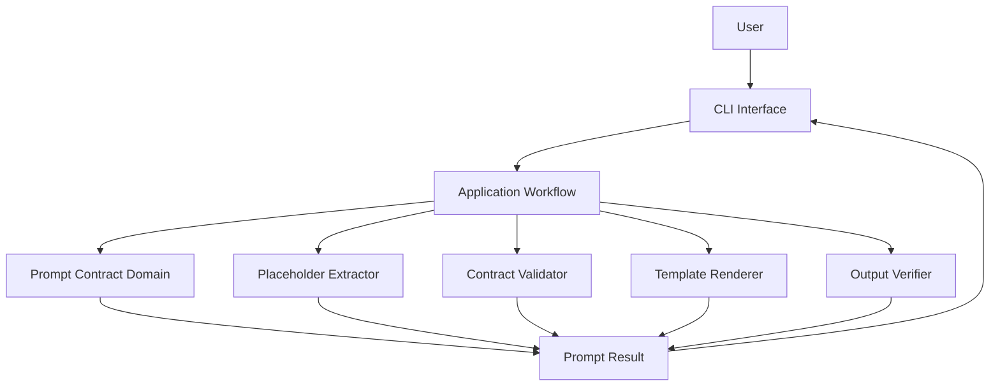
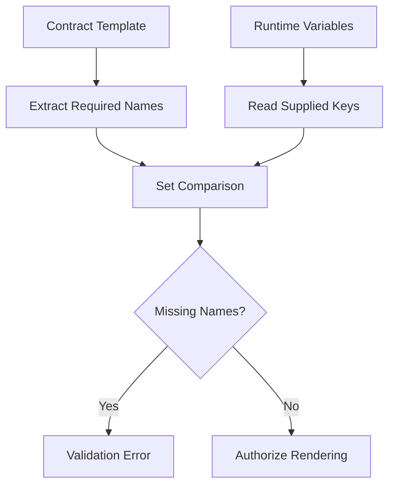
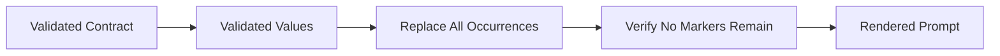
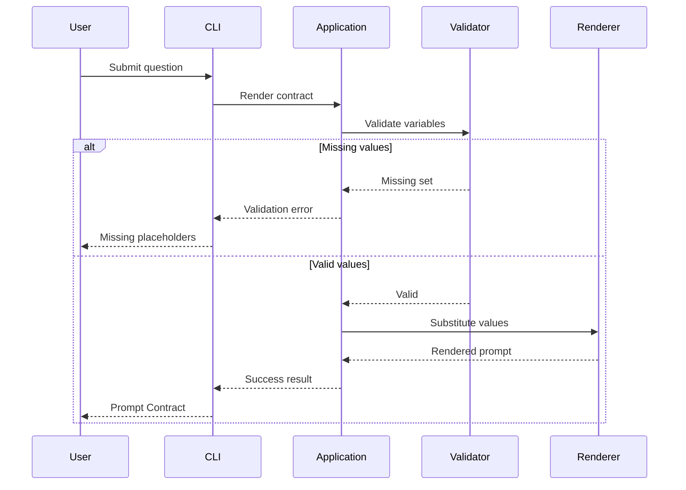
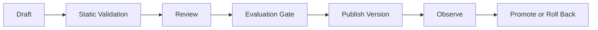

# Prompt Contract Lab
## Engineering Project Note

> **Invariant:** a prompt must satisfy its contract before it crosses a model-provider boundary.
>
> **Pipeline:** **DEFINE → EXTRACT → VALIDATE → RENDER → VERIFY → DELIVER**

---

# 1. Project Overview

Prompt Contract Lab is a Python CLI that converts a structured prompt contract and runtime variables into a validated, deterministic prompt.

The implemented workflow:

- defines a contract,
- extracts required placeholders,
- validates supplied values,
- rejects incomplete input,
- renders the template,
- verifies that no supported placeholders remain,
- returns the rendered contract through a CLI.

The model call is outside this workflow. Prompt preparation is therefore deterministic, provider-independent, and testable without network access.

## Scope

| Capability | Current Behavior |
|---|---|
| Contract definition | Static version, role, objective, rules, input, and output format |
| Placeholder syntax | Double braces, for example `{{question}}` |
| Extraction | Distinct required names are derived from the template |
| Validation | Required names are compared with supplied keys |
| Rendering | Every occurrence is replaced with its validated value |
| Verification | Unresolved supported markers fail the workflow |
| Delivery | Typer-based CLI |
| Tests | Extraction, validation, rendering, and boundary behavior |

Explicit non-goals include provider execution, model-quality evaluation, response-schema validation, persistent storage, and registry workflows.

---

# 2. Problem Statement

Prompt strings embedded across application code introduce avoidable failure modes:

| Failure Mode | Engineering Impact |
|---|---|
| Duplicated prompt text | Changes diverge across call sites |
| Manually tracked variables | Templates and input requirements drift |
| Missing runtime values | Partially rendered prompts reach the provider |
| Implicit output requirements | Downstream parsing becomes unreliable |
| SDK-coupled construction | Prompt policy changes with provider code |
| Unversioned edits | Evaluations and regressions are difficult to reproduce |
| Mixed validation and rendering | Failures become late and ambiguous |

Prompt Contract Lab centralizes these concerns behind one application path:

```text
contract + runtime values
            ↓
extract → validate → render → verify
            ↓
rendered prompt or explicit error
```

---

# 3. Architecture



The implementation follows a simplified Clean Architecture dependency rule:

> Stable prompt policy does not depend on CLI frameworks, persistence, or model-provider SDKs.

## Layer Responsibilities

| Layer | Responsibility | Excludes |
|---|---|---|
| Domain | Contract concepts, invariants, and prompt-policy semantics | CLI parsing, storage, network calls |
| Application | Executes the contract-rendering use case | Framework-specific presentation |
| Ports | Defines future external boundaries | Concrete database or SDK behavior |
| Infrastructure | Implements loaders, registries, stores, or provider adapters | Core validation policy |
| Interfaces | Converts CLI input into use-case input and presents results | Extraction and rendering rules |

```text
CLI / API / Worker
        ↓
Application Workflow
        ↓
Domain + Deterministic Components
        ↑
Ports ← Infrastructure Adapters
```

The CLI may depend on the application layer. Domain code must not import Typer, FastAPI, databases, or provider SDKs.

---

# 4. Project Structure

```text
prompt-contract-lab/
├── docs/
│   └── PROJECT_NOTE.md
├── evals/
├── tests/
├── src/
│   └── prompt_contract/
│       ├── application/
│       ├── domain/
│       ├── infrastructure/
│       ├── interfaces/
│       └── ports/
├── README.md
└── pyproject.toml
```

| Path | Responsibility |
|---|---|
| `docs/` | Engineering design and production notes |
| `evals/` | Future model-behavior evaluation evidence |
| `tests/` | Deterministic component and workflow verification |
| `domain/` | Prompt Contract concepts and invariants |
| `application/` | Use-case orchestration |
| `ports/` | Abstract external boundaries |
| `infrastructure/` | Concrete external adapters |
| `interfaces/` | CLI and future delivery mechanisms |
| `pyproject.toml` | Package metadata, dependencies, and tooling |

Directory responsibilities are stable even if implementation filenames evolve.

---

# 5. Prompt Contract Model

```text
Version:
v1.0

ROLE
Senior AI Assistant

OBJECTIVE
Answer the user's question accurately using the supplied context.

RULES
- Never hallucinate.
- Use only supplied context.
- State when information is missing.
- Be concise.

INPUT

Question:
{{question}}

Context:
{{context}}

OUTPUT FORMAT

Markdown

Sections:
- Answer
- Explanation
- References
```

## Section Semantics

| Section | Responsibility |
|---|---|
| Version | Identifies the contract revision used to render |
| Role | Establishes the operating perspective |
| Objective | Defines the task |
| Rules | Captures behavior and application constraints |
| Input | Contains runtime data and placeholders |
| Output Format | Declares the requested response structure |

A template performs substitution. A prompt contract adds identity, policy, required inputs, and output expectations around that template.

The output section is declarative. It does not guarantee model compliance; response validation remains a separate boundary.

## Contract Identity

The current project carries an explicit version but does not implement a registry. A production render should resolve an immutable identity:

```text
contract_id + contract_version + template_digest
```

That identity should accompany evaluations, traces, and response records.

---

# 6. Components

## 6.1 Prompt Contract Domain

The domain represents version, role, objective, rules, input template, and requested output format. It is independent of how a contract is loaded and where the result is delivered.

Core invariants:

1. Rendering does not begin when required values are missing.
2. Duplicate placeholders represent one required variable.
3. Every occurrence receives the same value.
4. Identical contracts and inputs produce identical text.
5. Provider execution does not occur in the renderer.
6. Validation errors identify every missing field.
7. No supported placeholder may remain in a successful result.

## 6.2 Placeholder Extractor

Input:

```text
Question: {{question}}
Context: {{context}}
Restated question: {{question}}
```

Result:

```python
{"question", "context"}
```

The extractor performs discovery only. Expected properties:

- deterministic output,
- duplicate elimination,
- explicit supported syntax,
- Unicode-safe surrounding text,
- stable behavior with no placeholders.

For a template of length `n`, extraction should be approximately `O(n)`.

## 6.3 Contract Validator

The validator compares required placeholders with supplied keys:

```text
missing = required_placeholders - supplied_keys
```

Current policy:

| Condition | Behavior |
|---|---|
| Required key missing | Reject |
| Several keys missing | Reject and report all |
| Required key present | Accept |
| Duplicate placeholder | Validate once |
| Empty optional value | Accept when permitted |
| Unknown supplied key | Ignore |
| Case mismatch | Treat as a different key |

Missing and empty are different states. An absent key violates the contract; a supplied empty string is data. A future schema should model required, optional, nullable, and non-empty constraints directly.

## 6.4 Template Renderer

The renderer receives a validated template and values, replaces every supported occurrence, and returns text.

It must not:

- infer missing values,
- select or call a model,
- retry network requests,
- modify prompt policy,
- sanitize or summarize input,
- parse the eventual model response.

This narrow responsibility keeps rendering side-effect free and exact-output tests reliable.

## 6.5 Output Verifier

After substitution, the workflow verifies that no supported markers remain. This protects against extractor/renderer disagreement, malformed substitution, and partially rendered output.

Verification is defense in depth; it does not replace pre-render validation.

## 6.6 Application Workflow

```text
load contract
→ extract placeholders
→ validate values
→ render template
→ verify output
→ return result
```

The application layer turns component outcomes into a success result or explicit application error. It does not own CLI formatting.

## 6.7 Ports and Infrastructure

Future ports may define:

- `ContractRepository`,
- `ContractLoader`,
- `ContractPublisher`,
- `PromptProvider`,
- `EvaluationStore`.

Adapters may use YAML, JSON, PostgreSQL, object storage, remote registries, or provider SDKs. Adding an adapter must not change core validation semantics.

---

# 7. Validation Pipeline



## Sequence

1. Resolve the selected contract version.
2. Extract the distinct supported placeholders.
3. Build the supplied-key set.
4. Compute all missing names.
5. Return one error containing the full missing set.
6. Continue only when the set is empty.

Given:

```python
required = {"question", "context"}
supplied = {"question"}
```

the request fails:

```text
Missing placeholder:
context
```

The application does not leave `{{context}}` unresolved, invent a default, or call a provider.

## Policy Evolution

| Decision | Current Policy | Production Direction |
|---|---|---|
| Unknown variables | Ignore | Configurable reject/ignore policy |
| Empty strings | Allowed when optional | Field-level constraint |
| Optional fields | Implicit | Explicit metadata |
| Type validation | Not implemented | Per-field schema |
| Nested values | Not implemented | Documented path syntax |
| Case sensitivity | Sensitive | Preserve unless aliases are defined |
| Maximum size | Not implemented | Field and aggregate limits |

---

# 8. Rendering Pipeline



Template:

```text
Question: {{question}}
Context: {{context}}
```

Values:

```python
{
    "question": "What is Prompt Engineering?",
    "context": "Prompt engineering is the design of model instructions.",
}
```

Result:

```text
Question: What is Prompt Engineering?
Context: Prompt engineering is the design of model instructions.
```

## Determinism

```text
same contract version
+ same template
+ same values
= same rendered prompt
```

This enables exact-output tests, snapshot regression checks, reproducible evaluations, prompt-diff review, rollback, and defect reproduction.

The renderer preserves Unicode, Markdown, line breaks, long text, and permitted empty values. Escaping or sanitization belongs at the destination boundary.

## Complexity

| Operation | Expected Cost |
|---|---|
| Extraction | Approximately `O(n)` in template length |
| Set validation | `O(p + v)` for placeholders and variables |
| Rendering | Proportional to template plus replacement size |

Caching extracted placeholders by immutable contract version is the first useful scale optimization.

---

# 9. CLI Flow



Command:

```bash
python -m prompt_contract.interfaces.cli \
  "What is Prompt Engineering?"
```

The CLI accepts input, builds the variable mapping, invokes the application workflow, and presents a prompt or validation error.

```text
CLI output = rendered prompt
CLI output ≠ LLM response
```

The CLI does not measure factual accuracy, hallucination rate, latency, or token cost because no model is invoked.

---

# 10. Design Decisions

| Decision | Rationale | Trade-off |
|---|---|---|
| Contracts over scattered strings | Centralizes policy and required inputs | Adds structure to simple prompts |
| Template-derived required fields | Avoids schema/template drift | Requires explicit syntax |
| Validation before rendering | Prevents partial prompts | Adds a pipeline stage |
| Separate extractor, validator, renderer | Isolates change and failure causes | More components |
| Side-effect-free renderer | Enables deterministic tests | Provider calls require another boundary |
| Provider-independent domain | Preserves behavior across SDK changes | Integrations need adapters |
| Thin CLI | Prevents a second policy path | Delivery layer remains limited |
| Explicit version | Makes prompt changes traceable | Governance remains manual |
| Structured failures | Makes missing input an expected outcome | Requires stable error contracts |

Each component has one primary reason to change:

| Component | Changes When |
|---|---|
| Extractor | Placeholder syntax changes |
| Validator | Field policy changes |
| Renderer | Substitution semantics change |
| Application | Workflow or result contract changes |
| CLI | Terminal input or presentation changes |

---

# 11. Testing Strategy

The test suite should prove that every contract succeeds and fails predictably.

## Component Coverage

| Component | Required Cases |
|---|---|
| Extractor | One, several, duplicate, none, Unicode surroundings |
| Validator | Complete, one missing, many missing, unknown key |
| Renderer | Exact substitution, repeats, empty value, formatting |
| Verifier | No markers, unresolved marker, malformed-marker policy |
| Application | Successful orchestration and error propagation |
| CLI | Input mapping, rendered output, visible failure |

## Boundary Matrix

| Case | Expected Result |
|---|---|
| Zero missing fields | Render |
| One missing field | Reject |
| Several missing fields | Reject and report all |
| Duplicate required field | Validate once; render every occurrence |
| Empty permitted context | Preserve empty string |
| Extra variable | Ignore under current policy |
| No placeholders | Return stable template |
| Unresolved supported marker | Fail verification |

Content tests verify that Unicode, Markdown, line breaks, long input, punctuation, and repeated values are unchanged.

## Regression Discipline

For a meaningful contract change:

1. increment the contract version,
2. review the rendered diff,
3. update exact-output fixtures intentionally,
4. rerun extraction and validation tests,
5. rerun model evaluations after provider execution exists.

The supplied project material records Pytest coverage for extraction, validation, rendering, missing-placeholder rejection, successful rendering, and invalid-contract rejection.

Pass counts and filenames should come from the active repository run rather than a permanently copied transcript.

---

# 12. Evaluation Boundary

Deterministic tests answer:

```text
Was the intended prompt constructed correctly?
```

Model evaluations answer:

```text
Did the model behave acceptably for this prompt and test case?
```

Current construction experiments cover:

| Experiment | Expected Result |
|---|---|
| Basic question | Render |
| Empty permitted context | Render |
| Missing placeholder | Reject |
| Duplicate placeholder | Replace all occurrences |
| Long prompt | Preserve content |
| Unicode input | Preserve characters |
| Markdown input | Preserve formatting |

Future evaluations should record contract identity, provider, model, parameters, test-case ID, prompt digest, response, grader result, latency, and token usage.

---

# 13. Security and Data Handling

Structural validation does not establish that input is safe, true, authorized, or appropriate to send to a model.

| Risk | Required Control |
|---|---|
| Prompt injection | Separate trusted instructions from untrusted content |
| Sensitive data | Apply classification, redaction, retention, and access policy |
| Secret leakage | Prohibit credentials in contracts |
| Oversized input | Enforce character and token budgets |
| Unauthorized changes | Require ownership, review, and immutable versions |
| Cross-tenant exposure | Isolate input, traces, and logs by tenant |
| Invalid model output | Validate response schemas after execution |
| Unsafe HTML/Markdown | Sanitize at the presentation boundary |
| Log leakage | Record metadata by default; restrict prompt logging |

Recommended audit metadata:

```text
request_id
contract_id
contract_version
template_digest
input_field_names
validation_result
error_code
provider
model
```

Raw values and rendered prompts should not be logged by default when they may contain user or business data.

---

# 14. Production Considerations

## Contract Storage and Publication

Published contracts should be immutable. A change creates a new version rather than rewriting historical behavior.

Storage should support stable IDs, versions, ownership, timestamps, template digests, lifecycle status, and rollback.



Static publication checks should reject unresolved placeholders, schema/template mismatches, duplicate versions, missing ownership, unsupported syntax, and forbidden secrets.

## Variable Schema

A production contract should declare:

```text
name
type
required
nullable
allow_empty
maximum_length
sensitivity
description
```

Placeholder discovery confirms template use; the schema enforces value semantics.

## Provider Boundary

```text
Prompt Contract Pipeline
        ↓
Rendered Prompt
        ↓
Provider Port
        ↓
Provider Adapter
        ↓
Model Response
        ↓
Output Validation
```

Provider selection, retries, timeouts, rate limits, token accounting, and provider errors remain outside the renderer.

## Observability

Measure:

- validation failures by contract version,
- missing-field frequency,
- render latency and prompt size,
- provider latency and failure rate,
- token usage and cost,
- response-schema failures,
- evaluation score by version,
- publication, rollback, and deprecation events.

## Performance

Production safeguards should include:

- maximum contract and field sizes,
- maximum rendered-prompt size,
- cached extraction for immutable versions,
- precompiled placeholder patterns,
- bounded error payloads,
- large-template benchmarks,
- token-budget validation.

Correctness and explicit failures take priority over micro-optimization.

---

# 15. Limitations

- Static prompt contract
- Plain-text template format
- No YAML or JSON loader
- No persistent registry
- No immutable version history
- No typed variable schema
- No conditional or nested placeholders
- No contract composition
- No provider integration
- No response-schema validation
- No authentication or authorization
- No approval or promotion workflow
- No CI evaluation gate
- No prompt-token budget

These constraints define the current project boundary; they are not hidden production claims.

---

# 16. Future Improvements

| Priority | Improvement | Engineering Outcome |
|---:|---|---|
| 1 | Typed variable schema | Required, optional, type, size, and sensitivity policy |
| 2 | YAML and JSON loaders | Reviewable contracts outside source code |
| 3 | Immutable registry | IDs, history, ownership, and rollback |
| 4 | FastAPI interface | Service boundary with structured errors |
| 5 | Response validation | Verify JSON or typed model output |
| 6 | Evaluation framework | Gate versions with reproducible cases |
| 7 | Provider adapters | OpenAI, Anthropic, Gemini, or local models |
| 8 | Observability | Version-aware traces, metrics, cost, and failures |
| 9 | Approval workflow | Draft, review, publish, deprecate, rollback |
| 10 | CI/CD integration | Static and evaluation gates on changes |

Additional candidates include conditional rendering, contract composition, model-specific variants, token budgeting, database storage, Docker, and LangChain or LangGraph adapters.

---

# 17. Key Takeaways

- Prompt preparation completes before provider execution.
- A contract includes policy, required inputs, output expectations, and version identity—not only a template.
- Placeholder extraction removes a manually maintained source of truth.
- Missing values fail before rendering.
- Rendering is deterministic, side-effect free, and provider-independent.
- Output verification protects against partial rendering.
- A thin interface prevents policy duplication across delivery mechanisms.
- Output instructions do not replace response validation.
- Structural completeness does not replace authorization, injection defenses, or data governance.
- Immutable versions and evaluation evidence are required for reproducible production changes.

---

# 18. Project Status

```text
IMPLEMENTED
→ Prompt Contract CLI
→ Placeholder extraction
→ Required-value validation
→ Deterministic rendering

VERIFIED SCOPE
→ Extraction, validation, and rendering behavior
→ Duplicate, empty, long, Unicode, and Markdown cases

NOT IMPLEMENTED
→ Provider execution
→ Registry and persistent versioning
→ Response-schema validation
→ Production approval and evaluation workflow
```

---

# License

MIT License.
