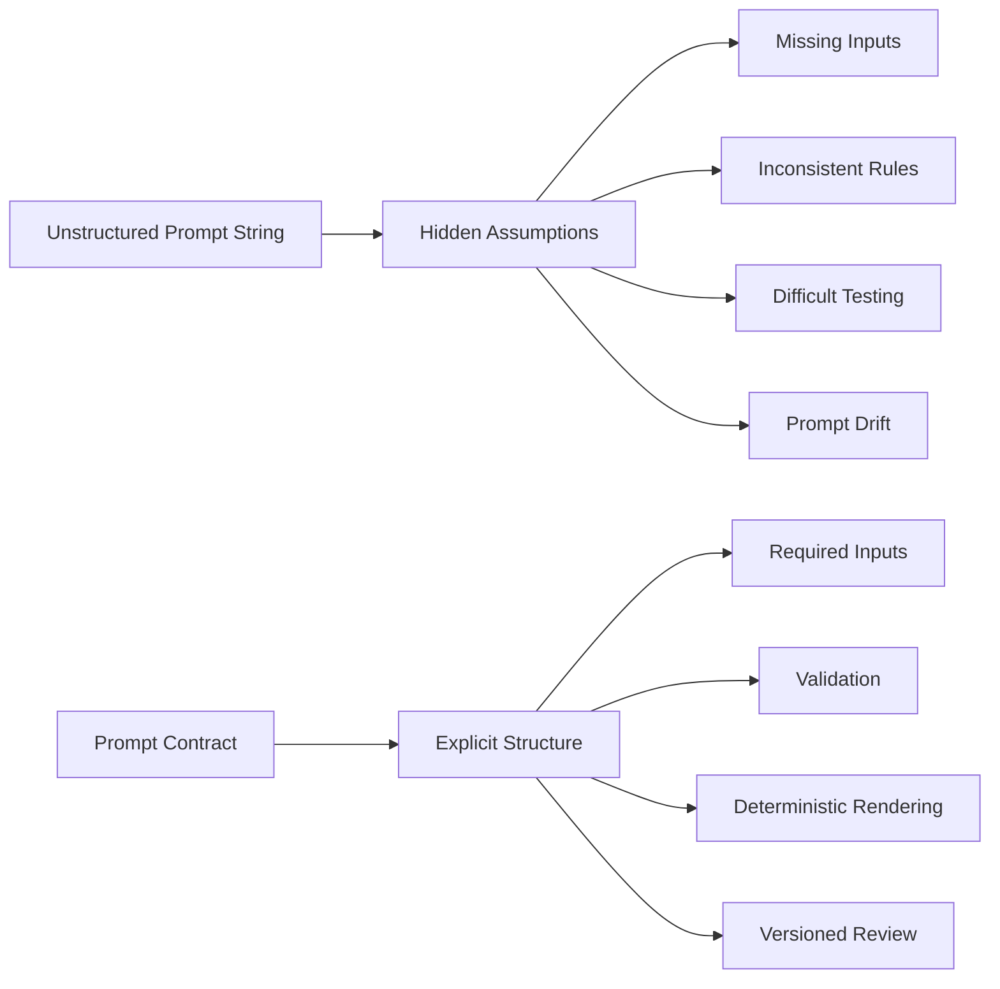
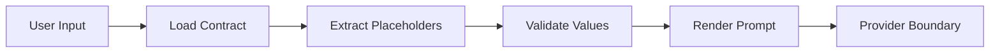
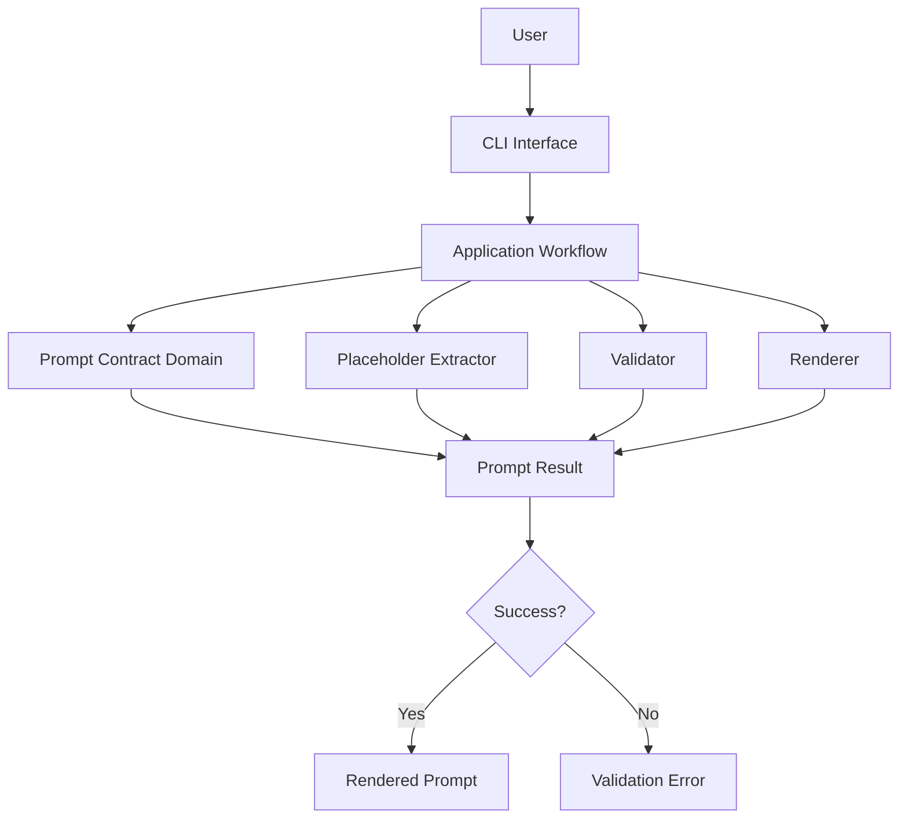
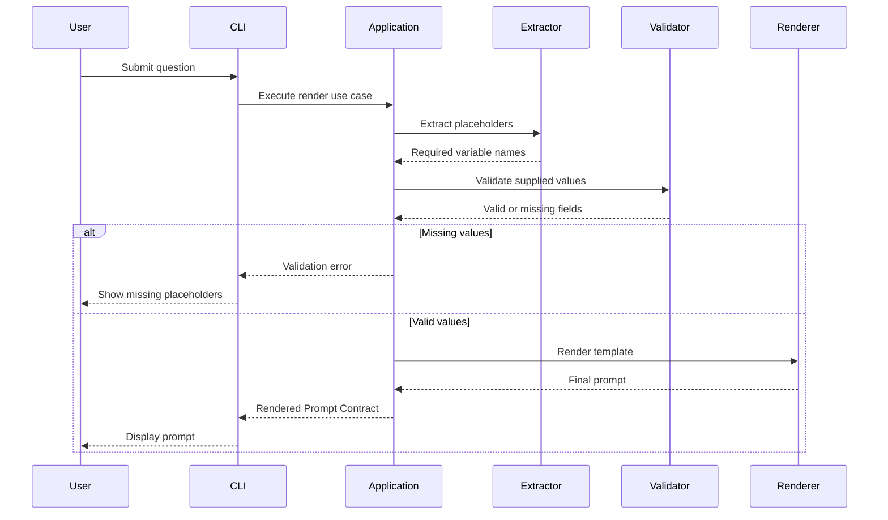
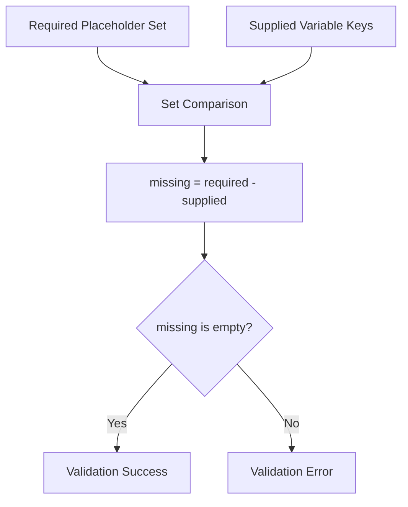
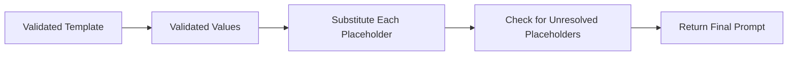
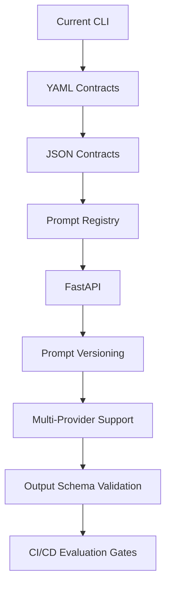
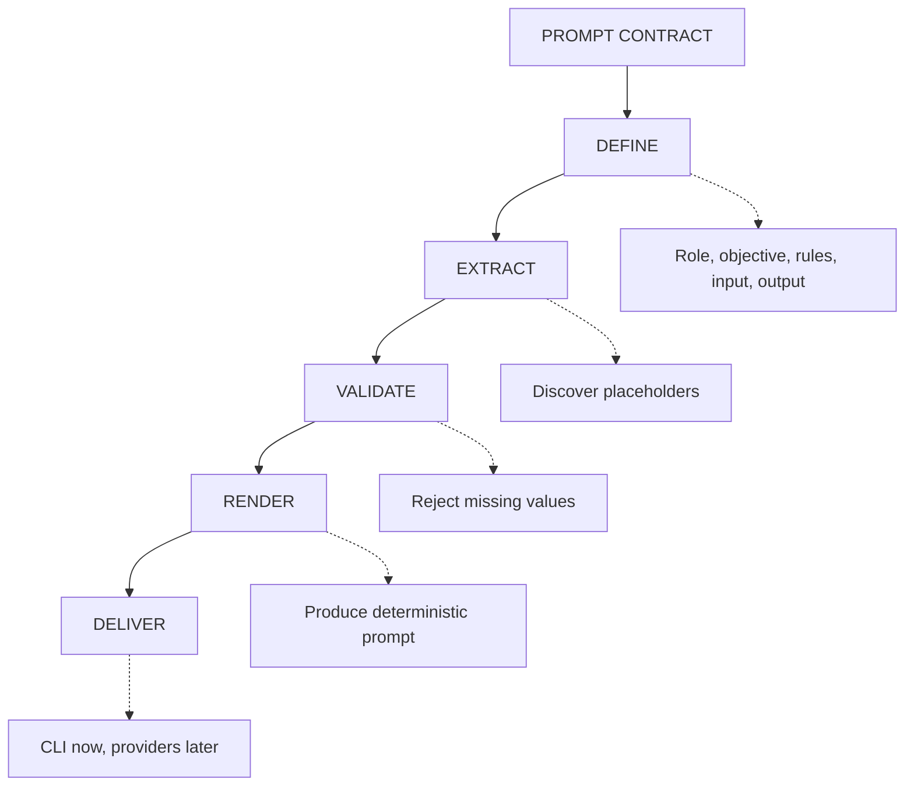

# Prompt Contract Lab
## AI Product Engineering — Engineering Project Note

> **Core question:** How can an AI application define, validate, and render prompts predictably before sending them to a Large Language Model?
>
> **Memory hook:** **DEFINE → EXTRACT → VALIDATE → RENDER → DELIVER**
>
> **Completion rule:** The project is complete only when the contract model, placeholder extraction, validation, rendering, CLI behavior, tests, and architecture decisions are understood and verified.

---

# 1. Project Overview

## 🧩 Prompt Contract Lab

Prompt Contract Lab is a production-inspired Python CLI for treating prompts as structured software artifacts.

Instead of constructing arbitrary strings and sending them directly to a model, the system:

- defines a Prompt Contract,
- discovers dynamic placeholders,
- validates required values,
- rejects incomplete requests,
- renders the final prompt deterministically,
- presents the result through a CLI.

The project focuses on a critical AI Product Engineering principle:

> **A prompt should satisfy its contract before a model receives it.**

The goal is not only text substitution.

The goal is learning how production AI systems make prompts:

- explicit,
- reusable,
- reviewable,
- testable,
- deterministic,
- easier to evolve.

---

# 2. Why Prompt Contracts Exist

LLM applications frequently begin with a prompt embedded directly inside code:

```python
prompt = f"Answer this question: {question}"
```

This works for a prototype.

It becomes risky when the application introduces:

- multiple tasks,
- several input variables,
- role instructions,
- business rules,
- required output formats,
- multiple developers,
- prompt evaluations,
- provider integrations.

Prompt Contracts exist to turn implicit prompt assumptions into explicit software rules.



A Prompt Contract is not a guarantee that the model will answer correctly.

It is a guarantee that the application constructed the prompt according to defined rules before execution.

---

# 3. The Problem Prompt Contracts Solve

## 3.1 Hidden prompt policy

When prompts are scattered across functions, business rules become hard to locate.

A developer may change one prompt while leaving another inconsistent.

## 3.2 Missing runtime values

Templates may require values such as:

```text
{{question}}
{{context}}
{{language}}
```

Without validation, one or more values may remain unresolved.

## 3.3 Unstable output expectations

If output instructions are implicit, different application paths may request different response formats.

## 3.4 Difficult testing

Random string construction makes it harder to prove that the same inputs produce the same final prompt.

## 3.5 Provider coupling

If prompt construction occurs inside provider SDK code, changing the provider can force changes to prompt policy.

## 3.6 Poor reviewability

A Prompt Contract makes role, objective, rules, inputs, and output requirements visible in one place.

---

# 4. Engineering Mindset

Beginner workflow:

```text
User Input
    ↓
Build String
    ↓
Call Model
```

Production-inspired workflow:



The application owns prompt correctness.

The provider only receives a prompt that has passed the application's contract rules.

---

# 5. Project Goals

| Goal | Why It Matters |
|---|---|
| Define prompt structure | Makes role, objective, rules, inputs, and output format visible |
| Extract placeholders | Removes manual tracking of required variables |
| Validate before rendering | Prevents incomplete prompts |
| Render deterministically | Makes tests and evaluations reproducible |
| Separate architecture layers | Keeps policy independent of CLI and providers |
| Expose a CLI | Creates a direct developer workflow |
| Preserve extensibility | Supports future storage, APIs, and provider integrations |

---

# 6. Real-World Examples

## 6.1 Retrieval-Augmented Generation

A RAG prompt may require:

```text
{{question}}
{{retrieved_context}}
```

The contract should fail before the provider call when retrieved context is missing and the workflow requires it.

## 6.2 Customer Support

A support assistant may require:

```text
{{customer_message}}
{{account_context}}
{{policy_excerpt}}
```

The contract makes required business context explicit.

## 6.3 Structured Data Extraction

A document extraction prompt may require:

```text
{{document_text}}
{{target_schema}}
```

The output format section can describe the expected JSON structure.

## 6.4 Content Review

A moderation prompt may require:

```text
{{content}}
{{policy}}
```

The contract separates policy text from user content.

## 6.5 Evaluation Harness

A test runner can render the same contract with multiple examples and compare model behavior while keeping prompt construction stable.

> These examples illustrate production applications of the architecture. They are not claims that those integrations are already implemented in this repository.

---

# 7. Feature Map

| Capability | Purpose |
|---|---|
| Prompt Contract | Defines the prompt specification |
| Contract Version | Identifies the prompt revision |
| Role Definition | Establishes the model's operating role |
| Objective Definition | States the task |
| Rule Set | Defines behavioral constraints |
| Input Section | Declares runtime values |
| Output Format | Describes expected response structure |
| Placeholder Extraction | Discovers required variables |
| Validation | Rejects missing values |
| Deterministic Rendering | Produces stable prompt text |
| CLI Interface | Provides developer access |
| Pytest Verification | Confirms predictable behavior |
| Clean Architecture | Isolates core policy |

---

# 8. System Architecture



The architecture follows a simplified Clean Architecture.

Core prompt rules remain independent from:

- Typer,
- FastAPI,
- OpenAI,
- Anthropic,
- Gemini,
- databases,
- remote registries.

---

# 9. Clean Architecture Explanation

Clean Architecture organizes software around stable business rules rather than frameworks.

For Prompt Contract Lab, the stable rules are:

- what a Prompt Contract represents,
- how required placeholders are discovered,
- when validation succeeds or fails,
- when rendering is allowed,
- what deterministic output means.

Frameworks are implementation details.

```text
Outside
────────────────────────────────────────
CLI / Future API / Future Provider
Infrastructure / Storage / Frameworks
────────────────────────────────────────
Application Workflow
────────────────────────────────────────
Prompt Contract Domain
────────────────────────────────────────
Inside
```

Dependencies should point inward.

The domain should not import the CLI.

The renderer should not call an LLM.

The validator should not read terminal arguments.

The CLI should not duplicate contract policy.

### Dependency Rule

> High-level prompt policy must not depend on low-level delivery or provider details.

---

# 10. Project Structure

```text
prompt-contract-lab/
│
├── docs/
│   └── PROJECT_NOTE.md
│
├── evals/
├── tests/
│
├── src/
│   └── prompt_contract/
│       ├── application/
│       ├── domain/
│       ├── infrastructure/
│       ├── interfaces/
│       └── ports/
│
├── README.md
└── pyproject.toml
```

The documentation intentionally avoids inventing implementation filenames that were not supplied.

---

# 11. Folder Structure Explanation

| Path | Responsibility |
|---|---|
| `docs/` | Deep engineering notes, recall material, and design explanations |
| `evals/` | Prompt experiments and future evaluation evidence |
| `tests/` | Unit and behavior tests |
| `src/prompt_contract/domain/` | Prompt Contract concepts and deterministic rules |
| `src/prompt_contract/application/` | Coordinates extraction, validation, and rendering |
| `src/prompt_contract/ports/` | Defines future boundaries for storage or external services |
| `src/prompt_contract/infrastructure/` | Contains future concrete adapters such as file loaders or registries |
| `src/prompt_contract/interfaces/` | Contains the CLI delivery mechanism |
| `README.md` | Portfolio-facing repository overview |
| `pyproject.toml` | Python project metadata and dependencies |

---

# 12. Module Explanation

The current project description establishes conceptual modules rather than exact implementation filenames.

## 12.1 Prompt Contract Domain

The domain represents the contract and its invariants.

It can own concepts such as:

- contract version,
- role,
- objective,
- rules,
- template,
- expected output format.

The domain should not know whether input came from a CLI, API, test, or background job.

## 12.2 Placeholder Extractor

The extractor scans the template for dynamic fields.

Input:

```text
Question: {{question}}
Context: {{context}}
```

Output:

```python
["question", "context"]
```

Its responsibility is discovery only.

It should not validate business values or render the template.

## 12.3 Contract Validator

The validator compares required placeholders with supplied variables.

It decides whether rendering may continue.

It should report missing values explicitly.

## 12.4 Template Renderer

The renderer replaces placeholders with validated values.

It should be deterministic and side-effect free.

It should not call providers or change business rules.

## 12.5 Application Workflow

The application layer coordinates:

```text
contract → extract → validate → render → result
```

It is the use-case boundary.

## 12.6 Ports

Ports define abstractions for future capabilities such as:

- loading contracts,
- storing versions,
- retrieving contracts,
- sending rendered prompts to a provider.

No such external integration should be required for the core learning implementation.

## 12.7 Infrastructure

Infrastructure can later implement ports using:

- YAML files,
- JSON files,
- databases,
- remote prompt registries,
- provider SDKs.

## 12.8 CLI Interface

The CLI receives user input and prints either:

- the rendered Prompt Contract,
- or a validation error.

It should delegate behavior to the application layer.

## 12.9 Tests

Tests verify extraction, validation, rendering, and failure behavior.

## 12.10 Evals

The `evals/` directory can preserve experiments that evaluate prompt behavior beyond deterministic construction.

The current documented experiments focus on rendering behavior, not provider response quality.

---

# 13. Internal Workflow



---

# 14. Prompt Contract Anatomy

A production-inspired Prompt Contract may contain:

```text
Version:
v1.0

ROLE
Senior AI Assistant

OBJECTIVE
Answer the user's question accurately using the supplied context.

RULES
- Never hallucinate.
- Use only supplied context.
- If information is missing, say you do not know.
- Be concise.

INPUT

Question:
{{question}}

Context:
{{context}}

OUTPUT FORMAT

Markdown

Sections:
- Answer
- Explanation
- References
```

## Section Responsibilities

| Section | Responsibility |
|---|---|
| Version | Distinguishes contract revisions |
| Role | Establishes operating perspective |
| Objective | Defines the task |
| Rules | Defines constraints |
| Input | Declares runtime content |
| Output Format | States response expectations |

A template alone performs substitution.

A Prompt Contract adds meaning, expectations, and validation requirements around that template.

---

# 15. Code Walkthrough

The exact source filenames were not provided, so this walkthrough follows the documented behavior rather than claiming a specific implementation.

## 15.1 Define the template

```python
template = """
Question:
{{question}}

Context:
{{context}}
"""
```

## 15.2 Extract required placeholders

Conceptual behavior:

```python
required = extract_placeholders(template)
# {"question", "context"}
```

## 15.3 Receive variables

```python
values = {
    "question": "What is Prompt Engineering?",
    "context": "",
}
```

## 15.4 Validate

```python
missing = required - values.keys()

if missing:
    raise ValueError(f"Missing placeholders: {sorted(missing)}")
```

## 15.5 Render

```python
rendered = render_contract(template, values)
```

## 15.6 Return the result

```python
print(rendered)
```

The architectural point is more important than a specific function name:

```text
Discovery
    is separate from
Validation
    is separate from
Rendering
```

---

# 16. Placeholder Extraction

## 16.1 Input

```text
Hello {{name}}.
Your task is {{task}}.
```

## 16.2 Expected result

```python
["name", "task"]
```

## 16.3 Duplicate placeholders

Input:

```text
Question: {{question}}
Repeat: {{question}}
```

Required set:

```python
{"question"}
```

Rendering should replace both occurrences.

## 16.4 Extraction properties

A reliable extractor should be:

- deterministic,
- independent from provider SDKs,
- explicit about supported syntax,
- tested with duplicate placeholders,
- tested with Unicode surrounding text,
- tested with templates containing no placeholders.

## 16.5 Complexity

For a template of length `n`, extraction should generally be close to:

```text
O(n)
```

The template must be scanned to discover placeholder markers.

---

# 17. Validation Flow



## Validation equation

```text
Missing Variables =
Required Placeholders
-
Supplied Variable Keys
```

## Example

Required:

```python
{"question", "context"}
```

Supplied:

```python
{"question"}
```

Missing:

```python
{"context"}
```

Expected result:

```text
Missing placeholder:
context
```

## Validation design questions

A production implementation should define:

- whether empty strings are allowed,
- whether unknown variables are ignored,
- whether all missing values are reported together,
- whether variable names are case-sensitive,
- whether whitespace in placeholder names is valid,
- whether required and optional fields are modeled separately.

The current project documentation states:

| Rule | Behavior |
|---|---|
| Missing placeholder | Reject |
| Existing placeholder | Accept |
| Duplicate placeholder | Supported |
| Empty optional field | Allowed |
| Unknown variable | Ignored |

---

# 18. Rendering Flow



## Example

Template:

```text
Hello {{name}}
```

Values:

```python
{"name": "Zaid"}
```

Output:

```text
Hello Zaid
```

## Rendering rules

- Do not render before validation.
- Preserve supplied text.
- Replace every occurrence of a placeholder.
- Do not make network calls.
- Do not apply model-specific logic.
- Do not silently remove unknown placeholder markers.
- Return the same output for the same inputs.

---

# 19. Determinism

Determinism means:

```text
Same Contract
+ Same Contract Version
+ Same Inputs
= Same Rendered Prompt
```

This property enables:

- exact comparisons,
- snapshot tests,
- reproducible experiments,
- prompt regression detection,
- version-based rollback,
- stable debugging.

The model response may still be probabilistic.

Prompt rendering should not be.

---

# 20. CLI Workflow

Run:

```bash
python -m prompt_contract.interfaces.cli \
  "What is Prompt Engineering?"
```

The CLI should:

1. receive the question,
2. construct the input mapping,
3. call the application workflow,
4. display the rendered contract,
5. return a clear error when validation fails.

Expected output:

```text
========================
Prompt Contract
========================

Version:
v1.0

ROLE
Senior AI Assistant

OBJECTIVE
Answer the user's question accurately using the provided context.

RULES
- Never hallucinate.
- Use only the supplied context.
- If information is missing, say you do not know.
- Be concise and clear.

INPUT

Question:
What is Prompt Engineering?

Context:

OUTPUT FORMAT

Answer in Markdown.

Sections:

- Answer
- Explanation
- References (if available)
```

Important distinction:

```text
CLI Output = Rendered Prompt
CLI Output ≠ LLM Response
```

---

# 21. Testing Explanation

The project uses Pytest.

The documented test areas are:

- placeholder extraction,
- prompt rendering,
- contract validation,
- missing placeholder detection,
- successful rendering,
- invalid contract rejection.

Run:

```bash
pytest
```

Documented example:

```text
========================= test session starts =========================

collected 6 items

tests/test_extract_placeholders.py ...
tests/test_render_contract.py .
tests/test_validate_contract.py ..

========================== 6 passed ==========================
```

The exact transcript must be updated whenever the real test suite changes.

---

# 22. Testing Strategy

## 22.1 Unit Tests

Test each deterministic component independently:

| Component | Test Focus |
|---|---|
| Extractor | Required names, duplicates, no placeholders |
| Validator | Complete input, one missing field, many missing fields |
| Renderer | Exact substitution and preserved formatting |
| Application | Correct orchestration and error propagation |
| CLI | Input handling and visible output |

## 22.2 Boundary Tests

```text
0 missing values → render
1 missing value  → reject
N missing values → reject and report
```

## 22.3 Content Tests

| Input Shape | Expected Behavior |
|---|---|
| Empty allowed context | Preserve empty string |
| Long question | Preserve entire value |
| Unicode | Preserve characters |
| Markdown | Preserve formatting |
| Repeated placeholder | Replace every occurrence |
| Extra variable | Ignore under current rule |
| No placeholders | Return stable template if valid |
| Unresolved marker | Reject or fail verification |

## 22.4 Regression Tests

When a Prompt Contract changes:

- record the version change,
- update expected rendered output,
- confirm old assumptions are intentionally changed,
- rerun extraction and validation tests.

---

# 23. Verification Experiments

| Experiment | Expected Result | Documented Status |
|---|---|---|
| Basic Question | Prompt rendered | ✅ |
| Empty Context | Valid contract | ✅ |
| Missing Placeholder | Validation error | ✅ |
| Duplicate Placeholder | Render correctly | ✅ |
| Long Prompt | Render successfully | ✅ |
| Unicode Input | Supported | ✅ |
| Markdown Output | Preserved | ✅ |

The experiments verify prompt construction behavior.

They do not evaluate factual accuracy, hallucination rate, latency, or provider cost because no provider call is part of the documented core workflow.

---

# 24. Traditional Prompting vs Prompt Contracts

| Traditional Prompting | Prompt Contracts |
|---|---|
| Random text | Structured specification |
| Manual editing | Controlled rendering |
| Hidden variables | Explicit placeholders |
| Missing values discovered late | Pre-render validation |
| Difficult testing | Deterministic behavior |
| Low reusability | Reusable contracts |
| No clear version discipline | Version-aware design |
| Provider logic can be mixed in | Provider-independent core |
| Output format is informal | Output requirements are declared |

---

# 25. Production Use Cases

| Use Case | Required Contract Inputs | Contract Benefit |
|---|---|---|
| RAG assistant | Question, retrieved context | Prevents context-free execution |
| Support assistant | Customer message, policy context | Enforces consistent rules |
| Data extraction | Document, schema | Declares structured output |
| Agent planning | Goal, tool descriptions | Creates repeatable planning instructions |
| Content review | Content, moderation policy | Separates data from policy |
| Report generation | Metrics, reporting period | Requires complete report inputs |
| Evaluation harness | Test case, context | Makes prompt comparisons reproducible |

---

# 26. Best Practices

1. Keep Prompt Contracts centralized.
2. Use explicit placeholder syntax.
3. Validate before rendering.
4. Report every missing field clearly.
5. Keep the renderer side-effect free.
6. Keep provider integrations outside the domain.
7. Version meaningful prompt changes.
8. Test exact rendered output where appropriate.
9. Separate user input from trusted system rules.
10. Validate model output in a separate boundary.
11. Preserve evaluation examples for important contract versions.
12. Review prompt changes like code changes.

---

# 27. Common Mistakes

## Mistake 1: Prompt strings everywhere

Problem:

```text
Multiple functions
→ multiple prompt copies
→ inconsistent behavior
```

Better:

```text
One contract
→ one validation path
→ one rendering path
```

## Mistake 2: Rendering before validation

Problem:

```text
Question: What is AI?
Context: {{context}}
```

Better:

```text
Reject: missing context
```

## Mistake 3: Mixing model calls into the renderer

The renderer should transform data.

It should not:

- select a provider,
- send HTTP requests,
- retry failures,
- parse model output.

## Mistake 4: Treating output instructions as guarantees

A contract can request JSON.

The application must still validate whether the model actually returned valid JSON.

## Mistake 5: Ignoring version changes

A small prompt edit can change model behavior.

Meaningful changes should be versioned and evaluated.

## Mistake 6: Logging sensitive prompts carelessly

Rendered prompts may contain private user or business data.

Logging must follow data-handling policy.

---

# 28. Performance Considerations

The core operations are lightweight.

## Placeholder extraction

Expected behavior:

```text
O(n)
```

where `n` is template length.

## Validation

With set-based comparison:

```text
O(p + v)
```

where:

- `p` = number of required placeholders,
- `v` = number of supplied variables.

## Rendering

Rendering is generally proportional to template size plus replacement content.

## Production optimization ideas

- cache extracted placeholders by contract version,
- avoid reparsing unchanged templates,
- precompile placeholder patterns,
- enforce maximum template and input sizes,
- benchmark large contracts,
- avoid premature complexity.

Correctness should remain more important than micro-optimization.

---

# 29. Security Considerations

Prompt Contract validation is not a complete security layer.

It confirms structural completeness.

It does not prove that input is safe, true, or authorized.

Production controls may include:

| Risk | Consideration |
|---|---|
| Prompt injection | Keep trusted rules separate from untrusted content |
| Sensitive data exposure | Avoid uncontrolled prompt logging |
| Secret leakage | Never embed API keys or secrets in templates |
| Oversized input | Enforce size and token budgets |
| Malicious template changes | Require review and version history |
| Invalid model output | Validate response schemas separately |
| Audit requirements | Record contract ID and version |
| Cross-tenant data | Isolate input and logs by tenant |
| Unsafe HTML/Markdown | Sanitize at the presentation boundary |

> Contract validation answers: “Are required inputs present?”  
> Security review answers: “Should this content be processed, logged, or trusted?”

---

# 30. Production Considerations

A production platform may extend the project with:

- YAML or JSON contract files,
- a prompt registry,
- semantic versioning,
- immutable published versions,
- approval workflows,
- environment promotion,
- provider compatibility metadata,
- model-specific variants,
- output schema validation,
- tracing and observability,
- rollback support,
- contract ownership metadata,
- access control,
- evaluation gates.

These are future extensions, not current implementation claims.

---

# 31. Current Limitations

The learning implementation intentionally remains small.

Documented limitations:

- static Prompt Contract,
- plain-text templates,
- no YAML contracts,
- no JSON contracts,
- no prompt registry,
- no prompt version history,
- no database storage,
- no provider integration,
- no schema validation,
- no conditional rendering,
- no nested placeholders.

The goal is to understand the contract pipeline before building a full prompt management platform.

---

# 32. Future Improvements



Planned ideas:

- YAML Prompt Contracts
- JSON Prompt Contracts
- Prompt versioning
- Prompt registry
- conditional templates
- nested placeholders
- variable schema validation
- required and optional metadata
- FastAPI
- LangChain integration
- LangGraph integration
- AI agent support
- database storage
- Docker
- GitHub Actions
- multi-provider prompt management
- structured output validation
- approval workflows

---

# 33. Engineering Lessons Learned

1. Prompt quality depends on process, not only wording.
2. A template is not automatically a contract.
3. Required inputs should be discovered and validated.
4. Validation belongs before rendering.
5. Rendering should be deterministic.
6. Domain rules should not depend on provider SDKs.
7. Delivery interfaces should remain thin.
8. Failure behavior is part of system design.
9. Prompt versions matter for reproducibility.
10. Model output validation is a separate responsibility.
11. Security controls must extend beyond structural validation.
12. Tests should cover malformed and incomplete input, not only successful rendering.

---

# 34. Learning Outcomes

After completing this project, I can explain:

| Topic | Learning Outcome |
|---|---|
| Prompt Contract | Explain how it differs from a prompt string |
| Placeholder Extraction | Discover required template values |
| Validation | Detect missing runtime input |
| Rendering | Produce deterministic prompt text |
| Clean Architecture | Keep core rules independent from frameworks |
| CLI Design | Deliver the use case through a terminal interface |
| Testing | Verify success, failure, and boundary behavior |
| Performance | Describe extraction, validation, and rendering cost |
| Security | Distinguish structural validation from safety |
| Production Design | Explain registries, versions, approvals, and schema validation |

---

# 35. Skills Demonstrated

- Python
- CLI development
- Clean Architecture
- Prompt engineering
- Contract design
- Template rendering
- Input validation
- Unit testing
- Software design
- AI Product Engineering fundamentals
- Production trade-off analysis
- Technical documentation

---

# 36. Interview Questions

## Fundamentals

1. What is a Prompt Contract?
2. How is a Prompt Contract different from a template?
3. Why should prompts be treated as software artifacts?
4. Why is deterministic rendering useful?
5. Why should validation happen before rendering?

## Architecture

6. Why does prompt policy belong in the domain layer?
7. What should the application layer coordinate?
8. Why should the CLI remain thin?
9. What belongs behind a port?
10. How would a provider SDK be integrated without changing core validation?

## Placeholder Handling

11. How are required variables discovered?
12. How should duplicate placeholders behave?
13. What is the difference between a missing value and an empty value?
14. Should unknown variables be ignored or rejected?
15. How would you support optional placeholders?

## Testing

16. Which boundary cases should be tested?
17. Why test exact rendered output?
18. How would you prevent prompt regressions?
19. How would you test Unicode and Markdown content?
20. What does the current test suite verify?

## Production

21. How would you version Prompt Contracts?
22. How would you implement a prompt registry?
23. How would you validate model output?
24. How would you reduce prompt-injection risk?
25. How would you prevent sensitive prompt data from leaking through logs?
26. When would caching extracted placeholders help?
27. How would you add YAML contracts?
28. How would you support multiple providers?
29. What observability fields would you record?
30. What should happen when a published contract is changed?

---

# 37. Project Completion Gate

```text
[ ] Prompt Contract structure understood
[ ] Placeholder extraction implemented
[ ] Required-value validation implemented
[ ] Deterministic rendering implemented
[ ] Missing-placeholder behavior verified
[ ] Duplicate-placeholder behavior verified
[ ] Empty-context behavior verified
[ ] Unicode and Markdown behavior verified
[ ] CLI workflow verified
[ ] Clean Architecture boundaries understood
[ ] Tests passing
[ ] Production limitations documented
```

---

# 38. Final Recall Map



---

# 39. Project Status

```text
IMPLEMENTED
→ Prompt Contract CLI

VERIFIED
→ Extraction, validation, and rendering behavior documented
→ Tests and experiments recorded

PRODUCTION CONCEPTS
→ Prompt contracts
→ Deterministic rendering
→ Clean Architecture
→ Validation boundaries
→ Versioning mindset
```

---

# 40. Summary

Prompt Contract Lab demonstrates how to move from unstructured prompt strings to a disciplined prompt preparation pipeline.

The system:

```text
defines
→ extracts
→ validates
→ renders
→ returns
```

before any provider call.

The project does not attempt to solve every prompt-management problem.

It establishes the foundation:

- explicit contract structure,
- required input discovery,
- deterministic validation,
- deterministic rendering,
- clean architecture boundaries,
- testable behavior.

---

# Key Takeaways

- Prompts should be treated as software artifacts.
- A Prompt Contract is more than a text template.
- Required placeholders should be extracted automatically.
- Missing values should fail before rendering.
- Rendering should remain deterministic and side-effect free.
- The domain should not depend on CLI or provider SDKs.
- Prompt changes should be versioned and tested.
- Output instructions do not replace output validation.
- Structural validation does not replace security controls.
- Clean boundaries make future production integrations easier.

---

# References

- Python documentation
- Pytest documentation
- Typer documentation
- *Clean Architecture* by Robert C. Martin
- Provider documentation for future LLM integrations

---

# Acknowledgements

Built as part of an **AI Product Engineering Journey** focused on learning production AI systems through small, testable, architecture-driven projects.

---

# License

MIT License.

---

> **DEFINE → EXTRACT → VALIDATE → RENDER → DELIVER**
