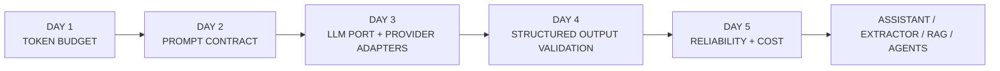
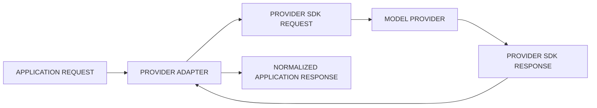
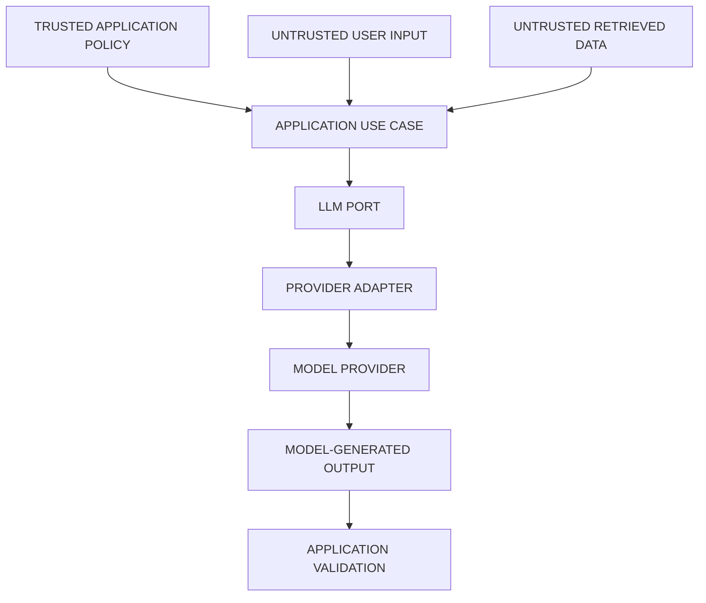
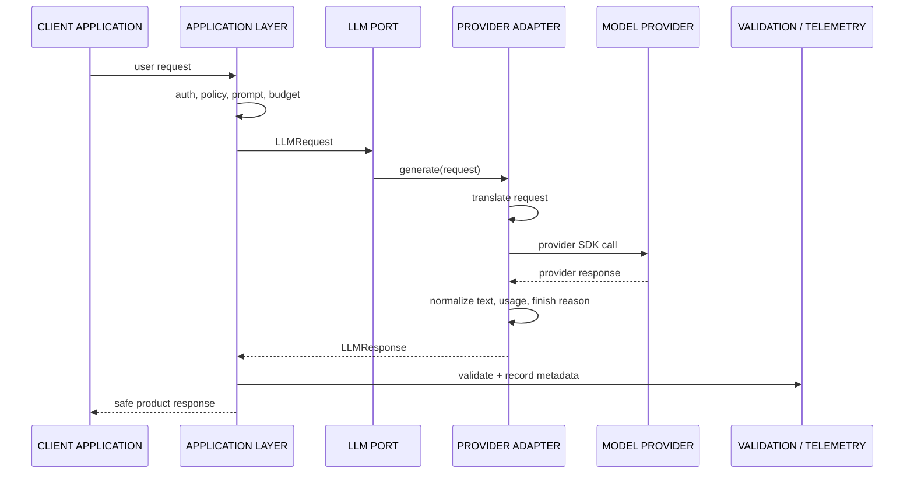
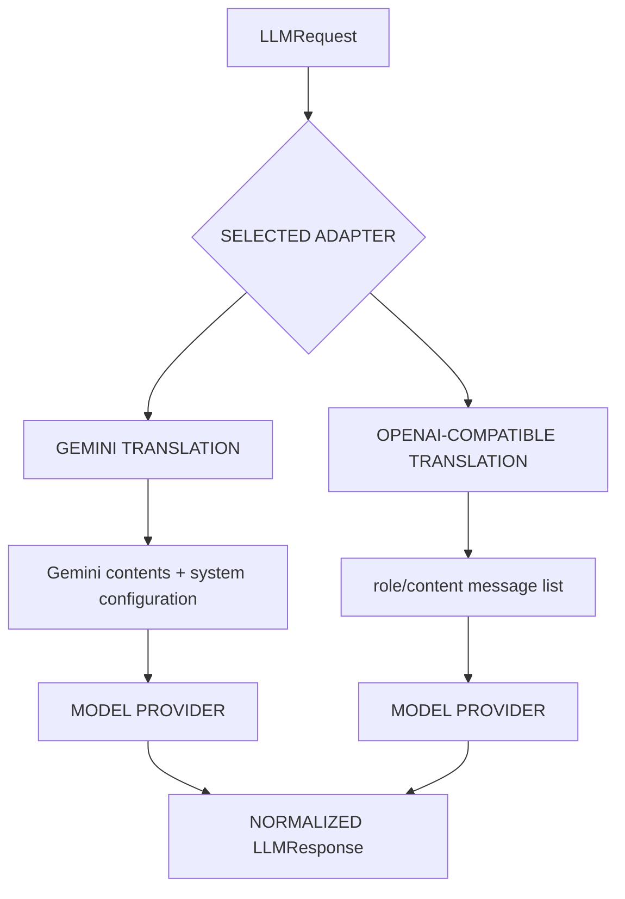
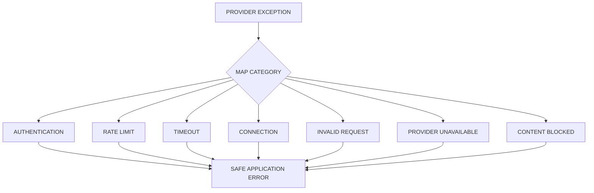
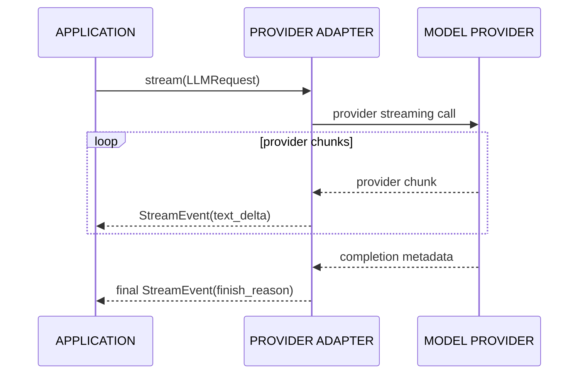
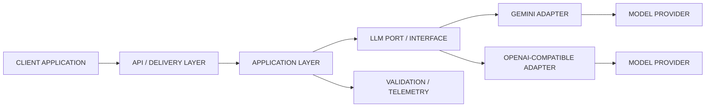

# Day 3 — Provider Adapter
## AI Product Engineering Learning Note

> **Core question:** How can an AI product call different model providers without allowing provider SDKs, response formats, credentials, or temporary model choices to spread through business logic?
>
> **Memory hook:** **CONTRACT → CONFIGURE → ADAPT → NORMALIZE → OBSERVE → SWITCH**
>
> **Completion rule:** Day 3 is not done because an SDK call works once. It is done only when one provider-neutral interface drives Gemini and one OpenAI-compatible provider through configuration, both smoke tests produce evidence, streaming crosses the same application boundary, and no secret or sensitive payload is committed or logged.

---

# 1. Why Day 3 Comes Here

The Week 1 sequence is deliberate:

```text
Day 1 — Tokens & Context
→ defines request capacity, output reservation, and resource budgets

Day 2 — Prompt Contracts
→ defines the behavior the application wants

Day 3 — Provider Adapter
→ executes that behavior through interchangeable provider infrastructure

Day 4 — Structured Outputs
→ validates provider output against application-owned schemas

Day 5 — Reliability & Cost
→ adds mature retries, fallback, error categories, and telemetry

Day 6–7 — Assistant + Extractor
→ use the completed application layer in end-to-end products
```

A provider adapter is introduced **after** request policy and prompt behavior because the application must own those concepts before provider SDKs appear. It comes **before** structured output, reliability, RAG, and agents because all of them need a stable model-call boundary.



## Prerequisite status

| Prerequisite | Why Day 3 needs it | Status |
|---|---|---|
| Tokens and context | Provider/model limits and usage differ | Concept studied; completion evidence pending |
| Request budget | Adapter configuration must respect product limits | Concept studied; implementation evidence pending |
| Prompt contract | The same application behavior should be sent through either provider | Concept studied; evaluation evidence pending |
| Environment variables and `.gitignore` | Credentials must remain outside source control | Must be verified in repository |
| Basic Python typing/testing | Needed for the interface, adapters, and smoke tests | Assumed from existing software-engineering experience; verify through implementation |

**Progression decision:** conceptually ready. Day 1 and Day 2 evidence remains pending, but neither missing evidence item prevents learning the Day 3 architecture. Do not mark the Week 1 gate complete until all required evidence exists.

---

# 2. Why a Provider Adapter Exists

Without an adapter, business/application code learns provider details:

```python
# Coupled application code — avoid
response = provider_sdk.special_method(
    model="temporary-model-id",
    messages=provider_specific_messages,
)
text = response.provider_specific_path[0].content
```

This creates several problems:

- provider switching requires edits across the codebase,
- tests require real SDK objects or network calls,
- provider-specific errors leak into delivery/business layers,
- streaming shapes differ,
- usage metadata becomes inconsistent,
- temporary model IDs become business logic,
- secrets and logging mistakes spread,
- fallback and evaluation become harder.

A provider adapter converts between two worlds:

```text
APPLICATION-OWNED CONTRACT
        ⇅ translation
PROVIDER-SPECIFIC SDK CONTRACT
```



> The adapter does not make Gemini behave exactly like Groq. It gives the application a stable boundary while preserving meaningful provider capabilities and differences.

---

# 3. Core Terminology and Mental Models

| Term | Meaning |
|---|---|
| **Port / Interface** | Application-owned contract describing the capability needed |
| **Provider Adapter** | Infrastructure component implementing the port for one provider |
| **Provider Configuration** | Provider, model, timeout, retry, streaming, endpoint, and capability settings |
| **Normalized Request** | Provider-neutral input accepted by the port |
| **Normalized Response** | Stable application-owned output returned by adapters |
| **Capability** | Feature such as streaming, structured output, tools, multimodal input, or token reporting |
| **Factory / Composition Root** | Place that selects and constructs the configured adapter |
| **Provider Error Mapping** | Conversion from SDK-specific exceptions into stable application error categories |
| **Smoke Test** | Small real-network test proving credentials, model configuration, request translation, and response normalization |
| **Test Double** | Fake/stub adapter used for deterministic unit tests without network calls |

## The essential distinction

```text
PORT
→ what the application needs

ADAPTER
→ how one provider supplies it

SDK
→ provider-owned implementation detail
```

---

# 4. What the Adapter Should and Should Not Own

## The adapter should own

- provider SDK initialization,
- provider request translation,
- provider response parsing,
- streaming event translation,
- provider-specific timeout/retry wiring,
- provider-specific usage extraction,
- provider exception mapping,
- safe provider metadata.

## The adapter should not own

- authentication or authorization,
- tenant access rules,
- billing entitlements,
- product quotas,
- prompt policy,
- business decisions,
- final schema validation,
- UI formatting,
- model-selection policy spread across random methods,
- silent fallback that the application cannot observe.



The adapter is an infrastructure boundary—not a security authority.

---

# 5. Internal Working — Step by Step

A non-streaming call should follow this lifecycle:



### Detailed lifecycle

1. **Delivery layer validates transport input.**
2. **Application layer checks deterministic policy.**
3. **Prompt contract builds provider-neutral messages.**
4. **Day 1 budget policy approves the request.**
5. **Composition root selects the configured adapter.**
6. **Adapter translates normalized messages/configuration.**
7. **Provider SDK sends the network request.**
8. **Adapter maps the provider response into stable types.**
9. **Application validates output and records telemetry.**
10. **Delivery layer returns a safe response.**

---

# 6. Contract Design

The smallest useful interface should represent product needs—not every field exposed by every provider.

```python
from collections.abc import AsyncIterator
from dataclasses import dataclass, field
from typing import Literal, Protocol


Role = Literal["system", "user", "assistant"]


@dataclass(frozen=True)
class Message:
    role: Role
    content: str


@dataclass(frozen=True)
class LLMRequest:
    messages: tuple[Message, ...]
    max_output_tokens: int
    temperature: float | None = None
    metadata: dict[str, str] = field(default_factory=dict)


@dataclass(frozen=True)
class Usage:
    input_tokens: int | None = None
    output_tokens: int | None = None


@dataclass(frozen=True)
class LLMResponse:
    text: str
    provider: str
    model: str
    finish_reason: str | None
    usage: Usage
    provider_request_id: str | None = None


@dataclass(frozen=True)
class StreamEvent:
    text_delta: str
    finish_reason: str | None = None


class LLMPort(Protocol):
    async def generate(self, request: LLMRequest) -> LLMResponse:
        ...

    def stream(self, request: LLMRequest) -> AsyncIterator[StreamEvent]:
        ...
```

## Why application-owned types?

They provide:

- stable tests,
- stable use-case code,
- explicit optional metadata,
- one location for semantics,
- freedom to change SDKs,
- control over what provider data enters the application.

## Avoid the “perfect universal interface” trap

Two bad extremes exist:

| Extreme | Failure |
|---|---|
| Expose every provider field | The port becomes a disguised provider SDK |
| Keep only one text string | Important capabilities and observability disappear |

Use a **small common core**, then add explicit capability-specific contracts when justified.

```text
COMMON CORE
→ text generation
→ streaming
→ usage
→ finish reason
→ request ID

OPTIONAL CAPABILITY PORTS
→ structured output
→ tool calling
→ multimodal input
→ embeddings
```

---

# 7. Configuration Design

Provider and model selection belongs in configuration and the composition root.

```python
from dataclasses import dataclass
from enum import StrEnum


class ProviderName(StrEnum):
    GEMINI = "gemini"
    GROQ = "groq"


@dataclass(frozen=True)
class ProviderSettings:
    provider: ProviderName
    model: str
    timeout_seconds: float = 20.0
    max_retries: int = 1
```

Example `.env.example`:

```dotenv
LLM_PROVIDER=gemini

GEMINI_API_KEY=
GEMINI_MODEL=

GROQ_API_KEY=
GROQ_MODEL=

LLM_TIMEOUT_SECONDS=20
LLM_MAX_RETRIES=1
```

### Why leave model values blank in the example?

Model names, availability, quotas, and lifecycle change. The repository should require an explicit currently verified model rather than burying a temporary identifier in business logic.

## Composition root

```python
def build_llm(settings: ProviderSettings) -> LLMPort:
    match settings.provider:
        case ProviderName.GEMINI:
            return GeminiAdapter(settings)
        case ProviderName.GROQ:
            return GroqAdapter(settings)
        case _:
            raise ValueError(f"Unsupported provider: {settings.provider}")
```

Only the composition root should decide which concrete adapter to construct.

---

# 8. Provider Translation

A provider-neutral message contract may not map identically to every provider.



Translation decisions may include:

- extracting the system instruction,
- converting message roles,
- mapping output limits,
- mapping sampling values,
- handling unsupported parameters,
- translating finish reasons,
- extracting usage,
- dealing with empty or blocked responses.

### Never silently ignore an unsupported important field

Choose one:

1. reject the request with a capability error,
2. intentionally degrade behavior and record it,
3. route to a provider that supports the requirement.

Silent degradation creates false confidence.

---

# 9. Direct SDK vs Provider Adapter

| Decision | Direct SDK call | Provider adapter |
|---|---|---|
| Small disposable experiment | Faster | More structure than needed |
| One-provider script | Often sufficient | Useful only if reuse/testing matters |
| Production product | Coupling spreads | Stable boundary |
| Provider comparison | Repeated translation code | Same application request |
| Unit testing | SDK/network-heavy | Fake port is easy |
| Fallback/routing | Difficult to centralize | Natural extension |
| Observability | Inconsistent | Normalized metadata |
| Migration | Expensive | Mostly infrastructure change |

### Senior decision

Use a direct SDK call for a short-lived experiment whose disposal is intentional.

Use an adapter when the call becomes an application capability, especially when:

- more than one provider is required,
- evaluation must compare providers,
- tests should avoid network access,
- streaming and usage must be normalized,
- the provider may change,
- security and logging boundaries matter.

---

# 10. Error Model and Failure Boundaries

Provider SDKs expose different exception classes. Application code should receive stable categories.

```python
class LLMError(RuntimeError):
    """Base application-facing provider error."""


class LLMAuthenticationError(LLMError):
    pass


class LLMRateLimitError(LLMError):
    pass


class LLMTimeoutError(LLMError):
    pass


class LLMConnectionError(LLMError):
    pass


class LLMInvalidRequestError(LLMError):
    pass


class LLMProviderUnavailableError(LLMError):
    pass


class LLMContentBlockedError(LLMError):
    pass
```



## Retry rule

Retry only failures likely to be transient.

| Failure | Retry? | Reason |
|---|---:|---|
| Authentication failure | No | Configuration/credential problem |
| Invalid request | No | Repeating the same request will fail |
| Content blocked | Usually no | Policy/input issue |
| Rate limit | Sometimes | Retry only with bounded backoff/budget |
| Timeout | Sometimes | Request may succeed later; duplication risk exists |
| Connection failure | Sometimes | Often transient |
| Provider 5xx | Sometimes | Provider may recover |

### Day 3 scope boundary

Day 3 should expose and configure timeout/retry behavior and prevent accidental unbounded retries. Day 5 owns the mature reliability policy: bounded backoff, fallback, explicit categories, and measured failure behavior.

Be careful of **nested retries**:

```text
APPLICATION RETRY × SDK RETRY × PROXY RETRY
→ request multiplication
→ latency explosion
→ duplicate cost
```

---

# 11. Streaming

Streaming is not “a string returned slowly.” It is a sequence of events with lifecycle semantics.



The normalized stream should make room for:

- text deltas,
- final finish reason,
- optional usage,
- cancellation,
- provider errors,
- future tool-call events.

### Streaming trade-offs

**Benefits**

- lower perceived latency,
- progressive UI,
- useful for assistant responses.

**Costs**

- more complicated cancellation,
- partial output can be invalid,
- errors may occur after visible text,
- usage may only arrive at the end,
- structured output should not be trusted until complete and validated.

---

# 12. Security and Trust Boundaries

Always distinguish:

```text
TRUSTED APPLICATION POLICY
→ authorization, budgets, allowed tools, business rules

UNTRUSTED USER INPUT
→ may contain injection, secrets, oversized content

UNTRUSTED RETRIEVED DATA
→ may contain malicious or incorrect instructions

MODEL-GENERATED OUTPUT
→ probabilistic and untrusted until validated
```

## Secret rules

- keep keys in environment variables for local development,
- use a managed secret store in production,
- never place provider keys in a client/mobile application,
- never commit `.env`,
- provide `.env.example` with empty values,
- redact secrets from traces and exceptions,
- rotate a leaked key immediately,
- enable secret scanning,
- avoid printing SDK request objects containing sensitive content.

## Logging rule

Prefer:

```json
{
  "trace_id": "trace-123",
  "provider": "gemini",
  "model": "configured-model",
  "latency_ms": 842,
  "status": "success"
}
```

Avoid logging:

- API keys,
- full system prompts by default,
- raw customer documents,
- personal data,
- authorization headers,
- complete provider payloads,
- unredacted model output containing sensitive data.

> The adapter controls provider access, but deterministic backend code still owns authentication, authorization, tenant isolation, billing, and destructive-action permission.

---

# 13. Performance, Cost, and Reliability

A provider adapter adds little computational cost. Its value is operational control.

Track at minimum:

- provider,
- configured model,
- request/trace ID,
- success/failure category,
- latency,
- time to first token for streaming,
- input/output tokens when available,
- retry count,
- finish reason.

## Provider selection is multi-dimensional

```text
QUALITY
+ LATENCY
+ COST
+ PRIVACY
+ CAPABILITIES
+ AVAILABILITY
+ RATE LIMITS
+ OPERATIONAL FIT
```

Do not select a provider from one impressive demo.

## Connection/client lifecycle

Construct reusable SDK clients at application startup where appropriate rather than creating a new client for every token chunk or request. Close clients cleanly during shutdown.

## Timeout design

One number may hide several phases:

- connection timeout,
- write timeout,
- read timeout,
- total request deadline.

The product deadline should be explicit even when the provider SDK offers defaults.

---

# 14. Clean Architecture Placement



| Layer | Owns |
|---|---|
| Domain | Product rules independent of LLM vendors |
| Application | Prompt selection, budgets, orchestration, validation decisions |
| Port / Interface | Required model-generation capability |
| Provider Infrastructure | SDK calls, translation, normalization, provider errors |
| API / Delivery | CLI/API transport |
| Observability | Trace/usage/failure evidence |

### Dependency direction

```text
APPLICATION → PORT
ADAPTER → PORT

APPLICATION ✕ PROVIDER SDK
DOMAIN ✕ PROVIDER SDK
CLIENT ✕ PROVIDER KEY
```

---

# 15. Minimal Adapter Shape

The current implementation should use the providers’ maintained SDKs, but keep SDK types inside infrastructure.

```python
# infrastructure/gemini_adapter.py
from google import genai
from google.genai import types


class GeminiAdapter:
    def __init__(self, settings: ProviderSettings) -> None:
        self._settings = settings
        self._client = genai.Client(
            http_options=types.HttpOptions(
                timeout=int(settings.timeout_seconds * 1000),
            )
        )

    async def generate(self, request: LLMRequest) -> LLMResponse:
        system_text = "\n\n".join(
            m.content for m in request.messages if m.role == "system"
        )
        conversation = [
            types.Content(
                role="model" if m.role == "assistant" else "user",
                parts=[types.Part.from_text(text=m.content)],
            )
            for m in request.messages
            if m.role != "system"
        ]

        response = await self._client.aio.models.generate_content(
            model=self._settings.model,
            contents=conversation,
            config=types.GenerateContentConfig(
                system_instruction=system_text or None,
                max_output_tokens=request.max_output_tokens,
                temperature=request.temperature,
            ),
        )

        return LLMResponse(
            text=response.text or "",
            provider="gemini",
            model=self._settings.model,
            finish_reason=None,       # map when required by product
            usage=Usage(),            # extract when available
        )
```

```python
# infrastructure/groq_adapter.py
from groq import AsyncGroq


class GroqAdapter:
    def __init__(self, settings: ProviderSettings) -> None:
        self._settings = settings
        self._client = AsyncGroq(
            timeout=settings.timeout_seconds,
            max_retries=settings.max_retries,
        )

    async def generate(self, request: LLMRequest) -> LLMResponse:
        response = await self._client.chat.completions.create(
            model=self._settings.model,
            messages=[
                {"role": m.role, "content": m.content}
                for m in request.messages
            ],
            max_completion_tokens=request.max_output_tokens,
            temperature=request.temperature,
        )

        choice = response.choices[0]
        usage = response.usage

        return LLMResponse(
            text=choice.message.content or "",
            provider="groq",
            model=self._settings.model,
            finish_reason=choice.finish_reason,
            usage=Usage(
                input_tokens=getattr(usage, "prompt_tokens", None),
                output_tokens=getattr(usage, "completion_tokens", None),
            ),
            provider_request_id=response.id,
        )
```

### Important implementation note

Provider SDKs and accepted parameters change. Before running these examples:

1. pin dependency versions,
2. choose currently available model IDs from official provider documentation,
3. verify timeout units and response fields against the installed SDK,
4. record the verified versions in the repository,
5. keep model names in environment/configuration.

---

# 16. Folder Structure

Continue the existing Week 1 repository:

```text
src/
└── llm_app/
    ├── domain/
    │   ├── budget.py
    │   └── errors.py
    ├── application/
    │   ├── prompt_contract.py
    │   └── generate_text.py
    ├── ports/
    │   └── llm.py
    ├── infrastructure/
    │   ├── gemini_adapter.py
    │   ├── groq_adapter.py
    │   └── settings.py
    └── interfaces/
        └── cli.py

tests/
├── unit/
│   ├── test_generate_text.py
│   └── test_provider_factory.py
└── smoke/
    ├── test_gemini_smoke.py
    └── test_groq_smoke.py

docs/
├── architecture/
│   └── provider_adapter.md
└── adr/
    └── 0001-provider-adapter.md

evals/
results/
.env.example
.gitignore
README.md
```

---

# 17. Mini Project — Dual-Provider LLM Gateway

## Goal

Extend the existing Week 1 repository with one application use case that can execute the same prompt contract through Gemini or Groq by changing configuration only.

## Acceptance criteria

```text
[ ] One LLMPort is owned by the application
[ ] GeminiAdapter implements the port
[ ] GroqAdapter implements the same port
[ ] Provider/model/timeout/retry are configuration-driven
[ ] Non-streaming generation works through both adapters
[ ] Streaming uses one normalized application event shape
[ ] Application/domain code imports no provider SDK
[ ] Unit tests use a fake adapter without network access
[ ] One real smoke test passes per provider
[ ] Logs contain safe metadata, not secrets/raw sensitive payloads
[ ] `.env` is ignored and `.env.example` contains no values
[ ] Architecture diagram and ADR are committed
```

## Smallest vertical slice

```text
CLI command
→ load settings
→ build adapter
→ build one PromptContract request
→ Day 1 budget check
→ call LLMPort
→ print normalized response
→ record safe metadata
```

## Smoke-test design

Use the same low-risk synthetic request for both providers:

```text
System: Return exactly the word READY.
User: Provider smoke test.
Expected: Non-empty response; ideally READY.
```

Record:

- timestamp,
- provider,
- configured model,
- dependency version,
- success/failure,
- latency,
- finish reason,
- token usage when returned,
- redacted error category.

Do not fabricate results. A test file existing is **implemented**; a captured successful run is **verified**.

---

# 18. Unit and Smoke Testing

## Unit test with a fake port

```python
class FakeLLM:
    async def generate(self, request: LLMRequest) -> LLMResponse:
        return LLMResponse(
            text="READY",
            provider="fake",
            model="fake-model",
            finish_reason="stop",
            usage=Usage(input_tokens=4, output_tokens=1),
        )


async def test_use_case_depends_on_port_not_sdk() -> None:
    response = await GenerateText(FakeLLM()).execute(
        LLMRequest(
            messages=(Message("user", "Provider smoke test."),),
            max_output_tokens=8,
        )
    )

    assert response.text == "READY"
```

## Factory test

```python
def test_factory_rejects_unknown_provider() -> None:
    with pytest.raises(ValueError):
        build_llm(
            ProviderSettings(
                provider="unknown",  # type: ignore[arg-type]
                model="configured-model",
            )
        )
```

## Smoke-test rule

Mark real-network smoke tests separately:

```python
@pytest.mark.smoke
@pytest.mark.skipif(not os.getenv("GEMINI_API_KEY"), reason="missing key")
async def test_gemini_smoke() -> None:
    ...
```

This keeps normal unit tests fast, deterministic, and free from provider cost.

---

# 19. Important Decisions and Trade-Offs

## One adapter per provider vs one OpenAI-compatible adapter

### One adapter per provider

**Better when**

- capabilities differ materially,
- provider SDK gives better typing/features,
- error/usage semantics matter,
- multimodal or structured output is required.

**Costs**

- more implementation code,
- more test surface.

### One OpenAI-compatible adapter

**Better when**

- several endpoints closely follow the same protocol,
- only the common chat capability is required,
- rapid provider comparison matters.

**Costs**

- “compatible” does not mean identical,
- unsupported parameters and response differences remain,
- provider-native features may be hidden.

## Lowest common denominator vs capability-aware design

### Lowest common denominator

- simpler,
- portable,
- can suppress valuable features.

### Capability-aware

- preserves provider strengths,
- requires capability discovery and explicit branching.

A practical design uses a small shared core plus explicit optional capability contracts.

## Factory vs dependency-injection framework

A plain factory is enough for Day 3. Introduce a dependency-injection framework only when lifecycle, scopes, many dependencies, or testing complexity justify it.

---

# 20. Beginner and Production Mistakes

## Beginner mistakes

- writing one interface whose method returns `Any`,
- leaking provider response objects upward,
- hard-coding model IDs everywhere,
- embedding keys in source code,
- thinking OpenAI compatibility means identical behavior,
- testing only the happy path,
- creating an abstraction before defining actual application needs.

## Production mistakes

- silently dropping unsupported request fields,
- hiding provider/fallback decisions from telemetry,
- nested unbounded retries,
- retrying authentication or invalid requests,
- returning partial streams as valid structured output,
- logging prompts/documents by default,
- selecting providers only by headline speed or price,
- allowing a mobile/client application to call privileged providers directly,
- using one global provider without tenant/privacy/capability review,
- changing provider and prompt simultaneously during evaluation.

---

# 21. Industry-Level Improvement Path

After the Day 3 vertical slice, improve in this order:

```text
1. Stable port
2. Two adapters
3. Safe configuration
4. Unit + smoke tests
5. Normalized errors
6. Usage/latency telemetry
7. Capability matrix
8. Explicit routing
9. Bounded fallback
10. Evaluation-based provider selection
```

A future capability matrix may look like:

| Capability | Provider A | Provider B | Product requirement |
|---|---:|---:|---:|
| Streaming | Yes | Yes | Required |
| Structured output | Verified | Verified/limited | Required Day 4 |
| Tool calling | Verified later | Verified later | Week 3+ |
| Usage metadata | Available/partial | Available | Required Day 5 |
| Data/privacy fit | Review | Review | Required before production |
| Latency target | Measure | Measure | Evidence required |
| Cost target | Measure | Measure | Evidence required |

Do not fill this table from memory. Verify current official documentation and measured behavior.

---

# 22. Engineering Challenge

Design the provider boundary for this scenario:

```text
Provider A
- best schema-validity score
- slower
- higher measured cost
- supports required structured output

Provider B
- low latency
- cheaper
- occasionally omits usage metadata
- OpenAI-compatible but rejects one optional parameter

Product
- meeting-action extraction
- 95th percentile latency target
- strict schema validation
- sensitive customer notes
- no silent fallback across regions
```

Answer:

1. What belongs in `LLMPort`?
2. What belongs in each adapter?
3. What belongs in application policy?
4. Should the application use one common adapter or two provider-specific adapters?
5. Which request field must not be silently ignored?
6. How should missing usage metadata be represented?
7. Which failures are retryable?
8. When is fallback allowed?
9. What telemetry proves the decision?
10. What would trigger an ADR revisit?

A strong answer protects correctness and privacy before optimizing convenience.

---

# 23. Completion and Evidence Gate

## Day 3 status vocabulary

```text
STUDIED
→ Provider-adapter concept understood

IMPLEMENTED
→ Port, adapters, factory, configuration, and tests exist

VERIFIED
→ Real Gemini and Groq smoke-test evidence exists

DONE
→ Day 3 evidence is satisfied and contributes to the Week 1 DONE WHEN gate
```

## Required Day 3 evidence

```text
[ ] Provider-adapter architecture diagram
[ ] One application-owned LLM interface
[ ] Gemini adapter
[ ] One OpenAI-compatible provider adapter
[ ] Provider/model/timeout/retry/streaming configuration
[ ] Gemini smoke-test output
[ ] OpenAI-compatible provider smoke-test output
[ ] Unit tests using a fake adapter
[ ] Provider switch demonstrated through configuration only
[ ] `.env` excluded from Git
[ ] No secrets or sensitive payloads in Git/logs
[ ] Dependency/model verification recorded
```

## Evidence status at note creation

- **Studied:** covered by this lesson.
- **Implemented:** pending your repository/code evidence.
- **Verified:** pending actual test and CLI output.
- **Done:** not yet claimed.
- **Previous evidence:** Day 1 and Day 2 practical/evaluation evidence remains pending.
- **Progression:** conceptually ready for Day 4 after Day 3 study, but Week 1 completion evidence remains open.

---

# 24. Today’s Notes

- A port defines the model capability the application needs.
- An adapter translates between the application contract and a provider SDK.
- Business policy must not depend on provider SDK types.
- Provider/model selection belongs in configuration and the composition root.
- Normalize response text, usage, finish reason, request ID, streaming events, and errors.
- Do not pretend all providers have identical capabilities.
- Use a small common core and explicit capability-specific extensions.
- Unit tests use fakes; smoke tests prove real provider integration.
- Secrets stay server-side and outside source control.
- Provider facts are volatile; verify current models, SDKs, quotas, and privacy terms.

# 25. Key Takeaways

1. **Portability is a boundary, not a promise of identical providers.**
2. **Provider-specific code belongs in provider infrastructure.**
3. **Configuration chooses infrastructure; business logic does not.**
4. **Normalize what the application truly needs, not every SDK field.**
5. **Measure provider behavior with the same prompt, data, and configuration.**
6. **Evidence requires real smoke-test output, not only mocked tests.**
7. **Security, authorization, and billing stay deterministic and server-side.**

# 26. What I Built

Target artifact:

```text
Dual-Provider LLM Gateway
→ LLMPort
→ GeminiAdapter
→ GroqAdapter
→ configuration-driven factory
→ normalized generation/streaming response
→ fake-adapter unit tests
→ two real smoke tests
→ architecture note + ADR
```

At note creation, this is the required build specification—not a claim that the implementation or smoke tests have been completed.

# 27. GitHub Commit Message

```text
feat(llm): add provider-neutral interface with Gemini and Groq adapters
```

# 28. Homework

1. Implement the smallest non-streaming vertical slice through both providers.
2. Add normalized streaming without changing the application use case.
3. Capture redacted smoke-test evidence for each provider.
4. Write ADR-0001 explaining the port shape, adapter choice, limitations, and revisit triggers.
5. Run a secret scan and inspect Git history before claiming completion.
6. Record one difference you observed between the two providers instead of assuming compatibility.

# 29. Interview Recall

Be able to answer without notes:

1. What problem does the Adapter pattern solve in an LLM application?
2. What is the difference between a port, adapter, SDK, and factory?
3. Why should the application own request/response types?
4. What should remain provider-specific?
5. Why is OpenAI compatibility not full behavioral equivalence?
6. How do you normalize provider errors?
7. Which errors should not be retried?
8. How do streaming and non-streaming contracts differ?
9. How do you test without making network calls?
10. What evidence proves provider switching?
11. Why must model IDs remain configuration?
12. Where do authentication, authorization, and quotas belong?

# 30. Reflection Questions

- Did my interface emerge from product requirements, or did I merely wrap two SDKs?
- Can I switch providers without editing application/domain code?
- What information did normalization hide, and was that loss intentional?
- Could nested retries multiply cost or latency?
- Can a provider SDK object escape into tests or delivery code?
- Do logs reveal customer data, prompts, keys, or authorization headers?
- How would I explain the failure behavior to an operator?
- What measured evidence would justify choosing one provider as primary?

# 31. Tomorrow’s Roadmap Topic

**Day 4 — Structured Outputs**

Roadmap direction:

- define Pydantic schemas for an information extractor,
- use native structured output or tool/function calling,
- test clean, messy, incomplete, multilingual, and zero-result inputs,
- reject malformed outputs,
- measure schema-valid response rate across at least 20 cases.

The provider adapter comes first so Day 4’s schema/validation logic remains application-owned while provider-specific structured-output mechanisms stay in infrastructure.

---

# Final Recall Map

```text
PORT
→ application-owned capability contract
→ keeps business logic provider-neutral
→ do not expose SDK objects

ADAPTER
→ translates request/response/error/stream
→ isolates provider infrastructure
→ does not make providers identical

CONFIGURATION
→ provider + model + timeout + retries
→ enables switching without code edits
→ model IDs are volatile

COMPOSITION ROOT
→ constructs selected adapter
→ concrete dependencies live at the edge
→ avoid provider selection across use cases

NORMALIZATION
→ stable text + usage + finish reason + request ID
→ supports tests and telemetry
→ preserve missing/unsupported data honestly

CAPABILITIES
→ streaming / schema / tools / multimodal
→ route by product requirement
→ avoid fake lowest-common-denominator promises

ERRORS
→ map provider exceptions to stable categories
→ supports safe handling
→ retry only transient failures

STREAMING
→ sequence of normalized events
→ improves perceived latency
→ partial output is not validated output

SECURITY
→ keys server-side; data minimized; logs redacted
→ protects users, quota, and billing
→ adapter is not an authorization boundary

TESTING
→ fake adapter for unit tests
→ real smoke test for integration evidence
→ code existing ≠ provider verified

PRODUCTION
→ CONTRACT
→ CONFIGURE
→ ADAPT
→ NORMALIZE
→ OBSERVE
→ SWITCH
```

---

# Day 3 Checkpoint Update

- **Day 3 — Provider Adapter**
- Core mental model: **port defines what the application needs; adapter translates how a provider supplies it**.
- Application/domain code must not depend on provider SDK types.
- One provider-neutral request/response contract supports both adapters.
- Provider, model, timeout, retry, and streaming behavior are configuration-driven.
- Composition root selects concrete provider infrastructure.
- Adapters translate requests, normalize responses/streams, and map provider errors.
- OpenAI-compatible does not mean identical capabilities or behavior.
- Use fakes for unit tests and real provider calls for smoke-test evidence.
- Secrets remain in environment/secret management; client applications never receive provider keys.
- Build: **Dual-Provider LLM Gateway — Gemini + Groq**.
- Evidence verified: **none supplied yet**.
- Evidence pending: implementation, unit tests, two smoke-test outputs, provider-switch proof, secret/log audit, architecture/ADR.
- Previous Day 1–2 completion evidence remains pending; conceptual progression is allowed.
- Memory hook: **CONTRACT → CONFIGURE → ADAPT → NORMALIZE → OBSERVE → SWITCH**
- Next roadmap topic: **Day 4 — Structured Outputs**
