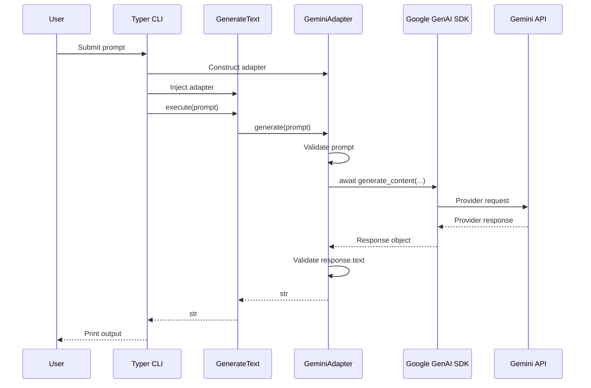
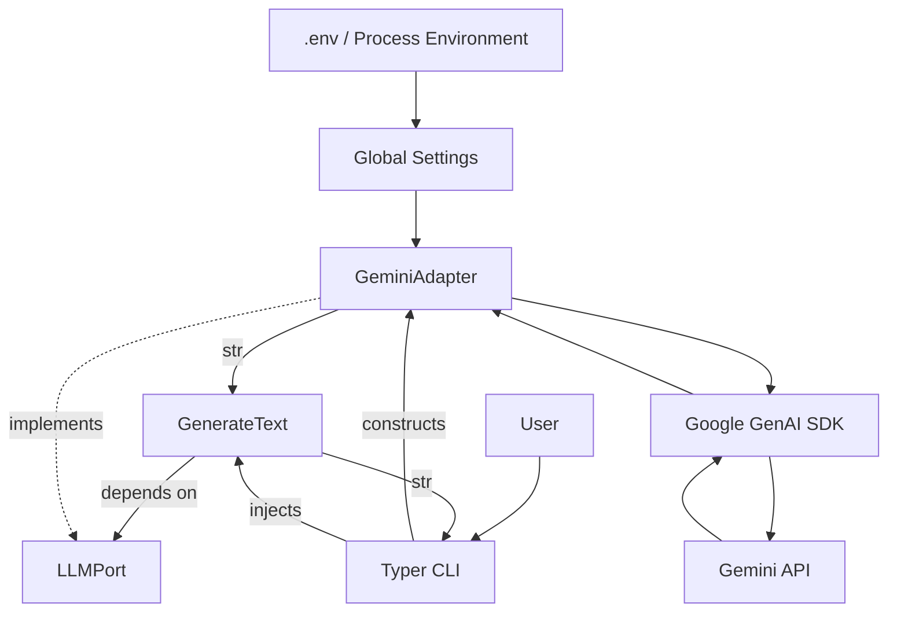
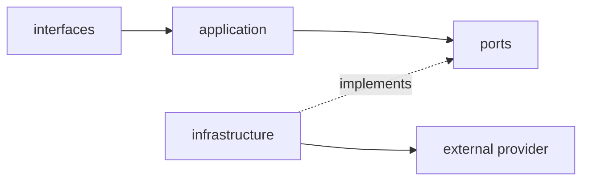
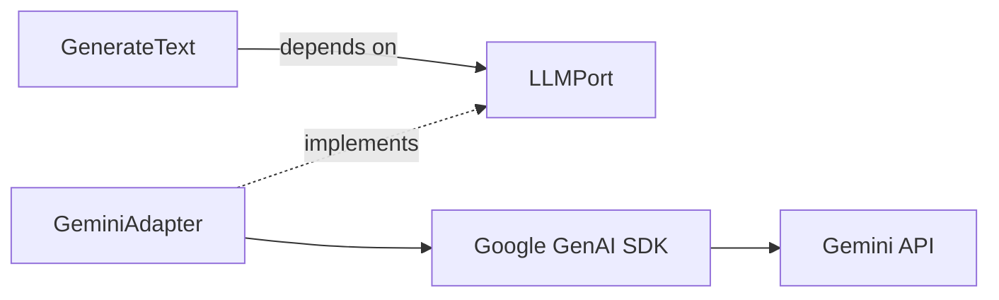
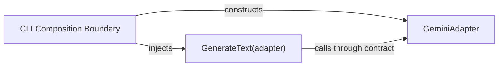
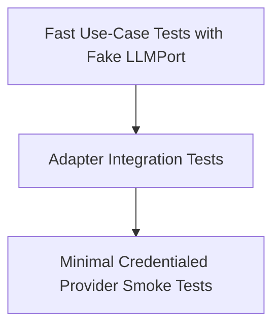

# LLM Gateway

> A Python CLI that isolates an LLM provider behind an application-owned contract using the Provider Adapter pattern.


## Overview

**LLM Gateway** demonstrates how to keep provider-specific SDK behavior out of application use cases.

`GenerateText` depends on the application-owned `LLMPort` protocol. `GeminiAdapter` satisfies that contract, calls the Google GenAI SDK asynchronously, and returns a provider-independent string. The Typer CLI acts as the composition boundary by constructing the adapter and injecting it into the use case.

> **Core rule:** The application owns the contract; the adapter owns provider translation.

## Current Scope

| Capability | Implementation |
|---|---|
| Application use case | `GenerateText.execute(prompt)` |
| Provider contract | `LLMPort.generate(prompt)` |
| Provider adapter | `GeminiAdapter` |
| Provider | Google Gemini |
| Interface | Typer CLI |
| Configuration | `.env` and process environment through `python-dotenv` |
| Execution | Asynchronous provider request |
| Tests | Settings test and credentialed live Gemini generation test |

The current version is intentionally narrow. It demonstrates dependency inversion and provider isolation; it is not yet a production multi-provider gateway.

## Request Lifecycle



## Architecture



### Dependency Direction



The application imports its own port, not the Gemini SDK. Provider-specific client construction, request execution, and response extraction remain in infrastructure.

## Project Structure

```text
llm_gateway/
├── docs/
│   └── LLM_Gateway_Engineering_Project_Note.md
├── evals/
├── tests/
│   ├── test_gemini.py
│   └── test_settings.py
├── src/
│   └── llm_gateway/
│       ├── application/
│       │   └── generate_text.py
│       ├── domain/
│       ├── infrastructure/
│       │   ├── gemini_adapter.py
│       │   └── settings.py
│       ├── interfaces/
│       │   └── cli.py
│       └── ports/
│           └── llm.py
├── .gitignore
├── README.md
└── pyproject.toml
```

## Installation

Requires Python 3.12 or later.

```bash
git clone <repository-url>
cd llm_gateway

python -m venv .venv
source .venv/bin/activate
```

On Windows PowerShell:

```powershell
python -m venv .venv
.venv\Scripts\Activate.ps1
```

The current `pyproject.toml` does not declare runtime or test dependencies. Install the packages used by the repository, then install the local package:

```bash
python -m pip install google-genai typer python-dotenv pytest anyio
python -m pip install -e .
```

## Configuration

Create a local `.env` file:

```env
GEMINI_API_KEY=your_api_key
GROQ_API_KEY=your_optional_future_key
LLM_PROVIDER=gemini
LLM_TIMEOUT_SECONDS=20
```

| Variable | Current Behavior |
|---|---|
| `GEMINI_API_KEY` | Required by `GeminiAdapter` |
| `GROQ_API_KEY` | Loaded but not currently used |
| `LLM_PROVIDER` | Loaded but does not yet select an adapter |
| `LLM_TIMEOUT_SECONDS` | Parsed but not yet enforced |

> **Security:** Never commit or publish `.env`. The uploaded project archive contains a `.env` file, while the uploaded `.gitignore` does not currently exclude it. Remove it before publishing, add `.env` to `.gitignore`, create `.env.example` with placeholders, and rotate any credential that may have been committed.

## Usage

```bash
python -m llm_gateway.interfaces.cli "Hello AI"
```

Example output:

```text
Hello! How can I help you today?
```

Provider output is nondeterministic and may differ between runs.

## Provider Boundary



### `LLMPort`

`LLMPort` defines the capability required by the application:

```python
from typing import Protocol


class LLMPort(Protocol):
    async def generate(self, prompt: str) -> str:
        ...
```

### `GeminiAdapter`

`GeminiAdapter`:

- checks that `GEMINI_API_KEY` exists,
- rejects empty prompts,
- awaits the Gemini SDK request,
- rejects an empty provider response,
- returns `response.text` as `str`.

The model identifier is currently hard-coded inside the adapter.

## Dependency Injection



Actual composition:

```python
provider = GeminiAdapter()
use_case = GenerateText(provider)
result = await use_case.execute(prompt)
```

The use case does not construct the adapter and does not import the provider SDK.

## Testing

Run:

```bash
pytest -q
```

The repository currently contains:

| Test | Purpose |
|---|---|
| `test_settings.py` | Checks provider configuration, positive timeout, and Gemini key presence |
| `test_gemini.py` | Makes a live Gemini request and verifies a non-empty string response |

The live test requires network access, installed provider dependencies, and a valid API key. A fake-port unit test is the recommended next addition so `GenerateText` can be verified without external I/O.



## Design Decisions

| Decision | Rationale | Trade-off |
|---|---|---|
| Application-owned protocol | Prevents provider SDK coupling | Adds an abstraction |
| Adapter per provider | Localizes SDK translation | Requires one implementation per provider |
| Async `generate` contract | Matches external network I/O | Requires event-loop handling |
| Environment configuration | Separates deployment values from code | Requires validation and secret hygiene |
| Thin CLI composition | Keeps orchestration outside the use case | Currently hard-wires Gemini |
| String result | Prevents provider response objects from leaking inward | Omits provider metadata and usage data |

## Current Limitations

- Gemini is the only implemented provider.
- `LLM_PROVIDER` does not yet control adapter selection.
- The timeout setting is not enforced.
- The model identifier is hard-coded.
- Provider SDK errors are not normalized.
- The CLI does not format failures for users.
- No retries, streaming, telemetry, cost tracking, or FastAPI delivery exist.
- No fake-port use-case test exists.
- Runtime and test dependencies are not declared in `pyproject.toml`.
- The uploaded archive requires `.env` cleanup before public release.
- No license file is present.

## Roadmap

```mermaid
flowchart LR
    CURRENT["v0.1.0<br/>Gemini CLI"] --> HYGIENE["Reproducible Install<br/>Secret Hygiene"]
    HYGIENE --> TESTS["Fake-Port and Failure Tests"]
    TESTS --> FACTORY["Provider Factory"]
    FACTORY --> PROVIDERS["Additional Adapters"]
    PROVIDERS --> RELIABILITY["Timeouts, Errors, Retries"]
    RELIABILITY --> STREAMING["Streaming"]
    STREAMING --> TELEMETRY["Usage and Cost Telemetry"]
    TELEMETRY --> API["FastAPI Delivery"]
```



## Current Scope Completion

- [x] Application-owned `LLMPort` exists
- [x] `GenerateText` depends on the port
- [x] Gemini integration is isolated in infrastructure
- [x] Provider calls are asynchronous
- [x] Typer CLI composes and executes the use case
- [x] Environment-backed configuration exists
- [x] Settings and live provider test assets exist
- [x] Architecture and runtime flows use Mermaid diagrams
- [x] Current and future capabilities are clearly separated

All checkboxes refer only to the implemented **v0.1.0 scope**. Planned production work is listed separately and is not part of this completion claim.

## Engineering Note

For deeper architecture reasoning, testing strategy, trade-offs, security considerations, and future production design, see [`docs/LLM_Gateway_Engineering_Project_Note.md`](docs/LLM_Gateway_Engineering_Project_Note.md).

## License

No `LICENSE` file is present in the uploaded repository. Add the intended license before public distribution.
