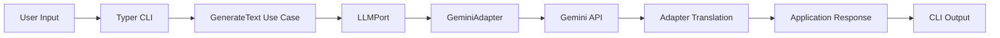
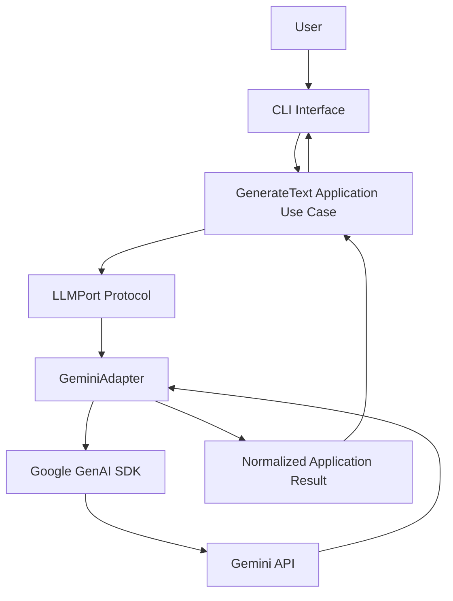
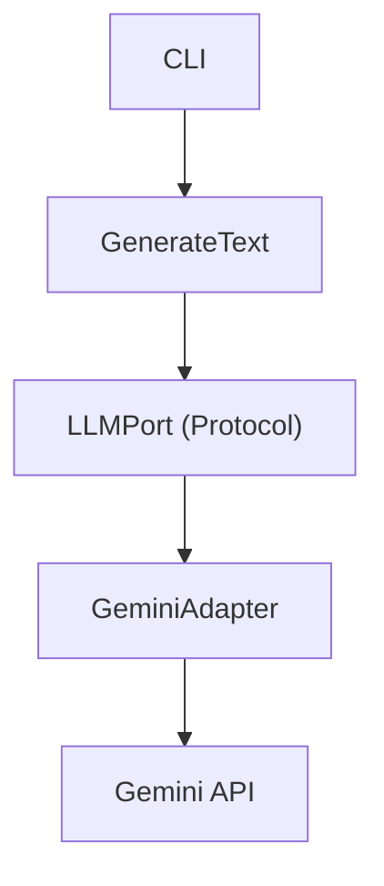
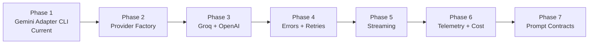

# LLM Gateway

> A production-inspired Python CLI that isolates Large Language Model providers behind an application-owned contract using the Provider Adapter pattern.

      

---

## Overview

**LLM Gateway** is a lightweight Python implementation of the **Provider Adapter** pattern for Large Language Models.

Instead of allowing application logic to call a provider SDK directly, the project places an application-owned abstraction—`LLMPort`—between the use case and the external provider. The current implementation integrates Google's Gemini API while keeping the application layer independent of Gemini-specific request objects, response types, configuration details, and SDK behavior.

The project demonstrates a core production principle:

> **The application owns the contract; the adapter owns provider translation.**

### What it protects

- Application logic from provider SDK coupling
- Use cases from provider-specific request and response objects
- Future provider replacement and migration
- Testability through dependency injection
- Configuration and secret boundaries
- Clean dependency direction
- Provider-independent application behavior

---

## Key Features

| Capability | Description |
|---|---|
| Provider Adapter architecture | Places provider-specific translation behind a stable application boundary |
| Application-owned `LLMPort` | Defines the capability the application requires |
| Gemini integration | Implements the current provider adapter with Google's Gemini API |
| Protocol-based dependency inversion | Lets the application depend on an abstraction instead of a concrete SDK |
| Async LLM requests | Supports non-blocking provider calls |
| Dependency injection | Supplies the selected adapter to the application use case |
| Environment configuration | Keeps API keys and runtime settings outside application code |
| Typer CLI | Exposes text generation through a terminal interface |
| Pytest unit tests | Verifies application behavior without requiring direct provider coupling |
| Clean Architecture | Separates domain, application, ports, infrastructure, and interfaces |
| Professional `src/` layout | Keeps package imports and repository structure explicit |

---

## Installation

Requires **Python 3.12**.

```bash
git clone <repository-url>
cd llm_gateway

python -m venv .venv
source .venv/bin/activate

python -m pip install -e .
```

On Windows PowerShell:

```powershell
python -m venv .venv
.venv\Scripts\Activate.ps1
python -m pip install -e .
```

---

## Environment Variables

Create a `.env` file in the project root:

```env
GEMINI_API_KEY=your_api_key
LLM_PROVIDER=gemini
LLM_TIMEOUT_SECONDS=20
```

### Configuration responsibilities

| Variable | Purpose |
|---|---|
| `GEMINI_API_KEY` | Authenticates requests to the Gemini API |
| `LLM_PROVIDER` | Selects the configured provider implementation |
| `LLM_TIMEOUT_SECONDS` | Defines the intended provider request timeout value |

Secrets should remain in trusted backend configuration and must not be committed to source control.

---

## Usage

Run the CLI with a prompt:

```bash
python -m llm_gateway.interfaces.cli "Hello AI"
```

Example output:

```text
Hello! How can I help you today?
```

The CLI accepts user input, invokes the application use case, and prints the normalized text returned through the `LLMPort` boundary.

---

## Request Lifecycle



The provider SDK is reached only after the request crosses the application-owned port.

---

## Architecture

The implementation follows a simplified **Clean Architecture** with dependency inversion at the provider boundary.



### Dependency direction

```text
interfaces → application → ports
infrastructure → ports
application ✕ provider SDK
```

The application depends on `LLMPort`. The Gemini adapter also depends on that contract by implementing it. The provider SDK remains an infrastructure detail.

> **Dependency rule:** application behavior depends on abstractions, not provider SDKs.

---

## Layer Responsibilities

| Layer | Responsibility |
|---|---|
| `domain` | Holds stable business concepts and provider-independent rules |
| `application` | Coordinates the text-generation use case |
| `ports` | Defines the `LLMPort` abstraction required by the application |
| `infrastructure` | Implements provider-specific translation and Gemini SDK access |
| `interfaces` | Accepts CLI input and presents the result |
| `tests` | Verifies use-case behavior, adapter boundaries, and dependency injection |
| `evals` | Stores provider experiments and future evaluation evidence |
| `docs` | Preserves architecture notes and engineering rationale |

---

## Project Structure

```text
llm_gateway/
│
├── docs/
├── evals/
├── tests/
│
├── src/
│   └── llm_gateway/
│       ├── application/
│       ├── domain/
│       ├── infrastructure/
│       ├── interfaces/
│       └── ports/
│
├── README.md
└── pyproject.toml
```

The `src/` layout prevents accidental imports from the repository root and keeps the installable package boundary explicit.

---

## Provider Boundary

The core provider flow is:



### `LLMPort`

`LLMPort` represents the capability required by the application.

It should describe provider-independent behavior rather than mirror the Gemini SDK. This lets application code request text generation without knowing which provider executes the request.

### `GeminiAdapter`

`GeminiAdapter` translates between the application contract and Gemini-specific infrastructure.

Its responsibilities include:

- receiving the application request,
- mapping it to the Gemini SDK,
- making the asynchronous provider call,
- extracting the generated text,
- returning an application-level result,
- preventing Gemini SDK objects from escaping into the application layer.

### Provider SDK

The Google GenAI SDK is treated as an external infrastructure dependency.

Provider authentication, request construction, response parsing, and SDK-specific behavior remain behind the adapter.

---

## Why the Adapter Matters

A direct SDK call is simple at the beginning:

```text
application → Gemini SDK
```

But direct coupling makes provider replacement, testing, configuration changes, and response normalization harder as the application grows.

The adapter changes the dependency structure:

```text
application → LLMPort ← GeminiAdapter → Gemini SDK
```

This creates a controlled translation boundary.

| Direct provider call | Provider adapter |
|---|---|
| Application imports the SDK | Application imports its own port |
| SDK types can leak into use cases | Provider objects remain in infrastructure |
| Tests may require provider mocking | Tests can inject a fake port |
| Provider replacement affects application code | Provider replacement is localized |
| Configuration may spread across layers | Composition selects the implementation |

---

## Engineering Decisions

### Protocol-based port

The application depends on a Python `Protocol` rather than a concrete provider class.

Conceptually:

```python
from typing import Protocol


class LLMPort(Protocol):
    async def generate(self, prompt: str) -> str:
        ...
```

The exact repository signature should remain the source of truth, but the architectural intent is stable: the use case depends on a capability contract.

**Benefit:** implementations can be replaced without changing the application workflow.

**Trade-off:** the abstraction adds structure that may feel unnecessary for a one-file experiment, but becomes valuable once generation is a real application capability.

### Provider-specific adapter

Gemini behavior remains inside `GeminiAdapter`.

This prevents the application layer from depending on:

- Gemini client construction,
- Gemini request fields,
- Gemini response objects,
- Gemini authentication,
- Gemini SDK exceptions,
- Gemini model identifiers.

**Benefit:** migration remains localized.

**Trade-off:** every provider requires its own translation implementation.

### Dependency injection

The application receives an object that satisfies `LLMPort`.

This makes the use case independent of adapter construction and allows tests to inject a deterministic fake implementation.

```text
composition root → choose adapter → inject port → run use case
```

Provider selection belongs at the composition boundary—not inside the use case.

### Async-first provider calls

LLM requests are network operations and may take significantly longer than ordinary in-process computation.

An async boundary allows the application to wait for provider responses without forcing the entire process into blocking I/O.

**Benefit:** better alignment with future APIs, concurrent workloads, and streaming.

**Trade-off:** async entry points and tests require explicit event-loop handling.

### Environment-based configuration

API keys, provider selection, and timeout values are loaded from environment configuration.

**Benefit:** configuration changes do not require application-code edits.

**Trade-off:** invalid or missing environment values need explicit startup validation as the project evolves.

### Thin CLI

The Typer CLI is a delivery interface.

It should:

- accept the prompt,
- call the application use case,
- present the result,
- translate user-facing failures into clear terminal messages.

It should not own provider construction rules, text-generation policy, or SDK translation.

---

## Provider Switching

The current implementation uses Gemini, but the boundary is designed for additional providers.

A future provider can implement the same application contract:

```text
LLMPort
├── GeminiAdapter
├── OpenAIAdapter
├── GroqAdapter
└── AnthropicAdapter
```

The composition root can then select an implementation using configuration:

```text
LLM_PROVIDER=gemini    → GeminiAdapter
LLM_PROVIDER=openai    → OpenAIAdapter
LLM_PROVIDER=groq      → GroqAdapter
LLM_PROVIDER=anthropic → AnthropicAdapter
```

The `GenerateText` use case should not require edits when the selected adapter changes.

> Provider portability means a stable application boundary. It does not imply that all providers have identical models, limits, errors, latency, metadata, or generation behavior.

---

## Testing

Run the test suite:

```bash
pytest
```

### Testing strategy

| Test level | Purpose |
|---|---|
| Application unit tests | Verify `GenerateText` orchestration through a fake `LLMPort` |
| Port-contract tests | Confirm implementations provide the expected async behavior |
| Adapter tests | Verify request and response translation |
| Configuration tests | Validate provider and environment settings |
| CLI tests | Verify terminal input, output, and failure presentation |
| Smoke tests | Confirm a real Gemini request works with valid credentials |

### Fake adapter example

A deterministic fake can replace the real provider in unit tests:

```python
class FakeLLM:
    async def generate(self, prompt: str) -> str:
        return f"Generated: {prompt}"
```

This allows application behavior to be tested without network access, API credentials, cost, or provider nondeterminism.

### Verification guidance

The supplied project description states that the project uses Pytest, but it does not include a current terminal transcript or an exact pass count. The README therefore avoids inventing a permanent test total.

---

## Engineering Observations

```text
PORT ≠ SDK
ADAPTER ≠ BUSINESS POLICY
PROVIDER SWITCHING ≠ IDENTICAL PROVIDER BEHAVIOR
CONFIGURATION ≠ APPLICATION LOGIC
IMPLEMENTED ≠ VERIFIED
```

Key takeaways:

- The application should own the contract it needs.
- Provider SDK objects should not cross the adapter boundary.
- Provider selection should happen in the composition root.
- Secrets belong in trusted configuration.
- Async provider calls should remain explicit.
- Unit tests should use deterministic fakes.
- Real-provider smoke tests are still required.
- A successful Gemini integration does not prove portability until another adapter can be substituted without use-case edits.
- Timeout, retry, streaming, and error normalization need deliberate policies rather than scattered SDK defaults.

---

## Current Scope

The current project includes:

- one application-owned LLM port,
- one Gemini provider adapter,
- asynchronous generation,
- environment-based configuration,
- a Typer CLI,
- Pytest-based testing,
- a Clean Architecture package structure.

The current scope intentionally demonstrates the provider boundary before adding broader reliability and observability features.

---

## Current Limitations

- Gemini is the only implemented provider
- No provider factory yet
- No OpenAI, Groq, or Anthropic adapters
- No normalized provider error hierarchy
- No explicit retry strategy
- No enforced timeout policy described beyond configuration
- No streaming response support
- No request or usage telemetry
- No cost tracking
- No fallback routing
- No prompt-contract integration
- No structured-output validation
- No API delivery layer
- No Docker or CI/CD workflow described

These are evolution points rather than reasons to move provider concerns into the application layer.

---

## Roadmap



| Phase | Goal | Status |
|---|---|---|
| 1 | Gemini-backed CLI through `LLMPort` | Current |
| 2 | Configuration-driven provider factory | Planned |
| 3 | OpenAI, Groq, and Anthropic adapters | Planned |
| 4 | Normalized errors, timeouts, and bounded retries | Planned |
| 5 | Provider-independent streaming events | Planned |
| 6 | Safe logging, usage telemetry, and cost tracking | Planned |
| 7 | Prompt Contract integration | Planned |

Additional work may include FastAPI delivery, Docker packaging, CI/CD, provider evaluation, fallback routing, and capability-specific ports.

---

## Learning Outcomes

| Area | Evidence |
|---|---|
| Python | Typed package structure and asynchronous implementation |
| Clean Architecture | Application, domain, ports, infrastructure, and interface boundaries |
| Provider Adapter pattern | Gemini isolated behind an application-owned contract |
| Dependency inversion | Use case depends on `LLMPort`, not the provider SDK |
| Dependency injection | Adapter supplied to the application at composition time |
| Python Protocols | Structural interface for provider implementations |
| Async programming | Non-blocking provider request boundary |
| CLI engineering | Typer-based terminal interface |
| Environment configuration | Provider settings and secrets kept outside code |
| Unit testing | Fake port enables deterministic tests |
| AI product engineering | Provider independence, migration boundaries, and infrastructure isolation |

---

## Design Principles

- Dependency Inversion Principle
- Provider Adapter pattern
- Interface-driven architecture
- Separation of concerns
- Explicit composition
- Provider-independent application logic
- Async-first external I/O
- Environment-based configuration
- Deterministic unit testing
- Replaceable infrastructure

---

## Technologies

| Technology | Role |
|---|---|
| Python 3.12 | Application language and runtime |
| Google GenAI SDK | Gemini provider integration |
| Typer | CLI delivery interface |
| Pytest | Unit and integration testing |
| `python-dotenv` | Local environment configuration |
| Python `Protocol` | Provider-independent application contract |

---

## Future Improvements

- Add an OpenAI adapter
- Add a Groq adapter
- Add an Anthropic adapter
- Implement a provider factory
- Validate provider configuration at startup
- Add normalized application errors
- Add bounded retry policies
- Enforce request timeouts
- Add streaming responses
- Add cancellation handling
- Add safe structured logging
- Record latency and usage metadata
- Add cost tracking
- Add fallback routing
- Integrate Prompt Contracts
- Add structured-output validation
- Expose the gateway through FastAPI
- Add Docker packaging
- Add CI/CD with GitHub Actions
- Add provider smoke tests and evaluation evidence

---

## Documentation

Deeper architecture notes, provider comparison evidence, configuration decisions, and implementation rationale can be maintained under:

```text
docs/
```

Suggested documentation:

```text
docs/
├── PROVIDER_ADAPTER_PROJECT_NOTE.md
├── ARCHITECTURE_DECISION_RECORD.md
└── PROVIDER_SMOKE_TESTS.md
```

---

## License

This project is intended for learning and educational purposes.

---

Built as part of an **AI Product Engineering Journey**.
