# LLM Gateway

**Engineering Project Note**

> **Invariant:** Application use cases depend on an LLM contract, not on a provider SDK.

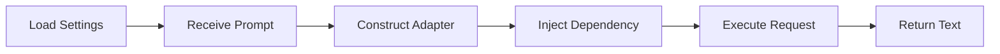

This note documents the architecture, design decisions, implementation boundaries, testing strategy, production considerations, and learning outcomes of the uploaded repository. Status statements are grounded in the repository files; runtime success still depends on installed dependencies, valid credentials, and provider availability.

<details>
<summary><strong>Table of contents</strong></summary>

- [1. Project Overview](#1-project-overview)
- [2. Problem Statement](#2-problem-statement)
- [3. Architecture](#3-architecture)
- [4. Project Structure](#4-project-structure)
- [5. Provider Adapter Model](#5-provider-adapter-model)
- [6. Components](#6-components)
- [7. Request Execution Pipeline](#7-request-execution-pipeline)
- [8. Async Execution](#8-async-execution)
- [9. Configuration and Provider Resolution](#9-configuration-and-provider-resolution)
- [10. CLI Usage](#10-cli-usage)
- [11. Design Principles](#11-design-principles)
- [12. Design Decisions](#12-design-decisions)
- [13. Testing Strategy](#13-testing-strategy)
- [14. Error Boundary](#14-error-boundary)
- [15. Security and Data Handling](#15-security-and-data-handling)
- [16. Production Considerations](#16-production-considerations)
- [17. Integration With Related Projects](#17-integration-with-related-projects)
- [18. Evaluation Boundary](#18-evaluation-boundary)
- [19. Current Limitations](#19-current-limitations)
- [20. Future Improvements](#20-future-improvements)
- [21. Key Takeaways](#21-key-takeaways)
- [22. Learning Outcomes](#22-learning-outcomes)
- [23. Project Completion Gate](#23-project-completion-gate)
- [24. Final Recall Map](#24-final-recall-map)
- [25. Interview Recall](#25-interview-recall)
- [26. Project Status](#26-project-status)

</details>

---

## 1. Project Overview

LLM Gateway is a lightweight Python application that demonstrates the **Provider Adapter Pattern** for large language models (LLMs).

The project separates application behavior from provider-specific integration code. Instead of importing and calling a model SDK directly inside the use case, the application communicates through an abstract contract named `LLMPort`.

The current implementation uses `GeminiAdapter` to communicate with Google Gemini. `GenerateText` depends on the `LLMPort` contract, so an additional adapter can be introduced without rewriting the use case; the current CLI still requires a provider-resolution change to select it.

The current request flow:

- loads environment-based settings when the infrastructure settings module is imported,
- accepts a prompt through a Typer CLI,
- constructs `GeminiAdapter` directly,
- injects the adapter into `GenerateText`,
- calls the provider through the `LLMPort` contract,
- validates that the prompt and provider text are non-empty,
- returns the generated string to the CLI.

### Scope

| Capability | Current Behavior |
|---|---|
| Application use case | `GenerateText` executes the text-generation workflow |
| Provider contract | `LLMPort` defines the interface required by the application |
| Provider adapter | `GeminiAdapter` implements the current Gemini integration |
| Configuration | Settings are loaded from environment variables |
| Dependency injection | A concrete adapter is supplied to the use case |
| Execution model | Provider calls are asynchronous |
| Delivery | Typer-based command-line interface |
| Tests | Settings configuration and a credentialed live Gemini generation test |
| Provider support | Google Gemini |
| Future direction | Configuration-driven provider resolution and additional adapters |

The current project is intentionally narrow. It demonstrates provider decoupling and application structure rather than a complete production gateway platform.

Explicit non-goals in the current version include provider failover, request routing, streaming, retries, cost accounting, prompt governance, token-budget enforcement, persistent request history, and response-schema validation.

---

## 2. Problem Statement

Directly calling an LLM provider SDK from application code creates avoidable architectural coupling.

| Failure Mode | Engineering Impact |
|---|---|
| SDK calls inside business logic | Provider details spread into the application layer |
| Provider-specific request objects | Core use cases become difficult to reuse |
| Hard-coded API keys | Secrets become coupled to source code |
| Provider-specific exceptions | Error handling leaks across the codebase |
| Direct model selection in the CLI | Presentation logic becomes responsible for infrastructure |
| No abstraction boundary | Replacing a provider requires application changes |
| Synchronous blocking calls | Concurrency and responsiveness become harder to manage |
| Uncontrolled configuration | Environments behave inconsistently |
| Concrete dependencies in tests | Unit tests require SDKs, credentials, or network access |

A tightly coupled implementation often looks like this:

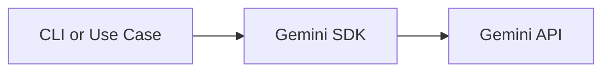

In that structure, the CLI or use case must understand provider credentials, model configuration, SDK methods, request syntax, and response objects.

LLM Gateway introduces an explicit boundary:

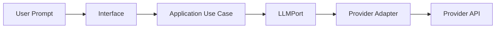

The application owns the use case.

The adapter owns provider-specific translation.

The provider SDK remains an infrastructure detail.

---

## 3. Architecture

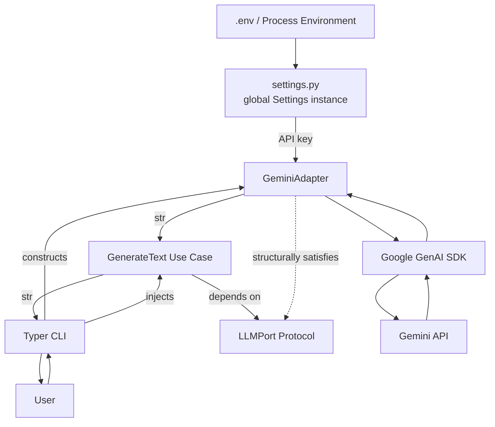

The implementation follows a simplified Clean Architecture dependency rule:

> Application policy may depend on abstractions. Infrastructure details implement those abstractions.

### Dependency Direction

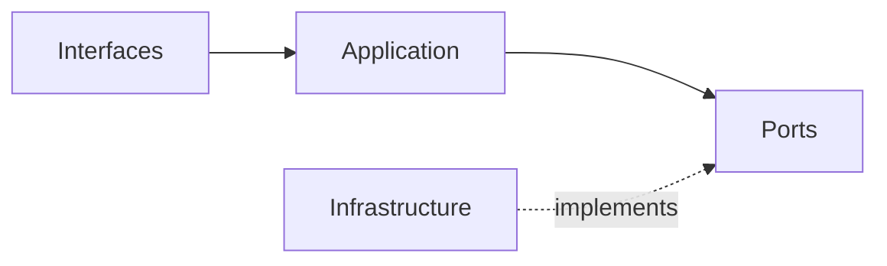

The important distinction is between **source-code dependency direction** and **runtime execution direction**.

At runtime, the application calls a concrete adapter. In source code, the application is designed against the `LLMPort` abstraction.

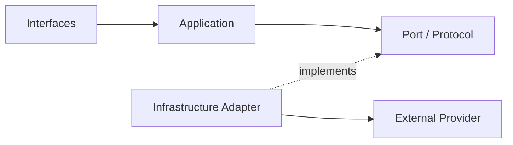

### Layer Responsibilities

| Layer | Responsibility | Excludes |
|---|---|---|
| Domain | Future provider-independent business concepts and rules | SDK calls, CLI parsing, environment loading |
| Application | Executes the text-generation use case | Gemini request construction and terminal formatting |
| Ports | Defines the provider capability required by the application | Concrete SDK implementation |
| Infrastructure | Implements provider communication and configuration | Application orchestration |
| Interfaces | Receives user input and presents output | Provider-specific request logic |

The application layer is structured so it does not need to know whether an implementation uses Gemini, another provider, a local model, or a test double.

---

## 4. Project Structure

```text
llm_gateway/
├── docs/
│   └── LLM_Gateway_Engineering_Project_Note.md
├── evals/
├── tests/
│   ├── test_gemini.py
│   └── test_settings.py
├── src/
│   └── llm_gateway/
│       ├── application/
│       │   └── generate_text.py
│       ├── domain/
│       ├── infrastructure/
│       │   ├── gemini_adapter.py
│       │   └── settings.py
│       ├── interfaces/
│       │   └── cli.py
│       └── ports/
│           └── llm.py
├── .gitignore
├── README.md
└── pyproject.toml
```

### Directory Responsibilities

| Path | Responsibility |
|---|---|
| `docs/` | Engineering notes, architecture decisions, and production guidance |
| `evals/` | Future model-behavior and provider-comparison evaluations |
| `tests/` | Unit, integration, interface, and contract verification |
| `application/` | Use-case orchestration |
| `domain/` | Provider-independent domain concepts |
| `ports/` | Abstract contracts required by the application |
| `infrastructure/` | Provider adapters and environment configuration |
| `interfaces/` | CLI and future API, worker, or event interfaces |
| `pyproject.toml` | Package metadata, dependencies, scripts, and tooling |

Each directory represents a reason for change.

| Change | Expected Location |
|---|---|
| Text-generation workflow changes | `application/` |
| Provider contract changes | `ports/` |
| Gemini SDK changes | `infrastructure/gemini_adapter.py` |
| Environment configuration changes | `infrastructure/settings.py` |
| CLI commands or output change | `interfaces/cli.py` |
| Provider-independent model concepts | `domain/` |

Directory responsibilities should remain stable even if filenames evolve.

---

## 5. Provider Adapter Model

The design separates application intent from provider implementation:

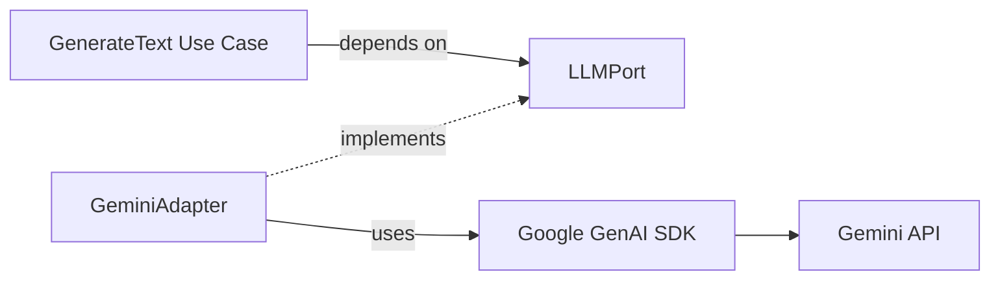

| Element | Responsibility | Must Not Expose |
|---|---|---|
| `GenerateText` | Coordinates the application workflow | Provider SDK types or credentials |
| `LLMPort` | Defines the capability required by the application | Provider construction or configuration |
| `GeminiAdapter` | Translates the port operation into Gemini-specific behavior | Gemini response objects outside infrastructure |
| Gemini SDK | Performs provider-specific transport and API operations | Application policy |

Conceptually, the application speaks in provider-independent terms:

```python
from typing import Protocol


class LLMPort(Protocol):
    async def generate(self, prompt: str) -> str:
        ...
```

The adapter translates that operation into provider-specific behavior:

```python
class GeminiAdapter:
    async def generate(self, prompt: str) -> str:
        # Build the Gemini request.
        # Execute the provider call.
        # Extract and return application-level text.
        ...
```

### Why a Protocol?

Python Protocols support structural typing. A concrete class satisfies `LLMPort` by implementing the required method shape; inheritance from a shared base class is not required.

This provides:

- low coupling,
- clear application contracts,
- simple test doubles,
- flexible adapter implementations,
- static type-checking support.

A Protocol defines what the application needs, not how a provider must be built.

---

## 6. Components

### 6.1 Application Use Case

The current application use case is `GenerateText`.

Its responsibility is to coordinate text generation through the port.

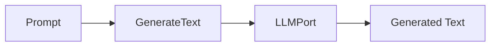

The use case should:

- accept application input,
- call the injected LLM abstraction,
- return provider-independent output,
- remain unaware of SDK initialization,
- remain unaware of environment variables,
- avoid CLI-specific formatting.

The use case should not:

- import the Gemini SDK,
- read `GEMINI_API_KEY`,
- choose terminal formatting,
- instantiate a provider internally,
- expose Gemini response objects,
- contain provider-specific retry logic.

A narrow use case is easier to test because a fake implementation of `LLMPort` can replace the real adapter.

---

### 6.2 LLM Port

The current port is `LLMPort`.

Responsibilities:

- define the text-generation capability,
- establish the method signature expected by the application,
- hide provider implementation details,
- support provider replacement,
- enable test doubles.

The port is an architectural boundary.

It is not a provider factory, configuration object, SDK wrapper collection, or universal representation of every possible provider feature.

A useful port should remain focused on application needs.

If future requirements introduce embeddings, structured output, image generation, audio, or streaming, those capabilities should be modeled deliberately rather than added indiscriminately to one oversized interface.

---

### 6.3 Gemini Adapter

The current concrete adapter is `GeminiAdapter`.

Responsibilities:

- initialize Gemini-specific dependencies,
- authenticate using configured credentials,
- translate the application prompt into the Gemini request format,
- execute the asynchronous provider call,
- extract generated text,
- translate provider failures into stable application-level errors when error handling is added.

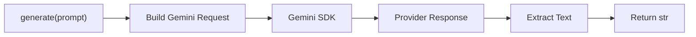

The adapter is the only current component that should understand Gemini-specific SDK behavior.

When the Gemini SDK changes, most required modifications should remain inside this adapter.

---

### 6.4 Settings

Application settings are loaded from `.env` or the process environment.

Current configuration:

| Variable | Current Use |
|---|---|
| `GEMINI_API_KEY` | Used by `GeminiAdapter` to construct the Google GenAI client |
| `GROQ_API_KEY` | Loaded by `Settings`, but no Groq adapter currently consumes it |
| `LLM_PROVIDER` | Loaded with a default of `gemini`, but does not yet drive provider resolution |
| `LLM_TIMEOUT_SECONDS` | Parsed as an integer, but not yet enforced by the adapter |

Configuration separates deployment values from source code.

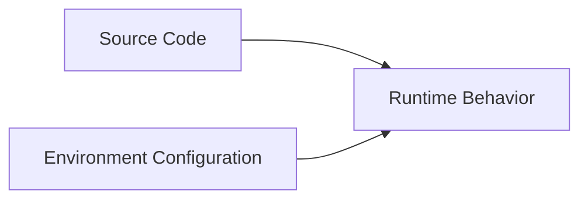

Settings should provide:

- explicit field names,
- predictable defaults where appropriate,
- validation for required secrets,
- typed values,
- clear startup failures for invalid configuration.

Secrets must not be committed to source control.

Recommended repository files:

```text
.env              # local secret values; never publish
.env.example      # documented variable names; placeholders only
```

> **Repository safety note:** The uploaded archive contains a `.env` file, while the uploaded `.gitignore` does not currently exclude `.env`. Remove the file before publishing the repository, add `.env` to `.gitignore`, and rotate any credential that may have been committed.

---

### 6.5 Typer CLI

The current interface is a Typer command-line application.

Current responsibilities:

- receive the prompt,
- construct `GeminiAdapter`,
- inject the adapter into `GenerateText`,
- run the asynchronous use case with `asyncio.run`,
- display the generated result.

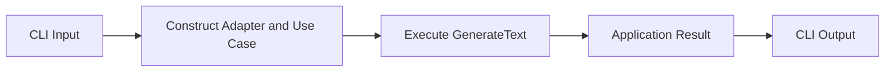

The current CLI does not yet translate exceptions into user-friendly terminal errors.

The CLI is a delivery mechanism, not the owner of provider logic.

A future FastAPI endpoint, background worker, scheduled job, or desktop interface should be able to reuse the same application use case.

---

### 6.6 Dependency Composition

The application requires a concrete object at runtime even though it depends on an abstraction in design.

Dependency composition connects the layers:

```python
provider = GeminiAdapter()
use_case = GenerateText(provider)
result = await use_case.execute(prompt)
```

This wiring should occur at the application boundary or composition root.

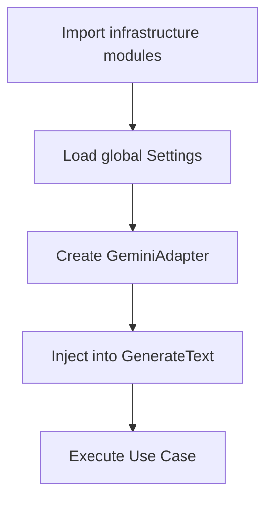

The composition root is allowed to know concrete classes.

The use case is not.

---

## 7. Request Execution Pipeline

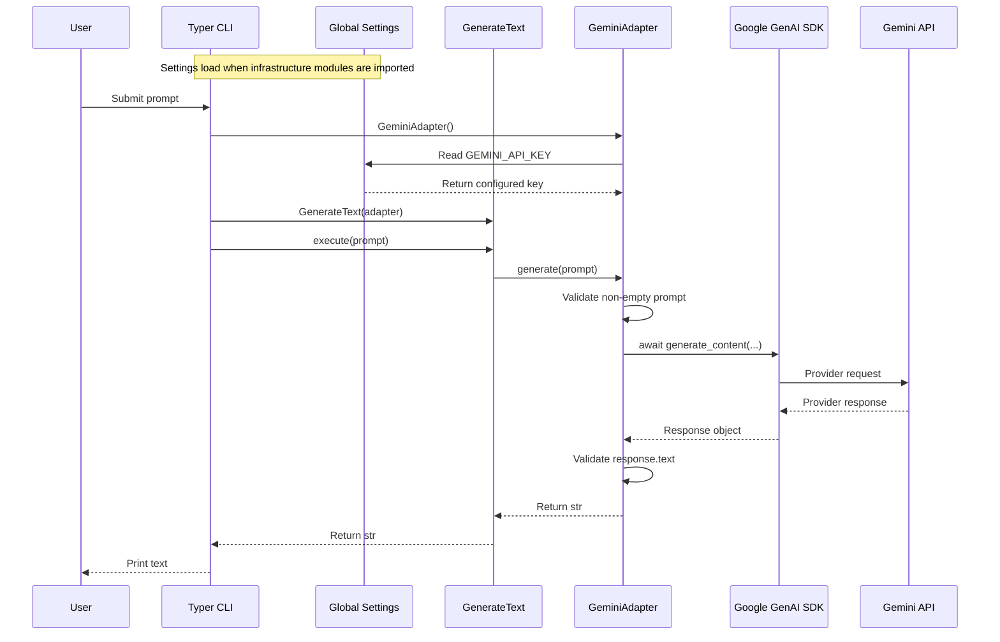

### Sequence

1. Importing the infrastructure modules loads the global `Settings` instance.
2. The user submits a prompt through the CLI.
3. The CLI constructs `GeminiAdapter` directly.
4. The adapter reads `GEMINI_API_KEY` from the global settings object.
5. The CLI injects the adapter into `GenerateText`.
6. The use case calls `generate(prompt)` through the `LLMPort` contract.
7. `GeminiAdapter` rejects an empty prompt, awaits the Gemini SDK, and rejects an empty response.
8. The normalized string returns through the use case to the CLI.

### Boundary Rule

| Boundary Input | Boundary Output |
|---|---|
| CLI string | Application prompt |
| Application prompt | Gemini SDK request |
| Gemini response object | Provider-independent `str` |

Translation occurs at system boundaries, preventing the provider SDK from becoming the application’s internal data model.

---

## 8. Async Execution

The provider call is asynchronous because network operations spend most of their time waiting for external I/O.

Conceptually:

```python
result = await llm.generate(prompt)
```

Async execution supports:

- non-blocking provider calls,
- better concurrency in API or worker environments,
- future parallel requests,
- streaming integration,
- timeout and cancellation handling.

Async does not automatically provide:

- retries,
- concurrency limits,
- rate limiting,
- cancellation safety,
- provider failover,
- lower latency.

Those behaviors require explicit policy.

### Async Boundary

| Component | Expected Async Behavior |
|---|---|
| CLI | Runs the async application entry point |
| Application use case | Awaits the port |
| Port | Declares the async operation |
| Adapter | Awaits the provider SDK |
| Settings | Normally synchronous |
| Pure domain rules | Normally synchronous |

The async contract should follow the I/O path rather than spreading into components that perform only deterministic computation.

---

## 9. Configuration and Provider Resolution

The current project defines `LLM_PROVIDER`, but the CLI does not use it to resolve an adapter. Gemini is constructed directly.

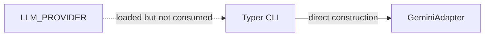

A future provider factory may support:

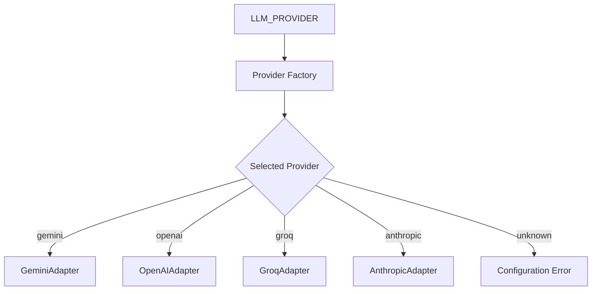

Provider resolution belongs in the composition layer.

It should not be placed inside `GenerateText`.

### Configuration Policy

| Condition | Recommended Behavior |
|---|---|
| Required API key missing | Fail during startup or dependency construction |
| Timeout is not numeric | Reject configuration |
| Timeout is zero or negative | Reject configuration |
| Unsupported provider | Return explicit configuration error |
| Provider-specific key missing | Reject only when that provider is selected |
| Secret appears in logs | Redact it |
| `.env` committed | Remove and rotate affected credentials |

A settings object should convert raw strings into validated application configuration before provider execution begins.

---

## 10. CLI Usage

Run the CLI:

```bash
python -m llm_gateway.interfaces.cli "Hello AI"
```

Example output:

```text
Hello! How can I help you today?
```

The exact response is provider-generated and may vary between executions.

The CLI demonstrates end-to-end dependency wiring. A successful response alone does not verify architecture conformance, failure behavior, cost control, output quality, or production reliability.

---

## 11. Design Principles

### Clean Architecture

The project separates application policy from delivery and provider details.

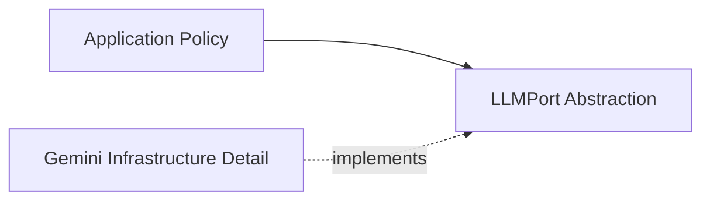

The stable part of the system should not depend on the most volatile part.

Provider SDKs, API versions, authentication mechanisms, and response formats may change frequently. The application use case should remain comparatively stable.

### Dependency Inversion Principle

High-level application logic should not depend directly on a low-level provider module.

Both communicate through an abstraction:

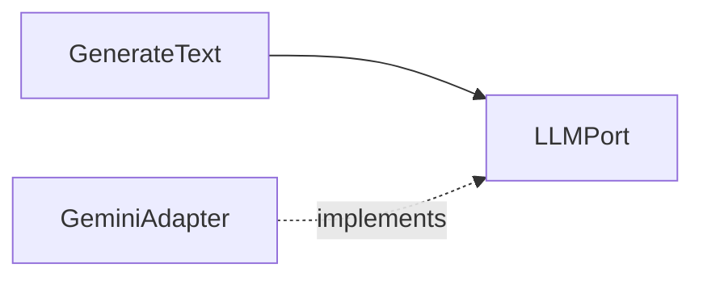

The arrow represents source-code dependency.

### Separation of Concerns

| Concern | Owner |
|---|---|
| Receive terminal input | CLI |
| Execute text-generation workflow | Application |
| Define required provider capability | Port |
| Call Gemini | Adapter |
| Load environment values | Settings |
| Select concrete dependencies | Composition root |

### Dependency Injection

The use case receives its dependency rather than constructing it internally.

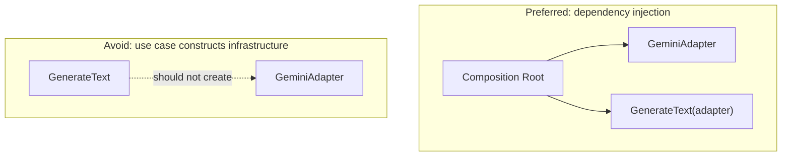

Injection improves substitution, testing, configuration, and lifecycle control.

### Interface-Driven Design

The application is designed around required behavior instead of a specific library.

The interface should be:

- small,
- explicit,
- provider-independent,
- aligned with application use cases,
- stable enough to support multiple implementations.

### Single Responsibility

Each component has one primary reason to change.

| Component | Changes When |
|---|---|
| `GenerateText` | Text-generation workflow changes |
| `LLMPort` | Required application capability changes |
| `GeminiAdapter` | Gemini integration changes |
| `Settings` | Configuration policy changes |
| CLI | Terminal interaction changes |
| Provider factory | Provider resolution rules change |

---

## 12. Design Decisions

| Decision | Rationale | Trade-off |
|---|---|---|
| Port between use case and provider | Prevents provider SDK coupling | Adds an abstraction |
| Python Protocol | Supports structural typing and simple test doubles | Runtime enforcement is limited |
| Adapter per provider | Isolates translation and SDK behavior | Requires one implementation per provider |
| Async provider method | Matches network I/O and future concurrency needs | Async execution must be managed |
| Environment-based settings | Separates deployment values and secrets from code | Configuration must be validated |
| Thin CLI | Keeps presentation separate from use-case policy | Dependency wiring must live elsewhere |
| Application-level string result | Prevents provider objects from leaking inward | Provider metadata is not yet exposed |
| Single current provider | Keeps learning scope focused | Multi-provider claims remain architectural, not implemented |
| Basic tests first | Verifies construction and configuration boundaries | Does not yet prove request behavior |
| Empty domain package | Preserves room for future domain concepts | Current project may appear structurally larger than its behavior |

### Port Granularity

A single `generate(prompt: str) -> str` operation is suitable for the present scope.

It may become insufficient when the product requires:

- system and user message separation,
- sampling parameters,
- tool calling,
- structured output,
- multimodal inputs,
- token usage,
- provider metadata,
- streaming events.

The port should evolve from real application requirements rather than mirror every feature offered by all providers.

---

## 13. Testing Strategy

The test suite should prove both deterministic architecture behavior and provider-boundary behavior.

### Current Coverage

The uploaded repository contains two tests:

- `test_settings.py` verifies that provider configuration exists, timeout is positive, and a Gemini key is available;
- `test_gemini.py` performs a credentialed live Gemini request and verifies that the returned value is a non-empty string.

Run:

```bash
pytest
```

The active repository run is the source of truth for pass counts. The uploaded `pyproject.toml` does not declare the runtime or test dependencies, so `pip install -e .` alone is not sufficient in a clean environment.

### Component Coverage

| Component | Required Cases |
|---|---|
| Settings | Valid values, missing API key, default provider, invalid timeout |
| `LLMPort` contract | Compatible fake and concrete implementations |
| `GenerateText` | Prompt forwarding, returned text, propagated application errors |
| Gemini adapter | Initialization, request translation, response extraction |
| Provider factory | Supported provider and unsupported provider |
| CLI | Valid prompt, configuration failure, provider failure, visible output |
| Async behavior | Awaited execution and cancellation/timeout behavior |

### Recommended Unit Test With a Fake Port

The current repository does not include this test. It is the highest-value next test because it can verify `GenerateText` without credentials or network access.

Conceptually:

```python
class FakeLLM:
    async def generate(self, prompt: str) -> str:
        return f"fake:{prompt}"


async def test_generate_text_uses_port() -> None:
    use_case = GenerateText(llm=FakeLLM())

    result = await use_case.execute("Hello")

    assert result == "fake:Hello"
```

This test proves application behavior independently of the provider SDK.

### Adapter Test Boundary

Adapter tests should verify translation behavior without making uncontrolled live requests.

Useful techniques include:

- mocking the SDK client,
- injecting a provider client,
- using recorded fixtures where permitted,
- separating unit tests from live smoke tests.

### Test Pyramid

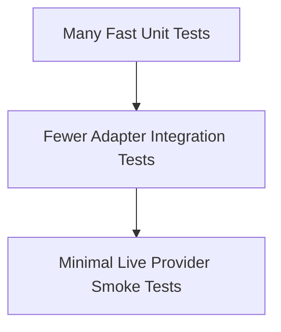

Live tests should be explicitly marked because they consume credentials, network access, time, and potentially money.

### Boundary Matrix

| Case | Expected Result |
|---|---|
| Valid configuration | Dependency construction succeeds |
| Missing Gemini key | Explicit configuration failure |
| Valid prompt | Use case forwards prompt once |
| Adapter returns text | Use case returns the same application-level text |
| Provider returns empty result | Apply documented empty-response policy |
| Provider raises an error | Translate or propagate according to error policy |
| Unsupported provider | Reject before use-case execution |
| Timeout reached | Cancel or fail with a stable timeout error |
| Fake port supplied | Unit test runs without network access |
| CLI receives invalid input | Return readable interface error |

---

## 14. Error Boundary

The current adapter provides three explicit validation errors:

| Condition | Current Exception |
|---|---|
| Missing `GEMINI_API_KEY` | `ValueError` during adapter construction |
| Empty prompt | `ValueError` before the provider call |
| Empty provider text | `RuntimeError` after the provider call |

Other provider SDK exceptions currently pass through unchanged. A future stable error model may include:

```text
LLMConfigurationError
LLMAuthenticationError
LLMRateLimitError
LLMTimeoutError
LLMProviderUnavailableError
LLMInvalidResponseError
LLMRequestError
```

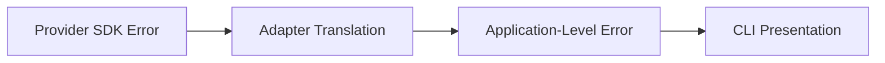

### Error Ownership

| Failure | Owner |
|---|---|
| Missing environment variable | Settings |
| Unsupported provider | Factory or composition root |
| Invalid application input | Interface or application validation |
| Gemini authentication failure | Gemini adapter |
| Provider timeout | Adapter and timeout policy |
| User-facing error message | CLI |
| Retry decision | Application/infrastructure resilience policy |

The CLI should display useful information without exposing API keys, internal stack traces, or provider response payloads containing sensitive data.

---

## 15. Security and Data Handling

An LLM gateway crosses a trust boundary between product input and an external provider.

| Risk | Required Control |
|---|---|
| API-key exposure | Store secrets in environment or a secret manager |
| Secret logging | Redact credentials and authorization headers |
| Prompt data leakage | Define provider data-handling and retention policy |
| Sensitive user input | Classify, minimize, and redact where required |
| Prompt injection | Separate trusted instructions from untrusted content |
| Unbounded requests | Integrate token and request-budget validation |
| Provider misuse | Apply authentication, authorization, and quotas at service boundaries |
| Cross-tenant leakage | Isolate request context, logs, and metadata |
| Unsafe output | Validate or moderate at the response boundary |
| Dependency compromise | Pin, scan, and update SDK dependencies |

Recommended request metadata:

```text
request_id
provider
model
timeout
input_size
status
latency
error_code
token_usage
estimated_cost
```

Raw prompts and responses should not be logged by default when they may contain private or business-sensitive information.

### Secret Management

```mermaid
flowchart LR
    LOCAL["Local Development<br/>Untracked .env"] --> APP["Application Settings"]
    CI["CI/CD Secret Store"] --> APP
    PROD["Managed Production Secret Store"] --> APP
```

In the uploaded archive, `.env` is present and `.gitignore` does not list it. Treat this as a release-safety issue: remove the file from any public artifact, add the ignore rule, and rotate keys if they were committed.

A real API key must never appear in:

- source code,
- README examples,
- committed `.env` files,
- test fixtures,
- exception messages,
- screenshots,
- public logs.

---

## 16. Production Considerations

### Provider Factory

A provider factory should map validated configuration to a concrete adapter.

```python
def build_llm(settings: Settings) -> LLMPort:
    if settings.llm_provider == "gemini":
        return GeminiAdapter(...)
    raise UnsupportedProviderError(settings.llm_provider)
```

The factory is a construction mechanism; it should not contain prompt policy or application workflow logic.

### Timeouts

`LLM_TIMEOUT_SECONDS` should become an enforced runtime policy rather than a documented setting only.

Timeout behavior should define:

- connection timeout,
- total request timeout,
- cancellation behavior,
- retry eligibility,
- user-facing error mapping.

### Retries

Retries should be limited to failures that may succeed on a later attempt.

| Failure | Typical Retry Decision |
|---|---|
| Temporary network interruption | Retry with backoff |
| Provider 5xx response | Retry within policy |
| Rate limit | Retry only with provider guidance and budget |
| Authentication failure | Do not retry |
| Invalid request | Do not retry |
| Content-policy rejection | Do not retry unchanged |
| Timeout | Retry only when idempotency and budget allow |

Retry policy should include:

- maximum attempts,
- exponential backoff,
- jitter,
- total deadline,
- retryable error classification,
- request idempotency,
- cost impact.

### Provider Failover

Provider failover is not merely an additional `try/except`.

Different providers may vary in:

- model capability,
- token limits,
- message format,
- safety behavior,
- tool-calling support,
- structured-output support,
- pricing,
- latency,
- response quality.

Failover requires an explicit compatibility and product policy.

### Streaming

Streaming changes the port contract from one returned string to a sequence of events or chunks.

```mermaid
flowchart LR
    REQUEST["Request"] --> START["Stream Start"]
    START --> CHUNKS["Content Chunks"]
    CHUNKS --> USAGE["Usage Metadata"]
    USAGE --> END["Completion or Failure"]
```

A streaming port may be separate from the simple text-generation port to avoid forcing all implementations into one interface.

### Observability

Production telemetry should measure:

- request count by provider and model,
- success and failure rates,
- latency percentiles,
- timeout frequency,
- retry count,
- rate-limit frequency,
- token usage,
- estimated and actual cost,
- empty-response frequency,
- adapter error categories,
- provider fallback frequency.

Metrics should use stable application error codes rather than arbitrary SDK exception strings.

### Lifecycle Management

Provider clients may hold HTTP sessions, connection pools, or other resources.

A production composition root should define:

- client creation,
- client reuse,
- startup validation,
- graceful shutdown,
- connection cleanup,
- concurrency limits.

---

## 17. Integration With Related Projects

The gateway can serve as the provider-execution boundary for related AI product engineering components.

```mermaid
flowchart TD
    INPUT["User Input"] --> CONTRACT["Prompt Contract"]
    CONTRACT --> BUDGET["Request Budget Guard"]
    BUDGET --> GATEWAY["LLM Gateway"]
    GATEWAY --> ADAPTER["Provider Adapter"]
    ADAPTER --> MODEL["LLM Provider"]
    MODEL --> OUTPUT["Raw Model Output"]
    OUTPUT --> VALIDATOR["Response Validation"]
    VALIDATOR --> PRODUCT["Product Response"]
```

| Component | Responsibility | Boundary Outcome |
|---|---|---|
| Prompt Contract | Define, validate, and render deterministic provider input | Rendered prompt or validation error |
| Request Budget Guard | Enforce context, token, and cost policy | Accepted request or budget error |
| LLM Gateway | Abstract and execute provider communication | Provider-independent response |
| Response Validator | Verify output shape, evidence, and policy | Validated result or response error |
| Product Interface | Deliver the final result | User-facing response |

The Prompt Contract prepares deterministic provider input. The Request Budget Guard rejects oversized or over-budget requests before provider execution. The gateway then executes the approved request without taking ownership of prompt policy or response validation.

---

## 18. Evaluation Boundary

Unit and integration tests answer:

> **Engineering tests:** Did the application call the configured provider boundary correctly?

Model evaluations answer:

> **Model evaluations:** Did the selected provider and model produce an acceptable response?

These are different questions.

### Engineering Tests

- Was the prompt forwarded correctly?
- Was the adapter selected correctly?
- Was the response translated correctly?
- Were provider errors mapped correctly?
- Was configuration validated?
- Did the call respect the timeout?

### Model Evaluations

- Was the answer accurate?
- Did the model follow instructions?
- Was the response format correct?
- Did quality change between providers?
- Did a model upgrade create regressions?
- Is latency and cost acceptable for the quality level?

Future evaluation records should include:

```text
test_case_id
gateway_version
provider
model
model_parameters
prompt_digest
response
grader_result
latency
input_tokens
output_tokens
cost
error_code
```

The gateway enables provider substitution; evaluations determine whether that substitution is acceptable for the product.

---

## 19. Current Limitations

The project is intentionally scoped as an architectural learning implementation rather than a production gateway.

| Area | Current Limitation |
|---|---|
| Provider support | Only Gemini is implemented, and the CLI constructs it directly |
| Configuration | `LLM_PROVIDER` and `GROQ_API_KEY` are loaded but not used for provider resolution |
| Timeout | `LLM_TIMEOUT_SECONDS` is parsed but not enforced |
| Model configuration | The Gemini model identifier is hard-coded inside `GeminiAdapter` |
| Reliability | Retries, rate limiting, cancellation policy, and provider failover are not implemented |
| Response capabilities | Streaming, structured output, response validation, and usage metadata are not modeled |
| Error handling | Provider SDK exceptions are not translated into stable application-level errors |
| Observability | Logging, metrics, tracing, token usage, and cost tracking are not implemented |
| Testing | The suite has one settings test and one live provider test; no fake-port use-case test exists |
| Packaging | Runtime and test dependencies are not declared in `pyproject.toml` |
| Secret hygiene | The uploaded archive contains `.env`, and `.gitignore` does not currently exclude it |
| Delivery | The current interface is CLI-only; no FastAPI service boundary exists |
| Domain model | The domain package is present but contains no substantive domain behavior |
| Licensing | No `LICENSE` file is present in the uploaded repository |

These constraints define the current project boundary and must not be presented as implemented production capabilities.

---

## 20. Future Improvements

| Priority | Improvement | Engineering Outcome |
|---:|---|---|
| 1 | Remove `.env` from publishable artifacts and add `.env` to `.gitignore` | Prevent accidental credential exposure |
| 2 | Add `.env.example` with placeholders | Document configuration without distributing secrets |
| 3 | Declare runtime and test dependencies in `pyproject.toml` | Make clean installation reproducible |
| 4 | Add a fake-port `GenerateText` unit test | Verify application behavior without network access |
| 5 | Add configuration and CLI failure tests | Prove predictable invalid-input and missing-key behavior |
| 6 | Move the model identifier into configuration | Remove a provider-specific deployment value from code |
| 7 | Implement a provider factory | Make `LLM_PROVIDER` control adapter resolution |
| 8 | Enforce request timeouts | Convert the timeout setting into runtime policy |
| 9 | Define stable application errors | Prevent SDK exception leakage |
| 10 | Add bounded retries with backoff and jitter | Recover from transient failures safely |
| 11 | Add another provider adapter | Demonstrate actual provider substitution |
| 12 | Add provider-independent streaming | Deliver incremental model output |
| 13 | Add safe logging and metrics | Observe latency, failures, and provider behavior |
| 14 | Track token usage and cost | Measure request consumption |
| 15 | Add structured requests and response validation | Support typed AI product behavior |
| 16 | Add FastAPI delivery | Expose the use case as a service |
| 17 | Add Docker and CI/CD | Standardize installation, testing, and delivery |
| 18 | Add a repository license | Clarify public-use and contribution terms |

Additional candidates include provider health checks, circuit breakers, concurrency control, caching, model routing, usage quotas, tracing, secret-manager integration, and evaluation-driven provider selection.

---

## 21. Key Takeaways

- Application use cases should depend on provider capabilities, not provider SDKs.
- `LLMPort` defines what the application needs.
- `GeminiAdapter` translates that need into Gemini-specific behavior.
- The adapter owns provider request and response translation.
- The application layer should not read provider credentials or instantiate SDK clients.
- Python Protocols support flexible, structurally typed boundaries.
- Dependency injection makes provider replacement and unit testing easier.
- Async execution is appropriate for provider network I/O.
- Environment configuration separates deployment values from source code.
- A thin CLI prevents provider policy from spreading into the interface.
- Multi-provider architecture does not mean multi-provider behavior is already implemented.
- Retries, timeouts, streaming, cost tracking, and failover require explicit product policies.
- Prompt preparation, budget validation, provider execution, and response validation are separate engineering boundaries.
- Provider substitution must be verified by both engineering tests and model evaluations.

---

## 22. Learning Outcomes

Through this project, I learned:

- how the Provider Adapter Pattern works,
- why provider SDKs should remain infrastructure details,
- how Clean Architecture controls dependency direction,
- how the Dependency Inversion Principle protects high-level policy,
- how Python Protocols define structural interfaces,
- how dependency injection enables substitution,
- how to separate use cases from interfaces,
- how to load configuration from environment variables,
- how async provider calls fit into an application workflow,
- how to organize a Python project using a professional `src/` layout,
- how to prepare an application for additional providers,
- how the port design enables future unit tests to replace external providers with fakes,
- why production reliability requires more than a working SDK call.

---

## 23. Project Completion Gate

Every checkbox below is checked because this gate covers only the implemented **v0.1.0 repository scope**. Planned production work remains in [Future Improvements](#20-future-improvements) and is not part of this completion claim.

### Implementation

- [x] `LLMPort` protocol is defined
- [x] `GenerateText` depends on `LLMPort`
- [x] `GeminiAdapter` provides asynchronous text generation
- [x] Missing-key, empty-prompt, and empty-response validation paths exist
- [x] Environment settings are loaded through `python-dotenv`
- [x] Typer CLI accepts a prompt and prints the provider-independent string
- [x] The CLI constructs and injects the concrete adapter

### Repository Test Assets

- [x] Pytest is configured for the `src/` layout
- [x] A settings configuration test exists
- [x] A credentialed live Gemini generation test exists
- [x] The live test verifies a non-empty string response
- [x] Async test execution is configured with the AnyIO backend fixture

### Architecture

- [x] The application use case does not import the Gemini SDK
- [x] The provider contract is owned by the application boundary
- [x] Gemini SDK usage remains inside infrastructure
- [x] Provider response objects are normalized to `str` before returning to the application
- [x] Dependency injection occurs in the CLI composition boundary
- [x] The project uses a professional `src/` package layout

### Documentation

- [x] Current behavior is separated from planned behavior
- [x] Repository limitations are stated explicitly
- [x] Design decisions and trade-offs are documented
- [x] Testing and production boundaries are documented
- [x] All architectural and runtime flows are represented with Mermaid diagrams
- [x] The completion checklist contains no unfinished items outside the declared v0.1.0 scope

---

## 24. Final Recall Map

```mermaid
flowchart TD
    A["LOAD SETTINGS"] --> B["RECEIVE PROMPT"]
    B --> C["CONSTRUCT GEMINI ADAPTER"]
    C --> D["INJECT INTO GENERATE TEXT"]
    D --> E["VALIDATE PROMPT"]
    E --> F["AWAIT GEMINI REQUEST"]
    F --> G["VALIDATE RESPONSE TEXT"]
    G --> H["RETURN STR"]
    H --> I["DISPLAY CLI OUTPUT"]

    A -.-> A1["Load .env and process environment"]
    C -.-> C1["Read GEMINI_API_KEY"]
    D -.-> D1["Use GeminiAdapter through LLMPort"]
    F -.-> F1["Call Google GenAI async SDK"]
    H -.-> H1["Keep provider response objects in infrastructure"]
```

### Memory Hook

| Stage | Recall |
|---|---|
| Load | Read environment-backed settings |
| Receive | Accept the CLI prompt |
| Construct | Create `GeminiAdapter` |
| Inject | Supply the adapter to `GenerateText` |
| Execute | Await `generate(prompt)` |
| Normalize | Return provider-independent text |
| Display | Print the final string |

---

## 25. Interview Recall

You should be able to answer these without notes:

1. What problem does the Provider Adapter Pattern solve?
2. Why should `GenerateText` depend on `LLMPort` instead of `GeminiAdapter`?
3. What is the difference between a port and an adapter?
4. Why is the provider SDK an infrastructure detail?
5. How do Python Protocols support dependency inversion?
6. Why is dependency injection better than constructing the adapter inside the use case?
7. Where should provider selection occur?
8. Why should the CLI remain thin?
9. What should the Gemini adapter translate?
10. Why should provider response objects not leak into the application layer?
11. Why are async methods useful for LLM calls?
12. What does async execution not solve automatically?
13. How can `GenerateText` be tested without a Gemini API key?
14. What errors should be translated at the adapter boundary?
15. What is the difference between an engineering test and a model evaluation?
16. Why does adding another adapter not automatically guarantee equivalent behavior?
17. Where should retry and timeout policies live?
18. How would streaming change the port contract?
19. How should Prompt Contract Lab integrate with the gateway?
20. How should Request Budget Guard integrate with the gateway?

---

## 26. Project Status

| Status | Repository Evidence |
|---|---|
| **Current scope complete** | `LLMPort`, `GenerateText`, `GeminiAdapter`, environment settings, Typer CLI, async request path |
| **Test assets present** | Settings test and credentialed live Gemini generation test |
| **Documented but not implemented** | Dynamic provider resolution, enforced timeout, retries, stable errors, streaming, observability, cost tracking, and FastAPI delivery |
| **Before public release** | Remove `.env` from publishable artifacts, add ignore/example files, declare dependencies, and add a license |

The v0.1.0 architectural learning scope is complete. Production hardening and release hygiene remain separate follow-up work.

---

## Conclusion

LLM Gateway demonstrates how an AI application can communicate with an external model provider without allowing provider-specific code to control the application architecture.

The central boundary is `LLMPort`.

`GenerateText` depends on that abstraction, while `GeminiAdapter` implements it using Gemini-specific SDK behavior. This arrangement applies the Provider Adapter Pattern, Dependency Inversion Principle, dependency injection, and separation of concerns in a practical LLM application.

The current system remains intentionally lightweight. It does not yet provide the operational features expected from a production gateway, such as multiple providers, retries, enforced timeouts, streaming, observability, cost tracking, or response validation.

Its value is architectural: the project establishes a clean provider boundary that future capabilities can build upon without rewriting the application use case.

---

## License

No `LICENSE` file is present in the uploaded repository. Add the intended license before public distribution.
