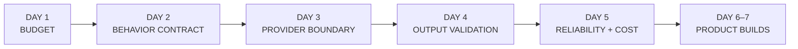
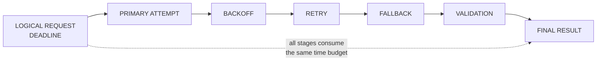
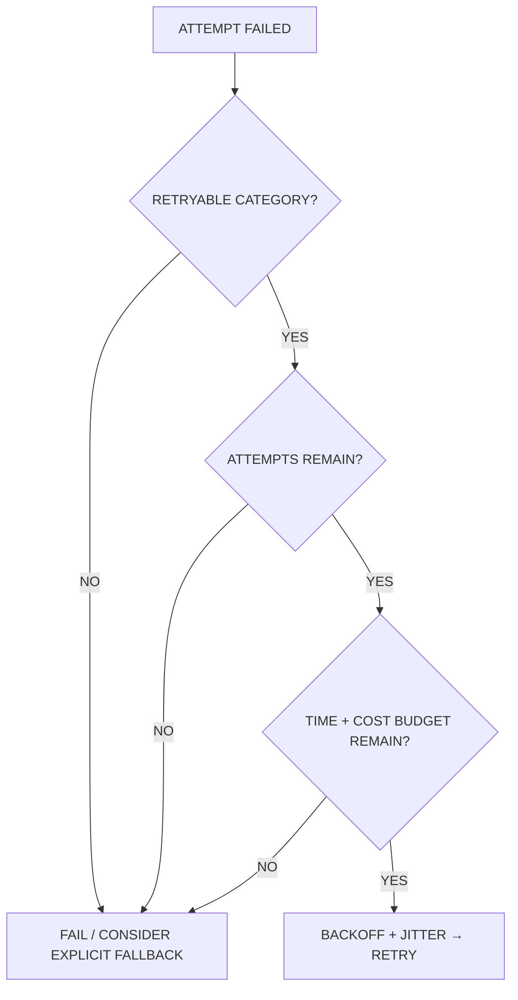
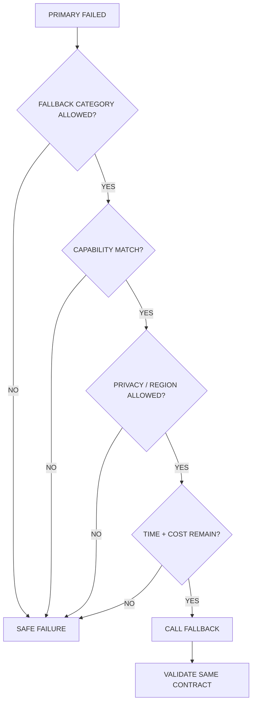
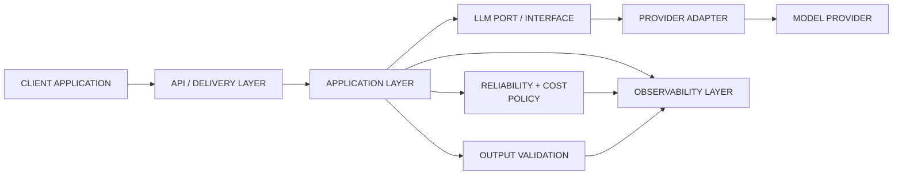
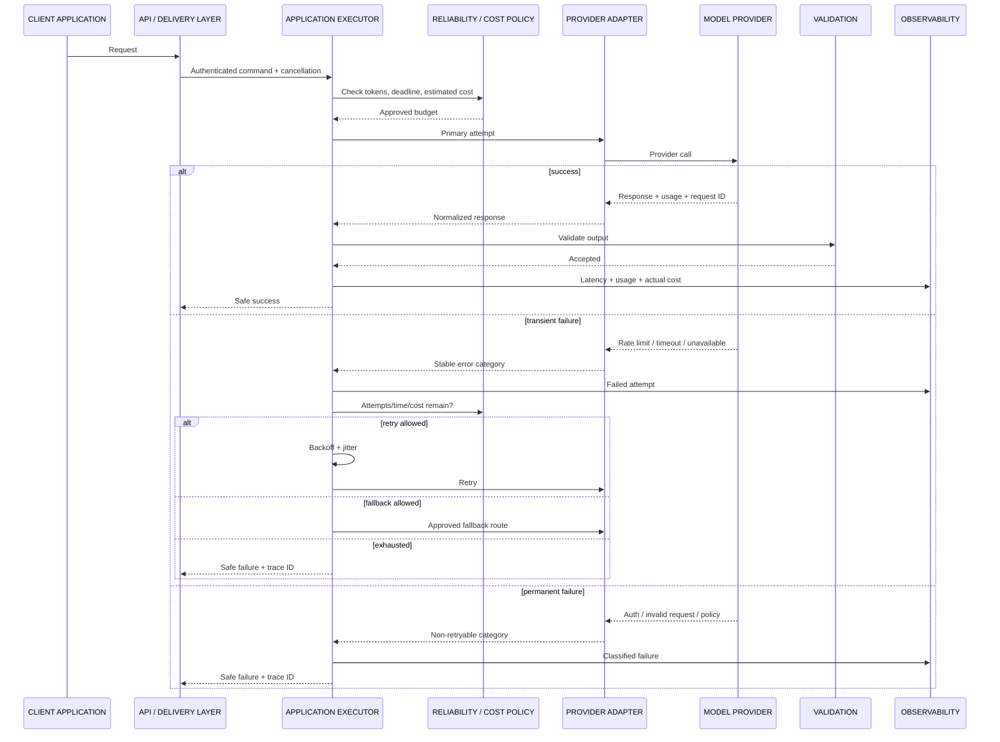

# Day 5 — Reliability & Cost
## AI Product Engineering Learning Note

> **Core question:** How should an AI product control time, retries, fallback, failures, usage, and cost so that one unreliable provider call does not become an unreliable product?
>
> **Memory hook:** **DEADLINE → CALL → CLASSIFY → RETRY / FALLBACK / FAIL → MEASURE → LEARN**
>
> **Completion rule:** Day 5 is not complete because a retry decorator exists. It is complete only when timeout behavior, bounded retry with backoff, explicit fallback policy, stable error categories, safe failure responses, and per-call latency/token/provider/model/request-ID/cost telemetry are implemented and verified with automated evidence.

---

# 1. Why Day 5 Comes Here in the Roadmap

Week 1 builds one dependable LLM application layer in a deliberate sequence:

```text
Day 1 — Tokens & Context
→ defines capacity, output headroom, latency target, and cost budget

Day 2 — Prompt Contracts
→ defines desired behavior and explicit failure behavior

Day 3 — Provider Adapter
→ isolates provider SDKs and enables configuration-driven switching

Day 4 — Structured Outputs
→ defines what a valid application result looks like

Day 5 — Reliability & Cost
→ controls what happens when execution is slow, unavailable, rate-limited,
  malformed, expensive, or dependent on fallback

Day 6 — Streaming AI Assistant
→ uses the complete execution layer in an interactive product

Day 7 — Information Extractor
→ uses validated output, tests, and provider smoke evidence
```



## Why reliability comes after structured output

Before retrying or falling back, the system needs to know:

- what success means,
- which errors are transient,
- which output failures are invalid,
- whether a second attempt is safe,
- whether fallback preserves required capabilities,
- whether the result may be used.

A retry policy without explicit error and validation contracts can repeat permanent failures, multiply cost, and hide defects.

## Why reliability comes before the assistant and extractor

The Day 6 assistant needs:

- streaming deadlines,
- cancellation,
- provider switching,
- graceful failure messages,
- usage telemetry.

The Day 7 extractor needs:

- validated structured output,
- bounded retries,
- provider smoke tests,
- safe failure,
- latency/token summaries.

## Future roadmap dependencies

Day 5 patterns later support:

- RAG generation and retrieval retries,
- document-ingestion workers,
- LangGraph retry/stop guards,
- tool-call execution,
- external API integrations,
- multi-tenant rate/cost controls,
- background jobs,
- cloud operations,
- observability and incident diagnosis,
- SaaS entitlements and usage ledgers.

### Senior-engineer mindset

Do not ask only:

> “How many retries should I add?”

Ask:

> “What failed, is another attempt useful and safe, how much time and money remains, may fallback cross this boundary, and what evidence will explain the final outcome?”

---

# 2. Roadmap Requirements

The uploaded roadmap requires Day 5 to:

1. Add a timeout.
2. Add bounded retry with backoff.
3. Add a fallback model.
4. Define explicit error categories.
5. Capture latency.
6. Capture input and output tokens.
7. Capture model and provider.
8. Capture request ID.
9. Estimate cost for every call.
10. Return a safe failure message without exposing stack traces, prompts, or secrets.

The Week 1 project evidence also requires:

- timeout/retry tests,
- provider smoke tests,
- latency/token summary,
- no secrets in Git history,
- privacy-safe logs.

This note keeps those requirements as the core. Circuit breakers, distributed rate limiting, service meshes, and advanced SRE platforms are useful future extensions, but they are not allowed to displace today’s smaller end-to-end gate.

---

# 3. Prerequisites and Evidence Status

| Prerequisite | Why Day 5 needs it | Current status |
|---|---|---|
| Day 1 token/context budget | Cost, output reserve, and latency targets begin before the call | Concept studied; implementation evidence pending |
| Day 2 prompt contract | Retry must not silently change expected behavior | Concept studied; evaluation evidence pending |
| Day 3 provider adapter | Provider errors, retries, and fallback must remain behind a stable boundary | Concept studied; adapter/smoke evidence pending |
| Day 4 structured output | Validation failures must be distinguished from transport/provider failures | Concept studied; 20-case evidence pending |
| Monotonic timing | Required for accurate elapsed duration and deadlines | Today’s implementation requirement |
| Dependency/version pinning | SDK retry defaults and fields can change | Must be verified in repository |
| Current provider pricing | Required for cost estimates | Must be loaded from a dated configuration snapshot |

## Progression decision

**Conceptually ready, but previous completion evidence is still pending.**

Missing evidence does not block the Day 5 concepts. It blocks a claim that the complete Week 1 execution layer is verified.

---

# 4. Reliability Is a Product Contract

Reliability is not “the request eventually returned something.”

A reliable AI call has explicit answers for:

```text
TIME
→ how long may the user/product wait?

ATTEMPTS
→ how many calls may one logical request create?

FAILURE
→ what category occurred?

FALLBACK
→ when may another model/provider be used?

QUALITY
→ did the result pass validation?

COST
→ what was estimated and what was actually consumed?

EVIDENCE
→ can an operator explain the outcome?
```

## Reliability dimensions

| Dimension | Product question |
|---|---|
| Availability | Can the capability be reached? |
| Latency | Does it finish within the product deadline? |
| Correctness | Does the result pass the application contract? |
| Graceful degradation | Is failure safe and understandable? |
| Cost control | Can one request exceed its financial budget? |
| Observability | Can failure and resource use be diagnosed? |
| Recoverability | Can a transient failure be retried or routed safely? |

### Key warning

```text
EVENTUAL RESPONSE
≠ reliable response
```

A response that arrives after the user has cancelled, exceeds the cost budget, uses an unauthorized fallback region, or fails schema validation is not a successful product outcome.

---

# 5. Failure Taxonomy

Stable application error categories prevent provider SDK exceptions from controlling product behavior.

```python
from dataclasses import dataclass
from enum import StrEnum


class ErrorCategory(StrEnum):
    AUTHENTICATION = "authentication"
    AUTHORIZATION = "authorization"
    INVALID_REQUEST = "invalid_request"
    INPUT_TOO_LARGE = "input_too_large"
    CONTENT_BLOCKED = "content_blocked"
    RATE_LIMIT = "rate_limit"
    TIMEOUT = "timeout"
    CONNECTION = "connection"
    PROVIDER_UNAVAILABLE = "provider_unavailable"
    OUTPUT_VALIDATION = "output_validation"
    CANCELLED = "cancelled"
    INTERNAL = "internal"


@dataclass(frozen=True)
class LLMExecutionError(RuntimeError):
    category: ErrorCategory
    safe_code: str
    retryable: bool
    provider: str | None = None
    provider_request_id: str | None = None
```

## Why explicit categories matter

They drive:

- retry decisions,
- fallback decisions,
- user messages,
- alert severity,
- evaluation reports,
- cost attribution,
- operational dashboards.

## Retry matrix

| Error category | Retry? | Fallback? | Reason |
|---|---:|---:|---|
| Authentication | No | Usually no | Credential/configuration defect |
| Authorization | No | No | Permission policy must not be bypassed |
| Invalid request | No | Usually no | Same invalid request will fail again |
| Input too large | No | Only explicit compatible route | Requires context policy change |
| Content blocked | Usually no | Only policy-approved behavior | Must not bypass safety policy |
| Rate limit | Sometimes | Sometimes | Transient, but obey retry timing and budgets |
| Timeout | Sometimes | Sometimes | May be transient; duplicate work/cost is possible |
| Connection failure | Sometimes | Sometimes | Often transient |
| Provider unavailable / 5xx | Sometimes | Sometimes | Often transient |
| Output validation | Carefully | Carefully | Retry may help, but can hide a bad schema/prompt/model |
| Cancelled | No | No | User/product no longer wants the result |
| Internal application error | No automatic retry | No automatic fallback | Fix deterministic code |

### Important distinction

```text
RETRYABLE
→ another attempt on the same route may succeed

FALLBACK-ELIGIBLE
→ another configured route may satisfy the same product contract

These are related, but not identical.
```

---

# 6. Timeout, Deadline, and Cancellation

These terms should not be used interchangeably.

## Timeout

A timeout limits a specific operation or phase.

Examples:

- connection timeout,
- write timeout,
- read timeout,
- provider-call timeout.

## Deadline

A deadline limits the complete logical request.

```text
OVERALL DEADLINE
includes:
→ queueing
→ primary attempt
→ backoff waits
→ retries
→ fallback
→ validation
```

## Cancellation

Cancellation means the caller or product no longer wants the work.

Examples:

- user presses Ctrl+C,
- client disconnects,
- upstream request is cancelled,
- product deadline expires.

### Core formula

```text
remaining_time
= overall_deadline - elapsed_time
```

Every new attempt must fit inside the remaining time budget.



## Why attempt timeout alone is insufficient

Suppose:

```text
per-attempt timeout = 10 seconds
maximum attempts    = 3
backoff              = 1 + 2 seconds
fallback attempt     = 10 seconds
```

The user may wait far longer than 10 seconds.

Therefore:

```text
PER-ATTEMPT TIMEOUT
≠ PRODUCT DEADLINE
```

## Cancellation rule

When cancellation occurs:

- stop scheduling retries,
- stop scheduling fallback,
- cancel the provider stream/request when supported,
- do not persist partial output as final,
- record cancellation as an explicit outcome,
- avoid converting cancellation into an internal error.

---

# 7. Bounded Retry

A retry is a new attempt after a classified failure.

A production retry policy must define:

- retryable categories/statuses,
- total attempt limit,
- initial delay,
- backoff multiplier,
- maximum delay,
- jitter strategy,
- overall deadline,
- cost/attempt budget,
- cancellation behavior.

```python
from dataclasses import dataclass


@dataclass(frozen=True)
class RetryPolicy:
    max_attempts: int = 3  # Includes the first attempt.
    initial_delay_seconds: float = 0.5
    multiplier: float = 2.0
    max_delay_seconds: float = 4.0
    jitter_ratio: float = 0.2
```

## Backoff

A conceptual capped exponential delay:

```text
base_delay(attempt)
= min(
    maximum_delay,
    initial_delay × multiplier^(failed_attempt - 1)
)
```

Jitter adds controlled randomness so many clients do not retry at exactly the same time.

```text
delay
= base_delay × random factor within configured jitter range
```

This is one practical design—not a universal algorithm.

## Why backoff exists

Immediate retries can:

- amplify an outage,
- create synchronized retry storms,
- consume rate-limit capacity,
- increase queue pressure,
- multiply cost.

## Why jitter exists

Without jitter:

```text
many clients fail together
→ wait the same duration
→ retry together
→ fail together again
```

With jitter, attempts are spread across time.

## Attempt counting

Use one clear definition:

```text
max_attempts = total calls including the first call
```

Avoid ambiguous configuration such as `retries=3`, which may mean either:

- three total attempts, or
- one initial attempt plus three retries.

## Retry budget

A request must not retry merely because attempts remain.

It must also have:

- remaining deadline,
- remaining cost budget,
- remaining token/request quota,
- no cancellation,
- a retryable error.



---

# 8. Idempotency and Duplicate Risk

Retry safety depends on side effects.

## Pure generation

An LLM generation request usually does not directly modify your database, but retries can still:

- create duplicate provider charges,
- produce different outputs,
- duplicate audit events,
- trigger duplicate downstream actions if boundaries are poorly designed.

## Tool or business actions

Retries become more dangerous when generation and execution are combined.

Examples:

- sending an email,
- charging a payment,
- deleting a file,
- creating an order,
- publishing content.

```text
MODEL CALL
→ proposed action

DETERMINISTIC EXECUTOR
→ authorized side effect
```

Use:

- idempotency keys,
- unique operation IDs,
- database constraints,
- transactional state,
- “execute once” records,
- separate generation from side-effect execution.

### Rule

> Retry the model call only when another generation attempt is acceptable. Never assume the downstream business action is safe to repeat.

---

# 9. Nested Retry Risk

SDKs, application code, gateways, workers, and proxies may each retry.

```text
APPLICATION ATTEMPTS
× SDK ATTEMPTS
× GATEWAY ATTEMPTS
× WORKER REDELIVERY
= potential call multiplication
```

Example:

```text
application: 3 attempts
SDK:         2 attempts
gateway:     2 attempts

possible provider calls:
3 × 2 × 2 = 12
```

The exact behavior depends on each layer, but the multiplication risk is real.

## Control rule

- choose one primary retry owner,
- explicitly inspect SDK defaults,
- disable or account for lower-layer retries,
- log attempt numbers at the application boundary,
- test the actual maximum provider-call count.

Official SDK defaults may change, so repository evidence must record:

- package version,
- retry settings,
- timeout settings,
- which layer owns retries.

---

# 10. Fallback

Fallback selects another configured route when the primary route cannot satisfy the request.

A route may differ by:

- model within the same provider,
- provider,
- region,
- service tier,
- capability.

## Fallback is not “try anything that works”

A fallback route must preserve the product contract.

Check:

```text
CAPABILITY
→ structured output, tools, streaming, modality

QUALITY
→ evaluation threshold for this task

PRIVACY
→ data handling, retention, region, customer policy

SECURITY
→ same authorization and trust boundaries

COST
→ remaining request/tenant budget

LATENCY
→ remaining deadline

OUTPUT CONTRACT
→ same schema and validation requirements
```

## Explicit fallback policy

```python
from dataclasses import dataclass


@dataclass(frozen=True)
class Route:
    provider: str
    model: str


@dataclass(frozen=True)
class FallbackPolicy:
    primary: Route
    fallback: Route | None
    allowed_categories: frozenset[ErrorCategory]
    max_total_provider_calls: int
```

## When fallback is usually inappropriate

- authentication failure,
- authorization failure,
- invalid application request,
- cross-tenant/resource denial,
- user cancellation,
- security policy refusal,
- a fallback that violates privacy/region constraints,
- a fallback lacking required structured output/tool capability,
- exhausted cost or deadline budget.

## Silent fallback is dangerous

Silent fallback can change:

- output quality,
- latency,
- price,
- data handling,
- model behavior,
- safety behavior,
- evaluation comparability.

Record:

- primary route,
- fallback route,
- trigger category,
- fallback count,
- final route,
- final outcome.



---

# 11. Rate Limits and Backpressure

Rate limits may be based on:

- requests per time window,
- input tokens,
- output tokens,
- total tokens,
- organization/project quota,
- model-specific quota.

A `429` means another request was not currently accepted; it does not mean unlimited immediate retries are safe.

## Handling principles

- respect provider retry timing when available,
- apply bounded backoff with jitter,
- enforce application/user/tenant quotas before provider calls,
- queue or reject excess work deliberately,
- do not let retries bypass rate limits,
- monitor remaining limits where response metadata supports it.

## Backpressure

Backpressure prevents the system from accepting more work than downstream capacity can serve.

For Day 5, a simple form is enough:

```text
REQUEST
→ product quota check
→ concurrency/request budget check
→ provider call
```

Distributed queues, semaphores, token buckets, and adaptive concurrency are future production extensions.

---

# 12. Cost Model

Cost control has two stages:

```text
BEFORE CALL
→ estimate and enforce budget

AFTER CALL
→ record actual usage and reconcile
```

## Basic estimate

For token-priced text generation:

```text
estimated_cost
=
(estimated_input_tokens / pricing_unit) × input_rate
+
(reserved_output_tokens / pricing_unit) × output_rate
+
estimated_tool_or_other_charges
```

## Actual cost

```text
actual_cost
=
(actual_billed_input / pricing_unit) × input_rate
+
(actual_billed_output / pricing_unit) × output_rate
+
actual_tool_or_other_charges
```

### Important provider differences

Billing may distinguish:

- ordinary input tokens,
- cached input tokens,
- output tokens,
- reasoning/thinking tokens,
- image/audio/video units,
- tool usage,
- search/grounding,
- batch/flex/priority tiers.

Therefore, the generic formula is a product abstraction—not a promise that every provider bills only two token fields.

## Pricing configuration

Do not hard-code volatile prices into domain or use-case code.

```python
from dataclasses import dataclass
from datetime import date


@dataclass(frozen=True)
class TokenRate:
    price_per_unit: float
    unit_tokens: int


@dataclass(frozen=True)
class PricingSnapshot:
    provider: str
    model: str
    effective_date: date
    source_reference: str
    input_rate: TokenRate
    output_rate: TokenRate
```

Store:

- provider,
- model,
- service tier,
- currency,
- effective date,
- source reference,
- token unit,
- input/output rates,
- any additional billed categories.

## Missing pricing or usage

Use:

```text
None / unknown
```

not:

```text
0
```

because:

```text
0
→ known zero cost/usage

None
→ information unavailable or not configured
```

## Estimate vs actual

Store both:

| Field | Purpose |
|---|---|
| Estimated input tokens | Pre-call budget decision |
| Reserved output tokens | Worst-case output allowance |
| Estimated cost | Pre-call product control |
| Actual input/output usage | Provider-reported outcome |
| Actual cost | Reconciliation from dated pricing |
| Estimate error | Improve future budgeting |

### Cost ceiling

A request can be rejected before the provider call when:

```text
estimated worst-case cost > product request budget
```

Retry and fallback must also consume the same logical request budget.

```text
TOTAL REQUEST COST
=
primary attempts
+ retry attempts
+ fallback attempts
+ tool/other charges
```

---

# 13. Usage and Telemetry Contract

The roadmap requires every call to capture:

- latency,
- input tokens,
- output tokens,
- model,
- provider,
- request ID,
- estimated cost.

A production-oriented normalized record can also include:

```python
from dataclasses import dataclass
from typing import Literal


@dataclass(frozen=True)
class Usage:
    input_tokens: int | None
    output_tokens: int | None
    total_tokens: int | None = None
    cached_input_tokens: int | None = None


@dataclass(frozen=True)
class AttemptTelemetry:
    trace_id: str
    logical_request_id: str
    attempt_number: int
    route_role: Literal["primary", "fallback"]
    provider: str
    model: str
    started_at_utc: str
    latency_ms: float
    time_to_first_token_ms: float | None
    usage: Usage
    estimated_cost: float | None
    actual_cost: float | None
    provider_request_id: str | None
    error_category: ErrorCategory | None
    outcome: Literal["success", "failure", "cancelled"]
```

## Internal vs provider request IDs

Keep separate:

```text
trace_id
→ correlates the end-to-end product request

logical_request_id
→ identifies one user/business operation

provider_request_id
→ identifies one provider attempt

attempt_number
→ identifies the attempt within the logical request
```

One logical request may create several provider request IDs because of retry or fallback.

## Timing

Use a monotonic clock for duration:

```python
from time import monotonic

started = monotonic()
# operation
latency_ms = (monotonic() - started) * 1000
```

Wall-clock timestamps are useful for records. A monotonic clock is safer for elapsed duration because system clock adjustments should not produce negative or distorted latency.

## Streaming telemetry

For streaming, capture separately:

- time to first token/event,
- total stream duration,
- completion/cancellation state,
- final usage if provided,
- partial-output flag,
- finish reason.

## Aggregation

One call has one latency value.

Operational performance needs distributions:

- p50,
- p95,
- p99,
- error rate,
- timeout rate,
- retry rate,
- fallback rate,
- cost per successful task.

Do not claim percentiles from one or two calls.

---

# 14. Safe Failure Messages

The user needs a useful outcome, not internal diagnostics.

## External response

Example:

```json
{
  "status": "error",
  "error_code": "AI_SERVICE_TEMPORARILY_UNAVAILABLE",
  "message": "The AI service could not complete this request safely. Please try again later.",
  "retryable": true,
  "trace_id": "trace-..."
}
```

## Internal record

May include:

- error category,
- provider/model,
- attempt count,
- fallback route,
- provider request ID,
- redacted provider status,
- latency and usage,
- trace ID.

## Never expose by default

- stack traces,
- API keys,
- environment values,
- authorization headers,
- system prompts,
- hidden policies,
- raw customer documents,
- complete provider request/response bodies,
- internal network endpoints,
- provider credentials.

## Error-message rule

```text
CLIENT
→ what happened at product level
→ whether retry is reasonable
→ trace ID

OPERATOR
→ classified cause
→ route/attempt metadata
→ redacted diagnostic detail
```

---

# 15. Security Boundaries

Always distinguish:

```text
TRUSTED APPLICATION POLICY
→ timeout, retry, fallback, budgets, authorization, business rules

UNTRUSTED USER INPUT
→ may trigger expensive or slow requests

UNTRUSTED RETRIEVED DATA
→ may contain prompt injection or large payloads

MODEL-GENERATED OUTPUT
→ untrusted until validation
```

## Denial of wallet

An attacker or faulty client can combine:

```text
large prompts
+ maximum output
+ repeated requests
+ retries
+ fallback
→ cost explosion
```

Controls:

- authentication,
- byte/token limits,
- per-user/tenant quotas,
- rate limits,
- maximum attempts,
- maximum total provider calls,
- cost ceilings,
- cancellation,
- concurrency limits.

## Fallback privacy boundary

Do not fallback to another provider or region merely because it is available.

Check:

- customer agreement,
- data classification,
- provider data handling,
- residency requirements,
- retention/training policy,
- approved subprocessors,
- configured route allowlist.

## Retry and secret safety

Provider errors may include request fragments. Redact before logging or returning them.

## Deterministic controls

The model must not decide:

- whether the user can bypass a cost cap,
- whether another tenant’s data may be sent,
- whether a forbidden fallback is permitted,
- whether a destructive action should be retried,
- whether an authorization denial is “temporary.”

---

# 16. Clean Architecture Responsibilities



| Layer | Responsibility |
|---|---|
| Domain Layer | Product budgets and invariants that do not depend on SDK exceptions |
| Application Layer | Overall deadline, retry/fallback orchestration, validation, final outcome |
| Port / Interface | Provider-neutral generation contract |
| Provider Adapter | SDK call, provider error mapping, request ID and usage extraction |
| Provider Infrastructure | Provider client configuration and network behavior |
| API / Delivery Layer | Cancellation propagation and safe client response |
| Observability Layer | Attempts, latency, usage, cost, errors, routes, traces |

## Where should retry live?

There is no universal answer.

### Adapter-owned retry

**Benefits**

- provider-specific status handling,
- hides transport details.

**Risks**

- application cannot see real attempt count,
- nested retry risk,
- fallback/cost/deadline policy becomes harder.

### Application-owned retry

**Benefits**

- one logical budget,
- visible attempts,
- consistent fallback/cost policy,
- easier testing.

**Risks**

- adapter must expose stable error categories,
- some SDK-native retry features may be duplicated.

### Practical Day 5 decision

Use the application execution service as the primary owner of logical retry/fallback policy. Configure SDK retries explicitly—often disabled or tightly bounded—and record the choice.

---

# 17. Minimal Reliability Contracts

```python
from dataclasses import dataclass


@dataclass(frozen=True)
class ExecutionBudget:
    overall_timeout_seconds: float
    maximum_provider_calls: int
    maximum_estimated_cost: float | None


@dataclass(frozen=True)
class ExecutionPolicy:
    retry: RetryPolicy
    fallback: FallbackPolicy
    budget: ExecutionBudget
```

## Backoff helper

```python
from collections.abc import Callable


def calculate_backoff(
    *,
    failed_attempt: int,
    policy: RetryPolicy,
    random_unit: Callable[[], float],
) -> float:
    base = min(
        policy.max_delay_seconds,
        policy.initial_delay_seconds
        * (policy.multiplier ** (failed_attempt - 1)),
    )

    # random_unit() must return a value from 0.0 to 1.0.
    spread = policy.jitter_ratio
    factor = (1.0 - spread) + (2.0 * spread * random_unit())

    return max(0.0, base * factor)
```

Injecting the random function makes the backoff testable.

## Cost calculation

```python
def token_cost(
    *,
    token_count: int | None,
    rate: TokenRate,
) -> float | None:
    if token_count is None:
        return None

    return (
        token_count
        / rate.unit_tokens
        * rate.price_per_unit
    )


def actual_text_cost(
    *,
    usage: Usage,
    pricing: PricingSnapshot,
) -> float | None:
    input_cost = token_cost(
        token_count=usage.input_tokens,
        rate=pricing.input_rate,
    )
    output_cost = token_cost(
        token_count=usage.output_tokens,
        rate=pricing.output_rate,
    )

    if input_cost is None or output_cost is None:
        return None

    return input_cost + output_cost
```

This example covers basic text token categories only. Add explicit provider-specific billed categories at the pricing/telemetry boundary when required.

---

# 18. Minimal Execution Flow

```python
import asyncio
from time import monotonic
from uuid import uuid4


async def execute_with_policy(
    *,
    request: LLMRequest,
    primary: LLMPort,
    fallback: LLMPort | None,
    policy: ExecutionPolicy,
) -> LLMResponse:
    started = monotonic()
    logical_request_id = str(uuid4())
    provider_calls = 0
    last_error: LLMExecutionError | None = None

    routes: list[tuple[str, LLMPort]] = [("primary", primary)]

    if fallback is not None:
        routes.append(("fallback", fallback))

    for route_role, route in routes:
        if route_role == "fallback":
            if last_error is None:
                break

            if (
                last_error.category
                not in policy.fallback.allowed_categories
            ):
                break

        for attempt in range(1, policy.retry.max_attempts + 1):
            elapsed = monotonic() - started
            remaining = (
                policy.budget.overall_timeout_seconds - elapsed
            )

            if remaining <= 0:
                raise LLMExecutionError(
                    category=ErrorCategory.TIMEOUT,
                    safe_code="AI_REQUEST_DEADLINE_EXCEEDED",
                    retryable=False,
                )

            if (
                provider_calls
                >= policy.budget.maximum_provider_calls
            ):
                break

            provider_calls += 1

            try:
                return await asyncio.wait_for(
                    route.generate(request),
                    timeout=remaining,
                )
            except asyncio.CancelledError:
                raise
            except LLMExecutionError as exc:
                last_error = exc

                no_more_attempts = (
                    attempt >= policy.retry.max_attempts
                )

                if not exc.retryable or no_more_attempts:
                    break

                delay = calculate_backoff(
                    failed_attempt=attempt,
                    policy=policy.retry,
                    random_unit=lambda: 0.5,
                )

                elapsed = monotonic() - started
                if elapsed + delay >= (
                    policy.budget.overall_timeout_seconds
                ):
                    break

                await asyncio.sleep(delay)

    if last_error is not None:
        raise last_error

    raise LLMExecutionError(
        category=ErrorCategory.INTERNAL,
        safe_code="AI_EXECUTION_FAILED",
        retryable=False,
    )
```

## What this minimal example intentionally omits

The production implementation must also:

- estimate cost before every route/attempt,
- capture telemetry in `finally`,
- validate fallback capability/privacy,
- use a real injectable jitter source,
- pass remaining time as a per-attempt timeout,
- map provider SDK errors in adapters,
- validate the final output,
- preserve cancellation,
- produce a safe client error.

The example teaches the orchestration shape without pretending to be the full production executor.

---

# 19. Production Request Lifecycle



---

# 20. Testing Strategy

The roadmap requires timeout/retry tests. Day 5 should add deterministic tests around the execution policy.

## Unit tests

```text
[ ] Authentication failure is not retried
[ ] Authorization failure is not retried or bypassed by fallback
[ ] Invalid request is not retried
[ ] Timeout is retried only within configured attempts
[ ] Rate limit respects bounded retry policy
[ ] Provider-unavailable error can trigger approved fallback
[ ] Cancellation stops retry and fallback
[ ] Maximum provider-call count is enforced
[ ] Overall deadline includes backoff and fallback
[ ] Backoff is capped
[ ] Jitter remains inside configured range
[ ] Fallback is denied when capability differs
[ ] Fallback is denied when privacy/region policy differs
[ ] Output-validation failure follows explicit policy
[ ] Safe error contains no stack trace, prompt, or secret
[ ] Every attempt emits telemetry
[ ] Missing usage/pricing remains unknown—not zero
[ ] Cost formula uses the correct pricing snapshot
[ ] Retry/fallback total cost shares one logical budget
```

## Failure injection

Use fake adapters that deliberately:

- time out,
- fail once and then succeed,
- always rate-limit,
- return a non-retryable error,
- return malformed structured output,
- provide no usage metadata,
- delay beyond the deadline,
- succeed only on fallback.

## Example fake

```python
class FailOnceThenSucceed:
    def __init__(self) -> None:
        self.calls = 0

    async def generate(
        self,
        request: LLMRequest,
    ) -> LLMResponse:
        self.calls += 1

        if self.calls == 1:
            raise LLMExecutionError(
                category=ErrorCategory.TIMEOUT,
                safe_code="PROVIDER_TIMEOUT",
                retryable=True,
            )

        return LLMResponse(
            text="READY",
            provider="fake",
            model="fake-model",
            finish_reason="stop",
            usage=Usage(
                input_tokens=4,
                output_tokens=1,
                total_tokens=5,
            ),
        )
```

## Integration/smoke evidence

Real provider smoke tests should record:

- configured model,
- provider,
- SDK/dependency version,
- timeout/retry configuration,
- request/trace IDs,
- latency,
- usage,
- cost estimate,
- redacted output,
- success/failure.

Do not deliberately create excessive paid traffic or harmful rate-limit load merely to prove a retry path. Use unit/fake failure injection for deterministic retry tests and small controlled provider tests for integration evidence.

---

# 21. Mini Project — Reliable LLM Execution Layer

## Goal

Extend the existing Week 1 repository so the same assistant/extractor use cases call one provider-neutral execution service with bounded reliability and cost controls.

## Vertical slice

```text
CLI REQUEST
→ AUTH / INPUT VALIDATION
→ DAY 1 TOKEN + COST PRECHECK
→ DAY 2 PROMPT CONTRACT
→ DAY 3 PROVIDER ADAPTER
→ DAY 5 DEADLINE / RETRY / FALLBACK EXECUTOR
→ DAY 4 OUTPUT VALIDATION
→ SAFE RESPONSE
→ TELEMETRY + RESULT RECORD
```

## Acceptance criteria

```text
[ ] Stable application error categories
[ ] Overall request deadline
[ ] Explicit per-attempt timeout
[ ] Bounded total attempts
[ ] Backoff with jitter
[ ] Maximum total provider calls
[ ] Approved fallback route
[ ] Capability/privacy/cost checks before fallback
[ ] Cancellation propagation
[ ] Input/output usage capture
[ ] Provider/model capture
[ ] Internal trace/logical request IDs
[ ] Provider request ID capture when available
[ ] Per-attempt and final latency
[ ] Estimated cost before call
[ ] Actual cost after call when data exists
[ ] Safe external error response
[ ] Privacy-safe structured logs
[ ] Unit tests for failure paths
[ ] Redacted real provider evidence
```

## Recommended CLI evidence

Example successful summary:

```json
{
  "status": "success",
  "trace_id": "trace-...",
  "provider": "configured-provider",
  "model": "configured-model",
  "attempts": 1,
  "fallback_used": false,
  "latency_ms": 842.4,
  "input_tokens": 118,
  "output_tokens": 34,
  "estimated_cost": null,
  "actual_cost": null
}
```

`null` is correct when pricing or usage evidence is unavailable.

Example safe failure:

```json
{
  "status": "error",
  "error_code": "AI_SERVICE_TEMPORARILY_UNAVAILABLE",
  "message": "The AI service could not complete this request safely.",
  "retryable": true,
  "trace_id": "trace-..."
}
```

---

# 22. Folder Structure

Continue the Week 1 repository:

```text
src/
└── llm_app/
    ├── domain/
    │   ├── budget.py
    │   ├── errors.py
    │   └── pricing.py
    ├── application/
    │   ├── execute_llm.py
    │   ├── reliability_policy.py
    │   ├── fallback_policy.py
    │   └── cost_service.py
    ├── ports/
    │   ├── llm.py
    │   ├── telemetry.py
    │   └── clock.py
    ├── infrastructure/
    │   ├── provider_a_adapter.py
    │   ├── provider_b_adapter.py
    │   ├── pricing_catalog.py
    │   └── structured_logging.py
    └── interfaces/
        └── cli.py

tests/
├── unit/
│   ├── test_backoff.py
│   ├── test_retry_policy.py
│   ├── test_fallback_policy.py
│   ├── test_cost_service.py
│   ├── test_safe_errors.py
│   └── test_execute_llm.py
└── smoke/
    ├── test_provider_a_smoke.py
    └── test_provider_b_smoke.py

evals/
results/
└── reliability/

config/
└── pricing.example.json

docs/
├── architecture/
│   └── reliability_and_cost.md
└── adr/
    └── 0003-retry-fallback-cost-policy.md
```

Keep the structure proportional to the project. A small repository may merge closely related application files.

---

# 23. Performance Considerations

## Latency budget

Total latency can include:

```text
queue time
+ connection
+ provider prefill
+ time to first token
+ generation
+ backoff
+ retries
+ fallback
+ validation
+ serialization
```

A faster model does not guarantee a faster product when rate limits, queues, retries, or validation failures dominate.

## Retry latency

Retries trade availability for:

- longer tail latency,
- additional cost,
- more quota use,
- more inconsistent outputs.

Track:

- first-attempt success rate,
- retry-success rate,
- fallback-success rate,
- p95 latency with and without retries.

## Timeout selection

A timeout that is too low creates false failures and unnecessary retry load.

A timeout that is too high:

- ties up concurrency,
- worsens user experience,
- delays fallback,
- hides provider degradation.

Choose from measured latency distributions and product expectations—not copied values.

## Streaming

Streaming affects:

- time to first token,
- cancellation,
- partial output,
- error timing.

A stream can fail after some content has been shown. The client must distinguish:

```text
PARTIAL DISPLAY
≠ completed validated response
```

## Concurrency

Even correct retry behavior can overload the product when many requests run simultaneously.

Day 5 should at least document:

- expected concurrency,
- maximum in-flight calls,
- provider quota,
- how excess work is rejected or queued.

Advanced adaptive concurrency is later work.

---

# 24. Cost Considerations

## Cost per call is not enough

Track:

```text
cost per attempt
cost per logical request
cost per successful validated result
cost per user / tenant
cost per feature
retry cost
fallback cost
```

A cheaper model with a poor validation rate can cost more per successful task because of retries and manual review.

## Cost vs quality vs latency

```text
LOWEST TOKEN PRICE
≠ lowest product cost

FASTEST SINGLE CALL
≠ best tail latency

HIGHEST QUALITY MODEL
≠ best default for every task
```

Provider/model selection should use measured:

- task quality,
- schema validity,
- latency,
- failure rate,
- retry rate,
- cost per successful task,
- privacy/capability fit.

## Free tiers

Free tiers are useful learning constraints—not production architecture.

Do not record:

```text
actual_cost = 0
```

merely because:

- the current account was not billed,
- promotional credits were used,
- a request fell inside a free quota.

Separate:

```text
list-price estimate
actual billed amount
credit/subsidy
```

when the product later needs financial reconciliation.

---

# 25. Security and Privacy Checklist

```text
[ ] No provider keys in client/mobile code
[ ] No secrets in Git history
[ ] Safe logs exclude raw sensitive prompts by default
[ ] Retry/fallback cannot bypass authorization
[ ] Fallback route is privacy/region approved
[ ] Per-user/tenant cost and request limits exist
[ ] Cancellation stops unnecessary work
[ ] Maximum provider-call count is enforced
[ ] Provider error bodies are redacted
[ ] Trace IDs are safe to expose
[ ] Internal stack traces remain operator-only
[ ] Partial streamed output is not persisted as final
[ ] Model output is validated before business use
```

---

# 26. Common Beginner Mistakes

- retrying every exception,
- using immediate retries without backoff,
- omitting jitter,
- confusing retries with attempts,
- setting only a provider timeout and no logical deadline,
- hard-coding pricing in the use case,
- recording missing usage as zero,
- exposing raw provider errors to users,
- retrying authentication or invalid requests,
- fallback to any available model,
- assuming fallback output has the same quality/capabilities,
- using wall-clock time only for elapsed duration,
- testing only success.

---

# 27. Common Production Mistakes

- nested retries across application, SDK, gateway, and worker,
- unbounded total provider calls,
- retries after user cancellation,
- fallback across forbidden data regions,
- retry/fallback that exceeds the request cost budget,
- silently changing model/provider without telemetry,
- not separating provider request ID from internal trace ID,
- measuring average latency only and hiding tail latency,
- claiming actual cost when pricing metadata is incomplete,
- losing usage metadata on streaming,
- logging prompts or provider payloads by default,
- retrying non-idempotent downstream actions,
- using one global fallback policy for every task,
- letting output-validation retries hide a poor prompt/schema,
- no failure injection,
- no rollback/revisit trigger in the ADR.

---

# 28. Important Decisions and Trade-offs

## Retry vs immediate fallback

### Retry primary

**Better when**

- failure is transient,
- primary route strongly wins quality/privacy,
- enough deadline/cost remains.

**Costs**

- increases tail latency,
- consumes primary quota,
- may repeat cost.

### Immediate fallback

**Better when**

- primary is clearly unavailable,
- fallback is approved and equivalent enough,
- product deadline is tight.

**Costs**

- may change quality/cost/privacy behavior,
- can hide primary instability.

## Same-provider fallback vs cross-provider fallback

### Same provider, different model

- simpler credentials/data policy,
- may share the same outage/quota,
- capabilities may differ.

### Different provider

- stronger outage diversity,
- greater operational and privacy complexity,
- response/usage behavior differs.

## SDK retry vs application retry

- SDK retry is convenient and provider-aware.
- Application retry gives one visible deadline/cost/fallback budget.

Document the chosen owner and account for every layer.

## Conservative vs aggressive timeout

- conservative/long timeout reduces false failures,
- aggressive/short timeout improves responsiveness but may increase retry load.

Use measured distributions and user expectations.

## Estimate from reserved output vs expected output

- reserved output gives a safer worst-case estimate,
- expected output gives a more realistic estimate.

Store both when useful:

```text
expected cost
worst-case allowed cost
```

---

# 29. Industry Examples

These are general industry patterns, not claims about a specific company’s private architecture.

## Interactive assistant

- tight user-facing deadline,
- streaming TTFT measured,
- cancellation supported,
- small retry budget,
- fallback only if streaming and policy match.

## Batch document extraction

- longer deadline,
- durable job state,
- more deliberate retries,
- idempotent task IDs,
- cost per validated document measured.

## Sensitive enterprise assistant

- provider allowlist per tenant,
- cross-provider fallback may be disabled,
- privacy and region outrank availability.

## High-volume classification

- inexpensive primary route,
- strict cost cap,
- fallback reserved for low-confidence/invalid outputs,
- quality measured per successful classification.

### Company-specific production architecture

**Not applicable for this topic.**

The uploaded roadmap does not provide a verified company architecture. Do not invent one.

---

# 30. Industry-Level Improvement Path

After the Day 5 vertical slice:

```text
1. Stable error taxonomy
2. Overall deadline
3. Explicit attempt timeout
4. Bounded retry + jitter
5. Maximum provider calls
6. Approved fallback policy
7. Per-attempt telemetry
8. Cost estimate + reconciliation
9. Failure-injection tests
10. Latency/cost baseline
11. Circuit breaker
12. Concurrency/backpressure controls
13. Operational alerts
14. Runbook and SLOs
```

## Later improvements

- circuit breaker,
- bulkheads,
- distributed rate limiting,
- adaptive concurrency,
- durable retry queues,
- provider health scoring,
- hedged requests for carefully justified read-like workloads,
- release SLOs,
- anomaly detection,
- budget alerts,
- cost reconciliation ledger.

These are not required to claim Day 5 studied. They become appropriate when real scale and operations justify them.

---

# 31. Engineering Challenge

Scenario:

```text
Product:
- interactive meeting-action extractor
- overall deadline: 8 seconds
- structured output required
- sensitive customer notes
- maximum logical-request budget: $0.01

Primary route:
- highest measured schema validity
- p95 latency near 6 seconds
- sometimes returns 429

Fallback route:
- faster
- lower measured schema validity
- different provider and data region
- cheaper token price

SDK:
- retries twice by default

Application:
- currently retries twice
```

Answer without notes:

1. What is the real maximum provider-call count?
2. Why is this dangerous?
3. Which layer should own retry policy?
4. Which SDK setting must be verified or changed?
5. Is an 8-second per-attempt timeout acceptable?
6. How should the overall deadline be divided?
7. Which failures are retryable?
8. Is cross-provider fallback allowed for sensitive notes?
9. What evidence is required before allowing it?
10. How should schema-validity differences affect routing?
11. How is total cost computed across attempts?
12. What happens if usage metadata is missing?
13. What IDs should be recorded?
14. What should the user see when all attempts fail?
15. Which tests prove the final policy?
16. What ADR revisit trigger would you document?

The best answer does not maximize attempts. It protects the product contract, user deadline, privacy, and cost budget.

---

# 32. Completion and Evidence Gate

## Status vocabulary

```text
STUDIED
→ reliability/cost concepts understood

IMPLEMENTED
→ policy, executor, telemetry, safe errors, and tests exist

VERIFIED
→ automated results and controlled provider evidence exist

DONE
→ Day 5 evidence contributes to the Week 1 DONE WHEN gate
```

## Day 5 evidence checklist

```text
[ ] Explicit error categories
[ ] Overall deadline
[ ] Per-attempt timeout
[ ] Bounded total attempts
[ ] Backoff with jitter
[ ] Maximum total provider calls
[ ] Retryable/non-retryable matrix
[ ] Application cancellation propagation
[ ] Approved fallback model/route
[ ] Capability check before fallback
[ ] Privacy/region check before fallback
[ ] Cost/deadline check before fallback
[ ] Provider + model recorded
[ ] Internal trace/logical request ID recorded
[ ] Provider request ID recorded when available
[ ] Latency recorded per attempt
[ ] TTFT recorded for streaming when applicable
[ ] Input/output usage recorded when available
[ ] Estimated cost recorded before call
[ ] Actual cost recorded or marked unknown
[ ] Safe client failure message
[ ] Privacy-safe structured logs
[ ] Timeout tests
[ ] Retry tests
[ ] Fallback tests
[ ] Cancellation tests
[ ] Cost tests
[ ] No secrets in Git/logs
[ ] Latency/token/cost summary
```

## Evidence status at note creation

- **Studied:** covered by this learning note.
- **Implemented:** no repository evidence supplied.
- **Verified:** no automated/provider output supplied.
- **Latency/token/cost results:** not measured yet.
- **Done:** not claimed.
- **Previous evidence:** Day 1–4 practical evidence remains pending.
- **Progression:** conceptually ready for Day 6 after studying Day 5, but the Week 1 gate remains open.

---

# 33. Verification Snapshot — 24 July 2026

This note was checked against the uploaded roadmap and current official technical documentation.

## Verified current implementation facts

- The Google Gen AI Python SDK documents client-level HTTP timeout and retry configuration, including bounded attempts, exponential-base/delay settings, maximum delay, status selection, and jitter.
- Groq documents `429 Too Many Requests`, rate-limit headers including `retry-after`, and model/project token/request limits that can vary by account configuration.
- Groq response usage examples include input/prompt and output/completion token fields plus timing information for supported responses.
- OpenAI’s official API reference recommends recording provider request IDs for production troubleshooting and exposes rate-limit headers.
- Google Cloud’s official retry guidance distinguishes transient failures from permanent failures, requires idempotency consideration, and recommends exponential backoff with jitter.
- Provider pricing pages, model availability, rate limits, billing categories, SDK defaults, and privacy terms are volatile. They must be verified from current official documentation and stored as dated configuration/evidence rather than copied into business logic.

## Deliberately not hard-coded

This note does not hard-code:

- provider model IDs,
- current token prices,
- account quotas,
- SDK default retry counts,
- privacy/data-retention promises,
- latency targets presented as universal values.

Those values must come from the product’s current configuration, official documentation, and measured evidence.

---

# 34. Today’s Notes

- Reliability is one logical request budget across attempts, fallback, time, and cost.
- Timeout limits an operation; deadline limits the complete product request.
- Cancellation must stop retries, fallback, and final persistence.
- Retry only classified transient failures.
- Bound attempts, delay, total provider calls, elapsed time, and cost.
- Use backoff with jitter to reduce synchronized retry pressure.
- Idempotency matters whenever a retry can repeat downstream side effects.
- Fallback must preserve capabilities, validation, privacy, security, deadline, and cost policy.
- Silent fallback destroys operational and evaluation clarity.
- Estimate cost before the call and record actual usage after it.
- Missing usage/pricing is unknown—not zero.
- One logical request may contain multiple provider request IDs.
- Safe client messages and rich redacted operator records serve different needs.
- Per-attempt telemetry makes retry and fallback evidence visible.
- SDK defaults must be explicitly verified to prevent nested retry multiplication.

# 35. Key Takeaways

1. **A retry is a budgeted engineering decision—not a reflex.**
2. **The overall deadline controls every attempt, wait, fallback, and validation step.**
3. **Permanent failures must fail fast.**
4. **Fallback is a policy boundary, not an availability shortcut.**
5. **Retry and fallback share one cost and provider-call budget.**
6. **Usage, pricing, and request IDs must preserve unknown values honestly.**
7. **Safe failure is part of successful product design.**
8. **Observability must show every attempt and final decision.**
9. **Provider/SDK defaults are volatile and must be verified.**
10. **Evidence requires failure-path tests—not only a successful API call.**

# 36. What I Built

Target Day 5 artifact:

```text
Reliable LLM Execution Layer
→ stable error taxonomy
→ overall deadline
→ per-attempt timeout
→ bounded retry with backoff + jitter
→ cancellation propagation
→ approved fallback policy
→ cost estimator
→ per-attempt telemetry
→ safe external error contract
→ deterministic failure-injection tests
```

At note creation, this is the required build specification—not a claim that implementation or verification has occurred.

# 37. Evidence Status

## Completed

- Day 5 roadmap requirements identified.
- Reliability architecture defined.
- Retry/fallback/cost policy model documented.
- Test/evidence requirements defined.
- Current official implementation facts verified.
- Final professional learning note created.

## Verified

- Source roadmap alignment.
- Current general SDK/documentation support for configurable timeout/retry, rate-limit metadata, usage fields, request IDs, idempotency-aware retries, and backoff/jitter.

## Still missing

- repository implementation,
- automated failure-path output,
- provider smoke output,
- measured latency,
- measured token usage,
- dated pricing configuration,
- actual cost results,
- retry/fallback trace,
- cancellation evidence,
- secret/log review.

# 38. GitHub Commit Message

```text
feat(llm): add bounded retry, fallback, usage telemetry, and cost controls
```

# 39. Homework

1. Implement the stable error taxonomy.
2. Add an overall deadline and explicit per-attempt timeout.
3. Implement bounded retry with injectable backoff/jitter.
4. Inspect and record both provider SDK retry defaults.
5. Ensure one layer owns the logical retry policy.
6. Add maximum provider-call and cost budgets.
7. Define the approved fallback capability/privacy matrix.
8. Add cancellation tests.
9. Add fake-adapter timeout, rate-limit, unavailable, and fail-once cases.
10. Capture per-attempt latency, route, IDs, usage, and outcome.
11. Create a dated pricing configuration from current official pricing.
12. Calculate estimate and actual cost without converting unknown to zero.
13. Implement the safe external failure response.
14. Run secret scanning and inspect logs.
15. Produce a small latency/token/cost summary.
16. Solve the engineering challenge without notes.

# 40. Interview Recall

You should be able to answer these without notes:

1. Timeout vs deadline?
2. Why must backoff be bounded?
3. Why add jitter?
4. What does `max_attempts` mean?
5. Which errors should not be retried?
6. Rate-limit retry vs provider-unavailable retry?
7. Why can a retry create duplicate cost?
8. What is idempotency?
9. Why are tool/business actions more dangerous to retry?
10. How do nested retries multiply?
11. Where should logical retry policy live?
12. Retry primary vs immediate fallback?
13. When must fallback be denied?
14. Why is silent fallback dangerous?
15. What is a fallback capability check?
16. How do privacy/region rules affect fallback?
17. Estimated cost vs actual cost?
18. Why is unknown usage not zero?
19. How do cached/reasoning/tool units affect generic cost formulas?
20. Internal trace ID vs provider request ID?
21. Why use a monotonic clock?
22. What is time to first token?
23. Why are averages insufficient for latency?
24. What should a safe user failure contain?
25. What should never appear in that failure?
26. How does cancellation affect retries?
27. What evidence proves Day 5?
28. What SDK settings must be verified?
29. How do retries create denial-of-wallet risk?
30. What belongs in the ADR?

# 41. Reflection Questions

- Is the timeout an attempt timeout or a complete product deadline?
- Can the real provider-call count exceed my configured application attempts?
- Which layer currently owns retry decisions?
- Can a retry outlive the user’s cancellation?
- Does fallback preserve the exact capability required by the schema/tool contract?
- Could fallback violate data residency or customer policy?
- Do retries and fallback share one cost ceiling?
- Are missing token/cost fields stored honestly?
- Can operators identify which attempt and route failed?
- Does the client receive only safe product-level information?
- Are output-validation retries hiding a poor prompt or schema?
- Are provider prices and SDK settings dated and reproducible?
- Can I reproduce the latency/token/cost summary?
- What variable would I change first after a high timeout rate?
- What failure would trigger an ADR revisit?

# 42. Tomorrow’s Roadmap Topic

**Day 6 — Build: AI Assistant**

The roadmap requires:

- a streaming command-line AI assistant,
- conversation history,
- reset,
- cancellation,
- provider switching,
- a small prompt-injection test set,
- confirmation that system rules are not treated as user-controlled data,
- architecture and known-limitations documentation.

Day 5 comes first because the assistant must stream and cancel through an execution layer that already owns timeout, retry, fallback, telemetry, cost, and safe failure behavior.

---

# Final Recall Map

```text
RELIABILITY
→ correct outcome within time, cost, policy, and validation boundaries
→ eventual response is not enough

TIMEOUT
→ limit for one operation/attempt

DEADLINE
→ limit for the whole logical request
→ includes retries, waits, fallback, and validation

CANCELLATION
→ caller no longer wants work
→ stop retries/fallback; do not persist partial output

ERROR CATEGORY
→ stable application meaning
→ drives retry, fallback, user message, and telemetry

RETRY
→ another attempt on the same route
→ only transient + safe + budget remains

BACKOFF
→ increasing bounded delay

JITTER
→ spreads synchronized retries

ATTEMPT BUDGET
→ max attempts
→ max provider calls
→ remaining deadline
→ remaining cost

IDEMPOTENCY
→ repeated execution has controlled final effect
→ never assume downstream actions are safe to repeat

NESTED RETRIES
→ application × SDK × gateway × worker
→ hidden call/cost multiplication

FALLBACK
→ approved alternate route
→ capability + quality + privacy + cost + deadline must match

RATE LIMIT
→ provider capacity/quota boundary
→ respect retry timing; apply backpressure

COST ESTIMATE
→ before call
→ protect budget

ACTUAL USAGE
→ after call
→ reconcile and learn

UNKNOWN
→ missing usage/pricing
→ never convert to zero

IDENTITY
→ trace ID
→ logical request ID
→ provider request ID
→ attempt number

TELEMETRY
→ route + latency + TTFT + usage + cost + error + outcome

SAFE FAILURE
→ useful client message + trace ID
→ no stack trace, prompt, secret, or sensitive payload

SECURITY
→ retry/fallback cannot bypass auth, tenant, privacy, or cost rules

ARCHITECTURE
→ application reliability policy
→ provider-neutral port
→ provider adapter
→ validation
→ observability

PRODUCTION
→ DEADLINE
→ CALL
→ CLASSIFY
→ RETRY / FALLBACK / FAIL
→ MEASURE
→ LEARN
```

---

# Day 5 Checkpoint Update

- **Day 5 — Reliability & Cost**
- Core mental model: one logical request owns a bounded time, attempt, fallback, and cost budget.
- Timeout limits an attempt; the overall deadline includes retries, waits, fallback, and validation.
- Retry only explicit transient categories with bounded backoff and jitter.
- Cancellation stops retry/fallback and prevents partial output from becoming final.
- Nested application/SDK/gateway retries can multiply provider calls and cost.
- Fallback must preserve capabilities, validation, privacy/region policy, deadline, and cost.
- Capture provider/model, trace/logical/provider request IDs, attempts, latency, tokens, route, and outcome.
- Estimate cost before calls; record actual usage/cost afterward; unknown is not zero.
- Safe client failures expose a product code, retry guidance, and trace ID—not prompts, secrets, or stack traces.
- Build: **Reliable LLM Execution Layer**.
- Evidence verified: roadmap alignment and current official documentation checks only.
- Evidence pending: implementation, failure-path tests, provider traces, latency/token/cost summary, pricing snapshot, security review.
- Memory hook: **DEADLINE → CALL → CLASSIFY → RETRY / FALLBACK / FAIL → MEASURE → LEARN**
- Next roadmap topic: **Day 6 — Build: AI Assistant**
