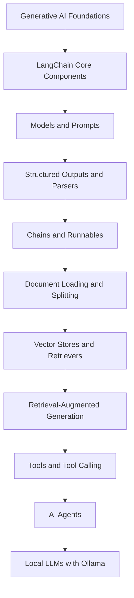
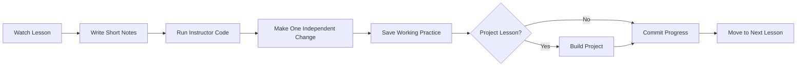
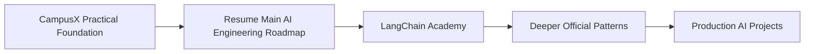

<div align="center">

# 🧠 Generative AI Using LangChain

### CampusX Guided Course Workspace

A structured learning repository for understanding LangChain,
building practical Generative AI applications,
and converting every lesson into working code.

<br>

<p>


</p>

<p>

</p>

<br>

`WATCH → CODE → MODIFY → PRACTICE → BUILD → REVIEW`

</div>

---

# 🚀 Overview

This directory documents my completion of the **CampusX Generative AI Using LangChain** playlist.

The course provides a practical introduction to LangChain and modern Generative AI application development. It covers models, prompts, structured outputs, chains, runnables, document processing, vector stores, retrieval, RAG, tools, agents, and local LLMs.

The purpose of this workspace is not to copy tutorial code blindly. Each lesson is used to build working understanding through short notes, executable practice, independent modifications, and selected projects.

---

# 🎓 Course Source

| Item | Details |
| :--- | :--- |
| **Instructor** | CampusX |
| **Course** | Generative AI Using LangChain |
| **Playlist** | [Open YouTube Playlist](https://www.youtube.com/playlist?list=PLKnIA16_RmvaTbihpo4MtzVm4XOQa0ER0) |
| **Learning method** | Video lessons, code-along practice, independent modification, and projects |
| **Current status** | 🚧 In Progress |
| **Primary goal** | Build a fast practical foundation before returning to the main AI Engineering roadmap |

---

# 💡 What This Course Covers



The learning path moves from basic LangChain concepts to complete AI application workflows.

---

# ✨ Learning Outcomes

<table>
<tr>
<td width="50%">

## 🧩 LangChain Foundations

Understand:

* LangChain architecture
* core components
* chat models
* prompt templates
* message-based workflows

</td>
<td width="50%">

## 📦 Structured AI Output

Practice:

* structured responses
* output parsers
* schema-oriented thinking
* reusable chains
* runnable pipelines

</td>
</tr>
<tr>
<td>

## 🔎 Retrieval and RAG

Build with:

* document loaders
* text splitters
* vector stores
* retrievers
* context-grounded answers

</td>
<td>

## 🛠️ Tools and Agents

Implement:

* custom tools
* tool calling
* controlled agent workflows
* end-to-end AI agents
* local models through Ollama

</td>
</tr>
</table>

---

# 🏗️ Learning Workflow



Each lesson follows one rule:

```text
Understand the concept
        +
Run the code
        +
Change something independently
        =
Real learning evidence
```

---

# 📂 Course Structure

```text
01_CampusX_Generative_AI/
├── README.md
├── 00_GenAI_Roadmap_for_Beginners/
│   └── Practice/
├── 01_Generative_AI_Using_LangChain_Overview/
│   └── Practice/
├── 02_Introduction_to_LangChain/
│   └── Practice/
├── 03_LangChain_Components/
│   └── Practice/
├── 04_LangChain_Models/
│   └── Practice/
├── 05_Prompts_in_LangChain/
│   └── Practice/
├── 06_Structured_Output_in_LangChain/
│   └── Practice/
├── 07_Output_Parsers_in_LangChain/
│   └── Practice/
├── 08_Chains_in_LangChain/
│   └── Practice/
├── 09_LangChain_Runnables_Part_1/
│   └── Practice/
├── 10_LangChain_Runnables_Part_2/
│   └── Practice/
├── 11_Document_Loaders_in_LangChain/
│   └── Practice/
├── 12_Text_Splitters_in_LangChain/
│   └── Practice/
├── 13_Vector_Stores_in_LangChain/
│   └── Practice/
├── 14_Retrievers_in_LangChain/
│   └── Practice/
├── 15_Retrieval_Augmented_Generation_RAG/
│   └── Practice/
├── 16_YouTube_Chatbot_RAG_System/
│   ├── Practice/
│   └── Project/
├── 17_Tools_in_LangChain/
│   └── Practice/
├── 18_Tool_Calling_in_LangChain/
│   └── Practice/
├── 19_End_to_End_AI_Agent/
│   ├── Practice/
│   └── Project/
└── 20_Ollama_Masterclass_Local_LLMs/
    ├── Practice/
    └── Project/
```

## Folder Rules

```text
Practice/
→ Code written while following the lesson
→ Small experiments and independent modifications
→ Error fixes and working examples

Project/
→ Created only for project-focused lessons
→ Contains a complete lesson-based implementation
```

---

# 📚 Playlist Coverage

| # | Lesson | Main Focus | Status |
|---:|---|---|---|
| **00** | GenAI Roadmap for Beginners | End-to-end Generative AI learning direction | ⬜ Not Started |
| **01** | Generative AI Using LangChain Overview | Course scope and application roadmap | ⬜ Not Started |
| **02** | Introduction to LangChain | Purpose, architecture, and basic workflow | ⬜ Not Started |
| **03** | LangChain Components | Core building blocks and relationships | ⬜ Not Started |
| **04** | LangChain Models | LLMs, chat models, and model integration | ⬜ Not Started |
| **05** | Prompts in LangChain | Prompt templates and message construction | ⬜ Not Started |
| **06** | Structured Output in LangChain | Schema-based and predictable responses | ⬜ Not Started |
| **07** | Output Parsers in LangChain | Converting model output into usable formats | ⬜ Not Started |
| **08** | Chains in LangChain | Combining models, prompts, and processing steps | ⬜ Not Started |
| **09** | LangChain Runnables — Part 1 | Runnable interface and composition basics | ⬜ Not Started |
| **10** | LangChain Runnables — Part 2 | Advanced runnable composition | ⬜ Not Started |
| **11** | Document Loaders in LangChain | Loading external documents and data | ⬜ Not Started |
| **12** | Text Splitters in LangChain | Chunking documents for retrieval workflows | ⬜ Not Started |
| **13** | Vector Stores in LangChain | Embedding storage and similarity search | ⬜ Not Started |
| **14** | Retrievers in LangChain | Retrieving relevant context | ⬜ Not Started |
| **15** | Retrieval-Augmented Generation | Building grounded LLM workflows | ⬜ Not Started |
| **16** | YouTube Chatbot Using LangChain | Complete RAG application project | ⬜ Not Started |
| **17** | Tools in LangChain | Creating and using tools | ⬜ Not Started |
| **18** | Tool Calling in LangChain | Model-driven tool selection and execution | ⬜ Not Started |
| **19** | End-to-End AI Agent | Complete agent workflow project | ⬜ Not Started |
| **20** | Ollama Masterclass — Local LLMs | Running local models with Ollama | ⬜ Not Started |

## Status Legend

| Status | Meaning |
|---|---|
| ⬜ **Not Started** | Lesson has not been watched |
| 🚧 **In Progress** | Lesson or practice is currently being completed |
| ✅ **Completed** | Video watched and practice code runs |
| 🔁 **Reviewed** | Concept was revised and can be explained independently |

---

# 🧪 Practice Standard

A lesson is marked **Completed** only when:

- the full video has been watched;
- the important code runs locally;
- at least one part has been modified independently;
- errors and fixes are understood;
- practice code is stored in the correct folder;
- the progress table has been updated;
- the work has been committed to Git.

Watching a video without running the code does not count as completion.

---

# 📦 Selected Projects

## YouTube Chatbot RAG System

```text
YouTube Content
      ↓
Transcript Loading
      ↓
Text Splitting
      ↓
Embeddings
      ↓
Vector Store
      ↓
Retriever
      ↓
Grounded Answer
```

## End-to-End AI Agent

```text
User Goal
    ↓
Agent Reasoning
    ↓
Tool Selection
    ↓
Tool Execution
    ↓
Final Response
```

## Local LLM Application

```text
Local Model
    ↓
Ollama Runtime
    ↓
LangChain Integration
    ↓
Private Local AI Workflow
```

These projects are learning implementations. Portfolio status will be assigned only after independent improvement, testing, documentation, and verification.

---

# ⚙️ Learning Stack

<div align="center">


<br>

| Core Technology | Learning Purpose |
| :--- | :--- |
| **Python** | Generative AI application development |
| **LangChain** | LLM application composition |
| **Vector Stores** | Semantic retrieval and similarity search |
| **RAG** | Context-grounded generation |
| **Tools and Agents** | Multi-step AI workflows |
| **Ollama** | Running local LLMs |
| **Git and GitHub** | Progress tracking and learning evidence |

</div>

---

# ⏱️ Time-Saving Rules

✅ Keep lesson notes short  
✅ Run code instead of copying screenshots  
✅ Make one meaningful modification per lesson  
✅ Use official documentation when tutorial syntax is outdated  
✅ Build projects only for project-focused lessons  
✅ Move forward after the learning objective is achieved  

❌ Do not create production architecture for every example  
❌ Do not write long notes for every video  
❌ Do not repeat the same example across multiple folders  
❌ Do not claim mastery from watching alone  

---

# 📝 Recommended Commit Style

```text
learn(langchain): complete introduction lesson
learn(models): practice chat model integrations
learn(prompts): implement prompt template examples
learn(outputs): practice structured output parsing
learn(runnables): complete runnable composition examples
learn(rag): implement retrieval pipeline
project(rag): build YouTube chatbot
learn(tools): practice tool calling
project(agent): build end-to-end AI agent
learn(ollama): run local LLM workflow
```

---

# 🎯 Completion Gate

| Requirement | Status |
|---|---:|
| All 21 playlist videos watched | ⏳ Pending |
| Important examples run locally | ⏳ Pending |
| Independent modifications completed | ⏳ Pending |
| YouTube RAG chatbot completed | ⏳ Pending |
| Tool-calling practice completed | ⏳ Pending |
| End-to-end agent completed | ⏳ Pending |
| Ollama local workflow completed | ⏳ Pending |
| Final course review written | ⏳ Pending |

---

# 🛣️ Next Learning Stage



CampusX provides the fast practical foundation.

The main AI Engineering roadmap and LangChain Academy will later deepen architecture, evaluation, reliability, security, backend integration, and production engineering.

---

# 📈 Current Status

| Milestone | Status |
|---|---|
| Folder Structure | ✅ Complete |
| Playlist Setup | ✅ Complete |
| Course Learning | 🚧 In Progress |
| Practice Completion | ⏳ Pending |
| Projects | ⏳ Pending |
| Final Review | ⏳ Pending |

---

<div align="center">

## Built as Part of My AI Engineering Learning Journey

Focused on practical understanding, working code, and measurable progress.

</div>
